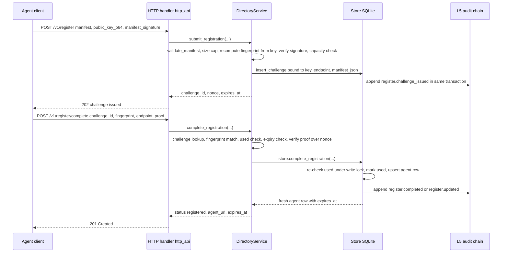
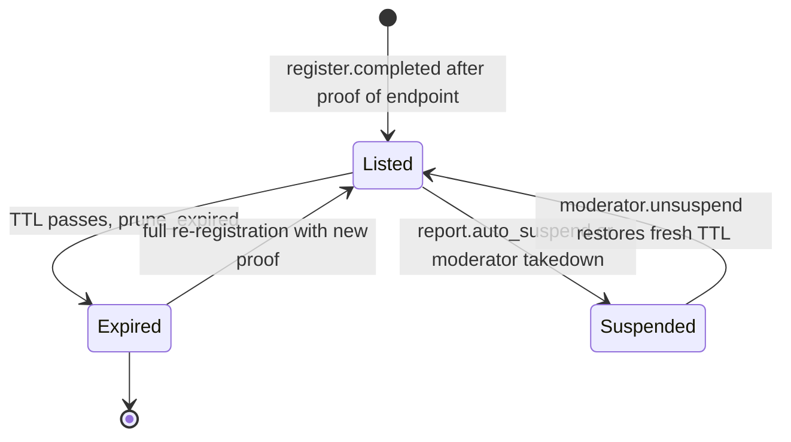

# Service Layer — Orchestration, Search & Trust-Block Assembly

`DirectoryService` (in `src/haap_directory/service.py`) is the directory's business-logic heart: it holds the L1 registration state machine, heartbeat renewal, search/profile reads, and the per-listing trust block. It sits between the HTTP surface and the SQLite `Store`: **`http_api.py` parses transport concerns (bodies, headers, rate limits, routing); `DirectoryService` and its sub-services validate and orchestrate; every state change goes through `Store` so it is persisted and appended to the L5 audit chain in the same transaction** (SPEC §3.6.1, §5.3). New mutating logic must preserve this layering — validation may live in a service, but the write and its audit entry always happen together inside a `Store` write transaction.

The file holds no HTTP code and `Store` holds no business decisions; the module docstring states the contract: *"Every state change goes through ``store`` so it is persisted and appended to the L5 audit chain in the same transaction"* (SPEC §4, §5).

## Responsibilities and the trust stance

The service implements the directory's core principle — **phone book, not a notary, never a judge** (SPEC §2.2). Concretely:

- It verifies cryptographic facts (manifest signatures, recomputed fingerprints, proof-of-endpoint, heartbeat signatures, signed request bodies).
- It runs *published automata only* (listing TTL/expiry, the L4 report-triggered auto-suspend threshold) and moderator-key actions.
- It serves **labelled signals with provenance** (`domain_verified`, `vouches_in`, `reports`, `status`, `block_recommendation`, `audit_verifiable`) — never a "safe/trusted" verdict and never a collapsed trust score. Absent signals use explicit "no signal" defaults instead of being fabricated.
- Identity lives in the agents' Ed25519 keys; a client-supplied fingerprint is never trusted — it is recomputed from the presented public key (`fingerprint_of_public_key`).

## Object graph and wiring

`DirectoryService.__init__(store, keypair, config, clock, resolver)` binds the service to a `Store`, the directory signing `KeyPair`, a `DirectoryConfig`, and an injected `Clock` (default `system_clock`). Construction:

- `directory_fingerprint` is derived from the directory's own key pair (the value echoed on every search/profile/health response).
- `self.domain = DomainService(store, config, clock, resolver)` — L2 is wired eagerly at the top of `__init__`.
- `_attach_subservices()` lazily imports and wires the L3–L5 services onto attributes: `self.vouches = VouchService(...)`, `self.reputation = ReputationService(...)`, `self.moderation = ModerationService(..., self.reputation)`, `self.audit = AuditService(store, keypair, config, clock)`. The lazy imports avoid an import cycle; the attributes start as `None` so the trust-block code can defensively fall back to honest empty defaults.
- Finally `self.store.prune_expired()` runs on startup (SPEC §5.3, phase F2 criterion): entries whose TTL has passed are transitioned to `expired` before the first request.

`self.now()` (and the identical method on each sub-service) reads the injected clock. **All expiry, age, decay, and freshness logic goes through this injected clock; nothing in `service.py`, the sub-services, or `store.py` calls `time.time()` directly** — tests inject a `MutableClock` and advance it to exercise TTL/expiry/decay deterministically.

## L1 registration: the proof-of-endpoint state machine

Registration is a two-step, single-use, short-TTL challenge bound to the exact public key validated at submit time. Endpoint-level detail (routes, bodies, legacy alias shapes) lives on the [registration lifecycle](/openwiki/workflows/registration-lifecycle.md) page; here is the orchestration.



**Step 1 — `submit_registration(manifest, public_key_b64, manifest_signature)`**:

1. `validate_manifest` rejects forbidden fields, floats, and invalid endpoints; the canonical JSON length must not exceed `config.max_manifest_bytes` (`MANIFEST_TOO_LARGE`).
2. The public key is base64-decoded, must be 32 bytes, and must hash to the fingerprint declared inside the manifest (`FINGERPRINT_MISMATCH` otherwise). The signature is verified over the canonical JSON with that key (`SIGNATURE_MISMATCH`).
3. Capacity: an *already-live* fingerprint may re-register freely; otherwise `DIRECTORY_FULL` when `store.count_live() >= config.max_agents`.
4. A challenge row (`ch_…`) is inserted via `store.insert_challenge` with a random nonce prefixed `v1:register:`, the validated manifest snapshot, the bound key and endpoint, and a TTL of `config.challenge_ttl_s` (120 s default). The response carries `challenge_id`, `nonce`, `expires_at`, and the directory fingerprint.

**Step 2 — `complete_registration(...)`**:

1. Challenge selection: the canonical v1 caller passes `challenge_id`; a legacy client omits it and the service falls back to `store.latest_pending_challenge(fingerprint)` (most recent unused endpoint challenge).
2. The service checks fingerprint match, single-use (`CHALLENGE_USED`), expiry vs `self.now()` (`CHALLENGE_EXPIRED`), and — when supplied — that the presented `public_key_b64` equals the bound key (`KEY_MISMATCH`).
3. The endpoint proof must be a valid Ed25519 signature by the *bound* key over the challenge nonce bytes (`PROOF_INVALID` otherwise).
4. `store.complete_registration` then does the atomic part: inside one `BEGIN IMMEDIATE` transaction it **re-checks the `used` flag under the write lock** (so a replayed completion loses the race with `CHALLENGE_USED`), marks the challenge used, upserts the agent row with a fresh TTL (`config.ttl_seconds`, 24 h default), and appends exactly one audit entry — `register.completed` for a fresh listing or `register.updated` when re-registering an entry that was still live.

Re-registration semantics live in `store._upsert_agent_cur`: a *live* re-registration is an update that preserves `registered_at`/`registered_epoch` (so `listed_since` and `age_days` survive); an expired or absent fingerprint is a fresh insert with a new `registered_at`.



A listing is live ("listed") iff `status == 'listed'`, not a history row, and `expires_epoch >= now` (`store.is_live_row`). Expiry is not deletion: `store.prune_expired` flips stale rows to `status='expired', is_history=1` with an audited `agent.expired` event, and runs both at `DirectoryService` construction and lazily inside `live_agents()`/`count_live()` before reads. `tests/test_search_heartbeat.py` pins both prune paths with the injected clock.

## Heartbeats and liveness

- **`heartbeat_v1(fingerprint, timestamp, signature_b64)`** — the signed form (SPEC §4.7). The RFC 3339 `timestamp` must parse and lie within `MAX_CLOCK_SKEW_S = 300` seconds of `self.now()` (`STALE_TIMESTAMP`). The message signed by the agent is the ASCII string `heartbeat:{fingerprint}:{timestamp}` verified against the stored `public_key_b64`. A failed signature and an unknown/expired fingerprint both raise `UNKNOWN_OR_EXPIRED`: the endpoint **never confirms fingerprint existence to a caller that cannot sign**. On success `store.heartbeat` extends the expiry by the full TTL (audit `heartbeat.ok`).
- **`heartbeat_legacy(fingerprint)`** — the unsigned `{fingerprint}` form kept for the unmodified legacy client. It renews through the same `store.heartbeat` path but is audit-flagged `heartbeat.legacy_unsigned`. The HTTP layer accepts an unsigned body on either route (`/heartbeat` or `/v1/heartbeat`) whenever `signature`/`timestamp` are absent, and returns `UNKNOWN_OR_EXPIRED` when renewal fails.

`tests/test_search_heartbeat.py` verifies TTL renewal across two windows, rejection of a timestamp 10 000 s stale, non-confirmation for an unknown fingerprint, and the legacy path.

## Search and profile

### Search pipeline

`DirectoryService.search(query)` is an in-memory pass over live rows:

1. `store.live_agents()` returns `listed`, non-history, unexpired rows ordered by `registered_epoch ASC` (after the lazy prune).
2. Each row's manifest is matched by `_matches_query(manifest, query)` (capability, free text, geo).
3. For manifest matches, `build_trust_block(row)` assembles the trust block, which is then checked by `_passes_trust_filters(trust, query)` (age, verification, suspension, vouches, reports).
4. `total` counts every match after both filter stages, ignoring pagination; the response window is `matches[offset : offset + limit]`.

The v1 response shape is `{"results": [{"manifest", "trust"}], "total", "limit", "offset", "directory_fingerprint"}`; the same method also exposes a `manifests` projection that the legacy `/search` alias serializes as a bare manifest list (see the [HTTP layer](/openwiki/architecture/http-layer.md)).

<!-- openwiki: mermaid parse failed and this diagram was converted to a text fence so it does not break rendering. Fix the diagram source and restore the mermaid fence. Parser error: Heuristic: an unescaped angle bracket inside a label breaks rendering; rephrase the label. -->
```text
flowchart TD
    Q["GET /v1/search query parameters"] --> P["SearchQuery parse and clamp: limit 0 to 100 default 20, offset >= 0, geo lat,lon,radius_km, min_age_hours, domain_verified, not_suspended default true, min_vouches_in, recent_reports_max"]
    P --> L["store.live_agents: lazy prune expired, then listed rows oldest registered first"]
    L --> A{"_matches_query: capability substring over speciality, services id or category, tools, skill names"}
    A -- no --> SKIP[skip row]
    A -- yes --> B{"q free text: every whitespace-separated word present in the lowercased canonical manifest JSON"}
    B -- no --> SKIP
    B -- yes --> C{"geo filter set: manifest has agent.geo and haversine distance is within radius km"}
    C -- no geo in manifest or out of radius --> SKIP
    C -- no geo filter or within radius --> T["build_trust_block: assemble labelled L1 to L5 signals for the row"]
    T --> D{"_passes_trust_filters: not_suspended, min_age_hours, domain_verified true, min_vouches_in, recent_reports_max"}
    D -- no --> SKIP
    D -- yes --> M[collect match]
    M --> P2["total equals match count, window is offset to offset plus limit"]
    P2 --> R["results as manifest plus trust, plus total, limit, offset, directory_fingerprint"]
```

### `SearchQuery` parsing and clamping

`SearchQuery` is a plain module-level class constructed by the HTTP handler from query-string parameters (`http_api._handle_search`). Parsing/clamping rules:

| Parameter | Parsing / clamping |
|---|---|
| `capability` | stripped, lowercased; case-insensitive substring |
| `q` | stripped, lowercased; words joined with AND |
| `geo` | `_parse_geo` splits `lat,lon,radius_km` into floats; unparseable input silently becomes `None` (no filter) |
| `limit` | `max(0, min(int(limit), 100))` — clamped, never errors; default 20 |
| `offset` | `max(0, int(offset))`; default 0 |
| `min_age_hours` | float; default 0.0 (no minimum) |
| `domain_verified` | optional bool; `None` unless `"1"/"true"/"yes"` was sent |
| `not_suspended` | bool, **default True** (send `false` to relax) |
| `min_vouches_in` | int; default 0 |
| `recent_reports_max` | optional int; `None` unless supplied |

### `_matches_query` semantics

- **`capability`** — case-insensitive substring over a haystack built from `agent.speciality`, each `services[].id` and `services[].category`, each `tools[]` entry, and each `skills[].name`. One hit anywhere matches.
- **`q`** — free text over the *whole* manifest: the manifest is canonical-JSON-serialized, lowercased, and every whitespace-separated word must be a substring (AND semantics). `tests/test_search_heartbeat.py` verifies that two words present match and one missing word excludes.
- **`geo`** — haversine distance (`_haversine_km`, Earth radius 6371.0088 km) between the query point and the agent's geo, read from `agent.geo` as `lat_microdeg`/`lon_microdeg` (preferred) or decimal `lat`/`lon`. Agents with no geo are excluded whenever a geo filter is present (verified by test).

### `_passes_trust_filters` semantics

Applied to the assembled trust block, all optional:

- `not_suspended` (default True) excludes `status == "suspended"`. Note that `store.live_agents()` already returns only `listed` rows, so suspended agents are excluded from search by construction; the filter is consumer-facing defense in depth.
- `min_age_hours` excludes entries whose `age_days * 24` is below the threshold (age is `listed_since`-based).
- `domain_verified=True` excludes entries whose trust block has no primary domain verification. The filter is one-sided: `domain_verified=false` does **not** require unverified entries.
- `min_vouches_in` counts **visible active inbound vouch edges** (`len(trust["vouches_in"])`) — counts edges, not quality, and is labelled as such.
- `recent_reports_max` excludes entries whose `reports.unique_reporters` exceeds the ceiling.

### Profile read

`get_agent(fingerprint)` returns `{"manifest", "trust"}` for a live listing. An unknown fingerprint raises `AGENT_NOT_FOUND`; an existing-but-not-currently-listed entry (expired **or** suspended) raises `AGENT_NOT_LISTED` — the anonymous API deliberately does not distinguish suspended from expired (SPEC §4.6), and `tests/test_search_heartbeat.py` confirms a pruned agent 404s this way.

## Trust-block assembly: `build_trust_block`

`build_trust_block(row)` turns one store row plus sub-service signals into the §5.2 `trust` object attached to every search result and profile. It reads `self.now()` once for age and freshness math. Field-by-field:

| Field | Source / meaning |
|---|---|
| `directory_fingerprint` | which directory instance produced this view (M12) |
| `listed_since`, `age_days` | `registered_at` / `registered_epoch`; `age_days = round((now - registered_epoch) / 86400, 4)` (M1) |
| `last_heartbeat`, `fresh` | last renewal and whether it lies within one TTL of now (M2) |
| `endpoint_proof_at` | when L1 proof-of-endpoint completed (M3) |
| `domain_verified`, `domain_verification` | bool plus `{domain, method, verified_at, expires_at, primary}` when the endpoint host lives under an active verification (M4). `primary` is chosen by `DomainService.primary_verification`: among `store.active_domain_verifications`, the most recently verified whose domain the listing's endpoint host matches (`host == domain` or a subdomain). |
| `vouches_in`, `vouch_annotations` | active inbound vouch edges, each with `voucher_tenure_hours` (M5/M6); annotations carry `mutual_vouch_density` and `vouchers_share_registration_cluster` |
| `reports` | raw counters `{by_category, unique_reporters, first_at, last_at}` over the decay window — allegations, not findings (M7) |
| `status`, `suspension` | listing status and, when suspended, the parsed `{rule, evidence_reports, at}` from `suspension_json` (M8) |
| `block_recommendation` | pure-function guidance from raw counters (M9), never enforcement |
| `reputation_history` | reserved for decayed history of past suspensions/report-wars/revocations; currently always `[]` |
| `audit_verifiable` | always `true`: every signal above is backed by hash-chain entries (M10) |

**Honesty rules the assembly.** The function never judges: it only concatenates labelled, dated facts, and it uses explicit absent-signal defaults when a mechanism has not produced data rather than emitting a value that could be misread as a measured zero:

- If `domain.primary_verification` finds nothing, `domain_verified` is `false` and `domain_verification` is `None`.
- If a sub-service is not attached (`self.vouches`/`self.reputation` is `None` — the defensive pre-wiring path), `vouches_in` defaults to `[]`, `vouch_annotations` to `{"mutual_vouch_density": 0.0, "vouchers_share_registration_cluster": False}`, `reports` to `{"by_category": {}, "unique_reporters": 0, "first_at": None, "last_at": None}`, and `block_recommendation` to `None`.
- Inside `VouchService.annotations`, `vouchers_share_registration_cluster` is **hard-coded `False` because registration-IP clustering is not tracked in this build** — the code documents this as an honest "no signal", not as a measured fact.
- `block_recommendation` is `None` unless the counter automaton fires; the verdict (whether to act on it) is always the consumer's (M9).

The trust semantics each field may and may not claim are fixed by the normative §3.7 matrix — see the [trust model](/openwiki/concepts/trust-model.md) page.

## Attached L2–L5 sub-services

`DirectoryService` owns thin orchestration for each later layer; endpoint/wire detail lives on the workflow pages.

### L2 — `DomainService` (`domain.py`)

Proves a key holder controls a domain via a directory-performed DNS TXT or HTTPS well-known check — a *signal*, never KYC. `request_verification` requires a live listing and a signature over the body subset `(fingerprint, domain, method)`, validates the domain (`DOMAIN_INVALID`) and method (`dns_txt` | `https_well_known`), then mints a 30-minute single-use token (`config.domain_token_ttl_s`). `confirm` re-verifies the signature, checks challenge identity/use/expiry, requires the agent's endpoint host to live under the claimed domain (`DOMAIN_ENDPOINT_MISMATCH`), and delegates the actual control check to the injected `Resolver` seam — which raises the stable codes `DNS_TXT_NOT_FOUND`, `WELL_KNOWN_NOT_FOUND`, `WELL_KNOWN_MISMATCH`, `DNS_ERROR_TEMPORARY` (the dig/TLS logic lives in `verify.py`; tests stub the resolver). Success persists a 90-day verification (`config.domain_verification_ttl_days`) atomically with audit `domain.verified`. See [domain verification](/openwiki/workflows/domain-verification.md).

### L3 — `VouchService` (`vouching.py`)

Enforces vouch *mechanics*, never opinion: `create` requires both parties live (`VOUCHER_NOT_LISTED`/`VOUCHEE_NOT_LISTED`), a lowercase scope, `weight == 1` in v1, RFC 3339 `created_at`/`expires_at`, a future expiry inside `config.vouch_max_expiry_days` (180), and a signature by the voucher over the whole body minus `signature`. `Store.create_vouch` additionally enforces ≤ `config.vouch_max_outgoing` (10) active edges (`VOUCH_LIMIT_REACHED`) and rejects an identical active `(voucher, vouchee, scope)` edge (`VOUCH_EXISTS`). `revoke` requires a signature over `{voucher_fingerprint, revoked_at}` by the original voucher only. Reads serve raw graph edges: `inbound_signal` (with per-vouch `voucher_tenure_hours`), `annotations` (mutual-vouch density as a cheap, raw ring signal), and `trust_paths`, a BFS over active edges only with depth clamped to ≤ 2. See [vouching](/openwiki/workflows/vouching.md).

### L4 — `ReputationService` (`reputation.py`)

Deterministic, transparent automata over signed reports. `create_report` validates category/severity/evidence-kind against the closed sets, requires a live target (`TARGET_NOT_LISTED`) and a live reporter with ≥ `config.report_tenure_hours` (72 h) tenure — tenure decides the `counts` eligibility flag that gates automation (`REPORTER_NOT_ELIGIBLE` keeps the report recorded but non-counting) — verifies the reporter's signature, and dedupes `(reporter, target, category)` within `config.report_dup_window_hours`. When a *counting* report in an abuse class (`spam`, `phishing`, `impersonation_attempt`, `endpoint_hijack`) is recorded, `_maybe_auto_suspend` suspends the target iff ≥ `config.auto_suspend_threshold` (3) unique eligible reporters exist in the `config.report_window_days` (7-day) window; the suspension is written through `store.suspend_agent` with `actor="directory"`, event `report.auto_suspend`, the rule text, and the evidence report ids — fully audited. Signals stay raw: `counters` over the `config.report_decay_days` (180-day) window and `block_recommendation`, a pure function returning `{"default_max_contact_rate_h": 1}` only when ≥ 2 unique eligible reporters allege `fraud`/`payment_fraud` in the window — data, never enforcement. See [reputation](/openwiki/workflows/reputation.md).

### L4 moderation — `ModerationService` (`moderation.py`)

Moderator-key actions are the only human judgement in the hot path and are all audited. The service builds a `fingerprint → public_key_b64` map from `config.moderator_keys` (operator-held Ed25519 keys configured out of band); unknown keys raise `MODERATOR_UNKNOWN`, failed signatures `TAKEDOWN_UNAUTHORIZED`. `takedown(report_id)` and `suspend(fingerprint)` both funnel into `store.suspend_agent` with `actor="moderator:<fp>"` and events `moderator.takedown`/`moderator.suspend`; `unsuspend` restores a suspended entry to `listed` with a fresh TTL and clears the suspension record. `appeal` is signed by the *agent* (not a moderator) and stores an `open` appeal row with audit `appeal.submitted`. See [moderation and appeals](/openwiki/workflows/moderation-appeals.md).

### L5 — `AuditService` (`audit_service.py`)

Wraps the store's hash chain (see [store and audit](/openwiki/architecture/store-and-audit.md)): `sign_body` returns a b64 Ed25519 signature over the canonical JSON of a response body — the basis for `X-HAAP-Directory-Signature` on audit endpoints; `head()`/`create_checkpoint()`/`maybe_checkpoint()` produce directory-key-signed `{seq, entry_hash, ts}` checkpoints on the configured cadence (`checkpoint_interval_s`, hourly) or on shutdown; `verify(seq)` recomputes chain validity up to a sequence number; `agent_audit(fingerprint)` exposes a per-agent, redacted view (`detail_hash` only, never detail bodies). See [audit transparency](/openwiki/workflows/audit-transparency.md).

## Invariants and failure semantics

- **Audit chain == mutations.** Every `Store` method that changes state appends exactly one audit entry inside the same `BEGIN IMMEDIATE` transaction (`store._write` + `_append_audit`); "audit rows == mutating ops" holds by construction. Registration, heartbeats, expiry, domain verifications, vouches, reports, suspensions, unsuspensions, appeals, and checkpoints all follow this.
- **Time is injected.** Every TTL, expiry, decay, tenure, and freshness comparison reads the injected `Clock` (`self.now()` on the service and each sub-service, `store.now()` in SQL); never call `time.time()` in this layer.
- **Stable errors, no leaks.** Services raise `DirectoryError` with the add-only §4.10 codes (`errors.py`); the HTTP layer maps them to statuses. Crypto failures are intentionally conflated with existence failures where anonymity requires it (`UNKNOWN_OR_EXPIRED`, `AGENT_NOT_LISTED`).
- **No fabricated signals.** Any field the directory has not measured is either omitted/`None`/`false` with an explicit "no signal" default, never a placeholder that could be read as evidence of absence.
- **Single-writer store.** All state changes serialize through the store's one re-entrant write lock; services never open their own transactions or connections.

## Extension rules for new mutating logic

To add a state change safely: put validation and orchestration in a `DirectoryService` method or the owning sub-service; have the new behavior read time only through the injected clock; perform the write via a new (or existing) `Store` method that wraps the change and its single audit `_append_audit` call in one `self._write()` transaction; and reserve any new failure as an add-only code in `errors.py`. Do not bypass `Store` with ad-hoc SQL in the service layer, and do not emit a trust-block field that asserts a verdict rather than reporting a labelled fact.

## Focused tests

- `tests/test_registration.py` — happy-path register → search → profile (trust block present, `endpoint_proof_at` set), plus the rejection matrix: bad manifest signature, fingerprint/key mismatch, forbidden fields, floats, oversized manifest, expired challenge (`CHALLENGE_EXPIRED` after clock advance), and challenge replay (`CHALLENGE_USED` on the second completion).
- `tests/test_search_heartbeat.py` — search semantics (multi-word `q` is AND, geo include/exclude and geo-less exclusion, pagination with `total` independent of the window, `limit` clamped to 100, empty-result shape), v1 heartbeat renewal across two TTL windows, stale-timestamp rejection, unknown-fingerprint non-confirmation, legacy unsigned heartbeat, and expiry pruning on read and on restart with the advanced injected clock.
- Vouch, domain, reputation, and moderation behavior is exercised by `tests/test_vouching.py`, `tests/test_domain_verification.py`, `tests/test_reputation.py`, and the audit chain by `tests/test_audit_chain.py` (see those workflow pages).
