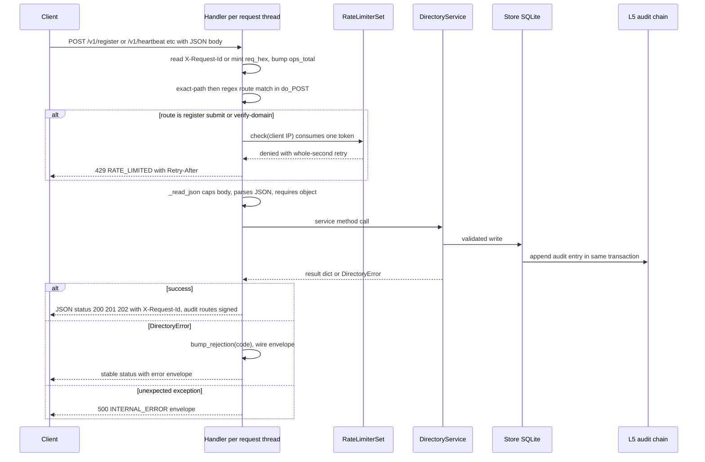

# HTTP Layer — Routing, Errors, Rate Limits & Observability Endpoints

The directory's HTTP surface is one stdlib `ThreadingHTTPServer` plus a per-server handler class, both defined in `src/haap_directory/http_api.py` (SPEC §4). `DirectoryHTTPServer` owns the `Store`, the `DirectoryService`, and a `RateLimiterSet`; each request runs on its own daemon thread against a `BaseHTTPRequestHandler` subclass that dispatches `do_GET` / `do_POST` / `do_DELETE` over a literal-then-regex route table. The layer is deliberately thin: **`http_api.py` owns transport concerns only** (routing, JSON body parsing and caps, per-IP rate limiting, request IDs, error serialization, response signing headers, `/health` and `/metrics`). Validation, orchestration, and state changes belong to `DirectoryService` and its sub-services ([business logic](/openwiki/architecture/business-logic.md)); every state change and its audit entry are committed together by `Store` ([store and audit](/openwiki/architecture/store-and-audit.md)).

Canonical endpoints live under `/v1`. Thin legacy aliases keep the unmodified `haap` client working (`POST /register`, `POST /register/complete`, `POST /heartbeat`, `GET /search`, `GET /agents/{fp}`, `GET /health`); this page covers them only as a routing map — wire-compat behavior lives on the [legacy client](/openwiki/integrations/legacy-client.md) page.

## Server construction and lifecycle

`DirectoryHTTPServer.build(config, keypair, clock, resolver)` constructs the SQLite `Store`, the `DirectoryService`, and the `RateLimiterSet`, then `start()` (or `serve_forever()`) binds a `ThreadingHTTPServer` to `config.host:config.port` (defaults `0.0.0.0:8444`, so TLS termination is an operator concern in front) with `daemon_threads = True` and launches:

- a `serve_forever` daemon thread;
- a background **checkpoint thread** that calls `audit.maybe_checkpoint()` every `config.checkpoint_interval_s` (default 3600 s) — it never crashes the process on error;

`stop()` sets the stop event, shuts the socket down, **signs one final audit checkpoint on shutdown** (SPEC §3.6.1), then closes the store. All time — uptime, rate-limit buckets, checkpoints — flows through the injectable `Clock` (tests use a `MutableClock`), never `time.time()`.

Per-request behavior in the `Handler`:

- `ops_total` increments on every handled request (`bump_ops`); `rejections[code]` increments on every rejection (`bump_rejection`, called from `_error`). These GIL-protected counters feed `/metrics`.
- `_request_id()` accepts an inbound `X-Request-Id` and echoes it; when absent it generates `req_<hex>`; every response carries it.



## Route table

Routing is ordered inside each verb handler: literal path comparisons first, then anchored regex matches. The agent fingerprint pattern is `HF-[0-9a-f]{16}`; one regex (`_AGENT_RE`) accepts both `/v1/agents/{fp}` and the legacy `/agents/{fp}` prefix, and the difference is purely serialization (full `{manifest, trust}` object vs bare manifest). Per-agent sub-resources (vouches, reports, audit, suspend, appeal) and all vouches/reports/takedown verbs are v1-only. A path that matches no branch falls through to `NOT_FOUND` (404); `DirectoryError` raised anywhere in a handler is converted by the surrounding `except`, and any non-`DirectoryError` exception is converted to `INTERNAL_ERROR` so internals never reach the wire.

### GET

| Path | Status | Response | Notes |
|---|---|---|---|
| `/health` | 200 | health JSON (§ below) | Unversioned by design (SPEC §4.9); no auth |
| `/metrics` | 200 | plain-text metrics (§ below) | `text/plain; version=0.0.4` |
| `/v1/search`, `/search` | 200 | v1 envelope `{results, total, limit, offset, directory_fingerprint}`; legacy is a bare `{results: [manifests]}` | **Rate-limited per client IP by `limiters.search`** |
| `/v1/audit/head` | 200 | chain head | **Signed** (`_send_signed`) |
| `/v1/audit/log?after&limit` | 200 | `{entries, next_after, head}` | **Signed**; store clamps `limit` to 1–1000 |
| `/v1/audit/checkpoints` | 200 | `{checkpoints: [...]}` | **Signed** |
| `/v1/audit/verify?seq` | 200 | `{valid, computed_head}` | **Signed** |
| `/v1/verify-domain/status?fingerprint` | 200 | verification list | Public read; no signature required |
| `/v1/trust/paths?from&to&max_depth` | 200 | `{paths: [...]}` | BFS over active edges; `max_depth` clamped ≤ 2 upstream |
| `/v1/agents/{fp}/vouches/outgoing` | 200 | outbound edges | |
| `/v1/agents/{fp}/vouches` | 200 | inbound edges + annotations | |
| `/v1/agents/{fp}/reports` | 200 | report counters/metadata | |
| `/v1/agents/{fp}/audit` | 200 | redacted per-agent audit | **Signed** |
| `/v1/agents/{fp}`, `/agents/{fp}` | 200 | v1: `{manifest, trust}`; legacy: bare manifest | `AGENT_NOT_FOUND` / `AGENT_NOT_LISTED` (404) from service |
| anything else | 404 | `NOT_FOUND` envelope | Wrong-verb requests to known paths also fall through here |

### POST

| Path | Status | Notes |
|---|---|---|
| `/v1/register`, `/register` | 202 v1 / 200 legacy | **Rate-limited per client IP by `limiters.register`**; legacy body is the challenge shape the unmodified client reads |
| `/v1/register/complete`, `/register/complete`, `/v1/register/challenge` | 201 v1 / 200 legacy | `/v1/register/challenge` is tolerated as an alias of the same handler; `/health` advertises the canonical `api.completion_route: /v1/register/complete` |
| `/v1/heartbeat`, `/heartbeat` | 200 | Signed body or a v1 path forces the signed `heartbeat_v1` path; an unsigned `{fingerprint}` body (legacy) is accepted on either route via `heartbeat_legacy` (audit-flagged) and answers `{"status": "ok"}` or 404 `UNKNOWN_OR_EXPIRED` |
| `/v1/verify-domain` | 202 | **Rate-limited per client IP by `limiters.register`**; delegates to `_json_action` |
| `/v1/verify-domain/confirm` | 200 | **Rate-limited per client IP by `limiters.register`** |
| `/v1/vouches` | 201 | `_json_action` over `vouches.create` |
| `/v1/reports` | 202 | `_json_action` over `reputation.create_report` |
| `/v1/reports/{report_id}/takedown` | 200 | moderator-signed |
| `/v1/agents/{fp}/suspend`, `/v1/agents/{fp}/unsuspend` | 200 | moderator-signed |
| `/v1/agents/{fp}/appeal` | 202 | agent-signed |
| anything else | 404 | `NOT_FOUND` envelope |

### DELETE

| Path | Status | Notes |
|---|---|---|
| `/v1/vouches/{vouch_id}` | 200 | `_json_action` over `vouches.revoke`; body signed by the original voucher |
| anything else | 404 | `NOT_FOUND` envelope |

## Request parsing and body caps

Every JSON-taking handler funnels through `_read_json(request_id)`, which implements SPEC §4.0/§2.7.5 rules:

- `Content-Length` is parsed; a missing or non-numeric header counts as length 0, and an empty body is treated as `{}` (no body is not an error in itself).
- A body larger than `config.max_body_bytes` (default **512 KiB**) is rejected with `PAYLOAD_TOO_LARGE` (413) **before reading** the stream.
- Malformed JSON is rejected with `INVALID_JSON` (400); valid JSON that is not an object (array/primitive) is rejected with `INVALID_SCHEMA` (400).
- The manifest itself has its own stricter cap — `service.submit_registration` rejects canonical JSON over `config.max_manifest_bytes` (default **256 KiB**) with `MANIFEST_TOO_LARGE` (413) — so the HTTP body cap is deliberately larger than the manifest cap.

`_json_action(status, fn, request_id)` is the common POST/DELETE wrapper: read body → call `fn(body)` → send `fn`'s dict at the given status, converting `DirectoryError` to the error envelope.

## The error envelope and the §4.10 master table

`src/haap_directory/errors.py` is normative for failures (SPEC §2.7.6, §4.10):

- **`ERROR_STATUS` is the master §4.10 table.** It maps every stable `UPPER_SNAKE` code to a fixed HTTP status. Codes are API: *never rename, never remove — add only*, and the reserved L2/L3/L4 codes are already present so the table stays complete as phases wire handlers in.
- `DirectoryError(code, message, *, retry_after)` carries the code, its status, and a short human `message` (defaulted from `_DEFAULT_MESSAGES`, never required of callers). **Messages are short and MUST NOT leak internals** — the generic handler converts any unexpected exception into `INTERNAL_ERROR` ("internal error", 500) rather than propagating tracebacks or details.
- `to_wire(request_id)` produces the single stable envelope used by every rejection:

```json
{"error": {"code": "RATE_LIMITED", "message": "too many requests", "request_id": "req_..."}}
```

Every rejection is counted into the server's `rejections` dict (`bump_rejection`) as it is serialized, which is what `/metrics` later reports.

Identity-protective conflation is a *service-layer* decision surfaced through these codes: `UNKNOWN_OR_EXPIRED` (heartbeat) and `AGENT_NOT_LISTED` (profile/suspended entries) intentionally do not confirm whether a fingerprint exists. `METHOD_NOT_ALLOWED` (405) exists in the table but no current route emits it — unmatched paths return `NOT_FOUND`, and unhandled verbs get the stdlib 501 rather than a directory envelope.

## Per-IP rate limiting and the client-IP decision

`rate_limit.py` implements a token-bucket limiter per key with continuous refill (`rate = capacity / refill_window`), a per-key lock, and the injected clock. `check(key)` consumes one token; when a bucket is empty it returns `(False, retry_after)` where `retry_after` is whole seconds until one token is available (`int(missing / rate) + 1`, or 3600 when refill is disabled). The `RateLimiterSet` exposes exactly two named limiters:

| Limiter | Config | Capacity / window | Applied to (per client IP) |
|---|---|---|---|
| `search` | `rate_search_per_min` (default 60) | 60 tokens / 60 s | `GET /v1/search` and legacy `GET /search` |
| `register` | `rate_register_per_hour` (default 5) | 5 tokens / 3600 s | `POST /v1/register`, `/register`, `/v1/verify-domain`, `/v1/verify-domain/confirm` |

Note what is **not** IP-limited at this layer: register *completion* (it requires a previously issued challenge), heartbeat, and the POST/DELETE L3/L4 verbs. Per-agent caps there are enforced by business logic with their own stable codes — `VOUCH_LIMIT_REACHED` (≤ 10 outgoing) and `VERIFICATION_LIMIT_REACHED` (≤ 5 pending) are raised inside `Store` write transactions.

When a limiter denies, the handler emits `DirectoryError("RATE_LIMITED", retry_after=...)`, which `_error` turns into **429 with a `Retry-After` header** (SPEC §2.7.7). `Retry-After` is attached only when `DirectoryError.retry_after` is set — currently only the token-bucket path does this — so the business-cap 429s (`VOUCH_LIMIT_REACHED`, `VERIFICATION_LIMIT_REACHED`) go out **without** `Retry-After`. Limiting is intentionally in-memory and per-instance: a multi-instance deployment fronts the service with a shared limiter/WAF.

### `_client_ip`: forwarding headers are honored only from loopback

The rate-limit key is `_client_ip()`, and the forwarding-header policy is deliberate:

```mermaid
flowchart TD
    P["TCP peer address from client_address"] --> T{"config.trust_proxy_headers enabled"}
    T -- no --> USE[P["use TCP peer address as the key"]]
    T -- yes --> L{"peer is 127.0.0.1 or ::1"}
    L -- no --> USE
    L -- yes --> H["read CF-Connecting-IP or X-Forwarded-For, first value before the first comma"]
    H --> U2["use that value as the key, empty falls back to the peer"]
```

- With `trust_proxy_headers` **off (default)**, the TCP peer address is always the key; a spoofed `X-Forwarded-For` cannot change anyone's bucket (`tests/test_proxy_headers.py` proves spoofed distinct IPs share the single loopback bucket and all get 429).
- With it **on**, forwarding headers are trusted **only when the TCP peer is loopback** (`127.0.0.1`/`::1`) — i.e. a reverse proxy on the same host — otherwise they are spoofable and ignored. The first element of `CF-Connecting-IP` or `X-Forwarded-For` (checked in that order) becomes the key; a missing/empty header falls back to the loopback peer.

`tests/test_ops_federation.py` pins the observable limiter contract: with `rate_register_per_hour=2`, the third `POST /v1/register` returns **429 and a `Retry-After` header**, and the rejection appears in `/metrics` as `haapd_rejections_total{code="RATE_LIMITED"}`.

## Signed audit responses

`_send_signed(code, obj, request_id)` adds two headers to an otherwise normal JSON response (SPEC §2.7.9):

- `X-HAAP-Directory-Signature` — base64 Ed25519 over the **canonical JSON of the exact response body**, produced by `AuditService.sign_body` (`audit_service.py`), not over any other representation;
- `X-HAAP-Directory-Fingerprint` — the directory instance's own fingerprint, so a consumer knows which key to verify against.

Signing applies **only to audit endpoints**: `GET /v1/audit/head`, `/v1/audit/log`, `/v1/audit/checkpoints`, `/v1/audit/verify`, and `/v1/agents/{fp}/audit`. All other responses (including search, profile, register, and `/health`) are unsigned; `registry_signature` embedded in the legacy register body is a different, legacy field, not this header. Consumers and mirror peers verify these headers to detect any rewrite of chain data they have already seen (federation ingest reads the same signed endpoints via `mirror.ingest_chain`).

## Observability: `/health` and `/metrics`

Both are unversioned, unauthenticated, and *not* rate-limited; both intentionally expose no sensitive data.

**`GET /health`** returns `service.health(uptime_s)` (SPEC §4.9, §9.2):

```json
{"status": "ok", "version": "...", "protocol_version": "1.0",
 "agents": 3, "suspended": 0, "pending_verifications": 0,
 "chain_seq": 12, "uptime_s": 42.1,
 "directory_fingerprint": "HF-...",
 "api": {"completion_route": "/v1/register/complete"}}
```

`agents` is `store.count_live()` (which lazily prunes expired entries), `chain_seq` is the L5 audit head sequence, `uptime_s` comes from the injected clock at `DirectoryHTTPServer` start, and the `api.completion_route` field is the machine-readable statement of which register-completion alias this server accepts (`/v1/register/challenge` is additionally tolerated).

**`GET /metrics`** renders plain text via `telemetry.render_metrics(service, uptime_s, ops_total, rejections)` — minimal Prometheus-style exposition, no client library, `Content-Type: text/plain; version=0.0.4`. Metric names:

| Metric | Type | Source |
|---|---|---|
| `haapd_agents_listed` | gauge | `store.count_live()` |
| `haapd_agents_suspended` | gauge | `store.count_suspended()` |
| `haapd_agents_total` | gauge | `store.count_total_agents()` (includes history rows) |
| `haapd_audit_seq` | counter | audit head `seq` |
| `haapd_ops_total` | counter | requests handled across all verbs |
| `haapd_uptime_seconds` | gauge | rounded server uptime |
| `haapd_rejections_total{code="<CODE>"}` | counter | one line per observed rejection code, sorted |

The rejection counters are exactly the `bump_rejection` increments made while serializing error envelopes, so a new `DirectoryError` code automatically shows up in `/metrics` the moment it is emitted — there is no separate registration step.

## Adding an endpoint safely

Because routing is a plain ordered dispatch table, a new endpoint touches `http_api.py` only:

1. **Add path constants/regexes** at module top (the anchored `_FP` fingerprint pattern is the reusable piece for per-agent routes) and one `if`/regex branch inside the right verb handler — literal paths first, then regexes, before the final `NOT_FOUND` fallthrough.
2. **Reuse the transport helpers** — `_read_json` + `_json_action` for body-taking verbs, `_send` for plain JSON, `_send_signed` for audit-surface reads, `_send_text` for non-JSON, and `_rate_limit(limiter, self._client_ip(), ...)` when the anonymous endpoint needs an IP bucket.
3. **Keep the layer thin**: call into `DirectoryService`/a sub-service for validation and orchestration; never write SQL or open store transactions here — writes plus their single audit entry must stay inside `Store` (see the extension rules on the [business logic](/openwiki/architecture/business-logic.md) page).
4. **Reserve any new failure code in `errors.py`** — add to `ERROR_STATUS` and `_DEFAULT_MESSAGES` in the same change (add-only, never rename or remove), with a short message that cannot leak internals; the `_error` path then supplies the envelope, the HTTP status, and the metrics counter automatically.
5. **Decide rate limiting deliberately**: anonymous write-heavy or read-heavy endpoints get a named limiter in `RateLimiterSet` + config knobs; per-agent caps belong in the service/store with their own stable codes.
6. **Wire-compat rule**: legacy aliases must map onto the same handler with identical semantics and only additive response fields; document the acceptance in `/health` `api.*` where the spec requires.

## Focused tests

- `tests/test_ops_federation.py` — `/metrics` content (`haapd_agents_listed`, `haapd_audit_seq`, `haapd_ops_total`), the register flood → 429 with `Retry-After`, rejection counters reaching metrics, and mirror federation consuming the signed audit endpoints.
- `tests/test_proxy_headers.py` — spoofed `X-Forwarded-For` cannot split the loopback bucket by default; with `trust_proxy_headers=True` each forwarded client keeps its own bucket and header-less requests fall back to the peer.
- `tests/test_registration.py`, `tests/test_compat_client.py`, `tests/test_search_heartbeat.py` — exercise the status codes and body shapes the route table promises (202/201 vs legacy 200, bare-manifest search, unsigned legacy heartbeat) through real HTTP on an ephemeral port.
- `tests/test_audit_chain.py`, `tests/test_checkpoints.py` — the L5 endpoints served here (head/log/checkpoints/verify) and the shutdown-final-checkpoint behavior.
