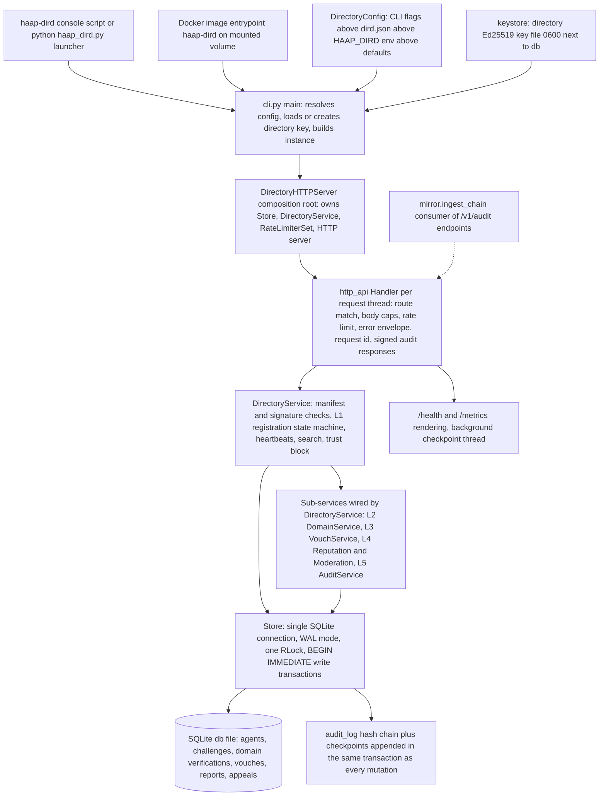
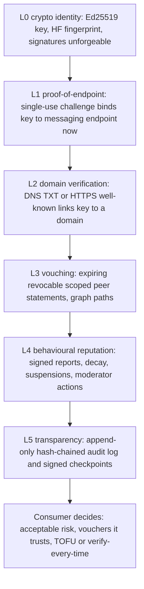

# System Overview — Topology, Trust Ladder & Build Phases

The HAAP Public Directory (`haap-directory`) is the federated **phone book** of the HAAP (Hermes Agent Alliance Protocol) ecosystem: agents register an Ed25519-signed capability manifest, prove control of their messaging endpoint, keep their entry alive with signed heartbeats, and become discoverable by capability, geography, language and free text. It is the production, SQLite-backed evolution of the in-memory reference registry shipped inside the `haap` client package, stays **wire-compatible** with the unmodified client, and exposes a canonical `/v1` HTTP API plus thin legacy aliases. This page is the entry map: who owns which component, how a request flows through the layers, what the L0–L5 trust ladder is, and what state the F0–F6 phased build is in. It is the starting point before reading any single page of this wiki.

The implementation is governed by a small set of deliberate constraints that shape every layer (full list in [Cross-cutting constraints](#cross-cutting-constraints)):

- **Stdlib-first.** The HTTP surface is `http.server`, persistence is `sqlite3`; `cryptography` is the *only* runtime dependency (Ed25519). No FastAPI, no Pydantic, no uvicorn — validation those would give for free is implemented explicitly.
- **Canonical JSON is vendored and frozen.** `canonical.py` reproduces the exact byte serialization the `haap` client signs; any deviation breaks signature verification.
- **One SQLite connection, one write lock.** All state changes and their L5 audit entries commit in the same `BEGIN IMMEDIATE` transaction.
- **Time is injected.** Expiry, age, decay, freshness and checkpoint cadence all read an injectable `Clock`, never `time.time()` directly.
- **Error codes are API.** The `errors.py` code table is add-only, and each rejection carries a stable code in a fixed envelope.

## The one principle: phone book, not notary — never a judge

Every component and every API decision is read through one lens, stated in the README, `AGENTS.md`, and the package docstring:

> **The directory is a phone book, not a notary — and never a judge.**

Identity lives in the agents' Ed25519 keys, not in the directory. The directory indexes signed manifests and verifies endpoint control, so its compromise must never allow impersonation; it verifies cryptographic facts and runs *published automata* only. What it returns is **labelled signals with provenance** — `domain_verified`, `vouches_in`, `reports`, `status`, `block_recommendation`, `audit_verifiable` — and **never** a "safe/trusted" verdict or a collapsed trust score. Directory decisions are limited to what to index (L0/L1 compliance), what to expose (all signals), and what to restrict under its terms of service for abuse classes (L4 suspensions, moderator takedowns). The consumer always decides. If a change would make the directory *assert* trust rather than *report* facts, it is wrong.

This stance is enforced mechanically: clients never present a fingerprint as identity — the service recomputes `HF-…` from the presented public key; signature checks cover every signed object (manifests, heartbeats, vouches, reports, moderator actions) over canonical JSON; and the per-listing trust block is assembled from whatever L1–L5 signals exist, with honest "no signal yet" defaults when a service has nothing to report.

## Module ownership map

The single-sentence ownership summary: `http_api.py` owns the HTTP surface; `service.py` together with the `domain`/`vouching`/`reputation`/`moderation`/`audit_service` modules owns orchestration and trust signals; `store.py` together with `audit.py` owns persistence and transparency; `config`/`keystore`/`cli`/`telemetry`/`rate_limit`/`mirror` are the ops and integration seams. Detail pages: [HTTP layer](/openwiki/architecture/http-layer.md), [service layer](/openwiki/architecture/business-logic.md), [store and audit](/openwiki/architecture/store-and-audit.md).

| System | Modules | Responsibility |
|---|---|---|
| HTTP surface | `http_api.py` | stdlib `ThreadingHTTPServer`; `/v1` route table + legacy aliases; body caps and JSON parsing; per-IP rate limiting; request IDs; stable error envelope; response-signing headers; `/health` `/metrics` |
| Orchestration & trust signals | `service.py`, `domain.py`, `vouching.py`, `reputation.py`, `moderation.py`, `audit_service.py` | L1 registration state machine, heartbeats, search/profile, trust-block assembly; L2 domain verification; L3 vouching graph; L4 reports/auto-suspend/appeals and moderator-key actions; L5 checkpoints, chain verify, signed responses |
| Persistence & transparency | `store.py`, `audit.py` | All SQL; single-writer transactions; append-only hash-chained audit log; genesis; agent/challenge/vouch/report/checkpoint/appeal tables |
| Shared substrate | `manifest.py`, `canonical.py`, `crypto.py`, `identity.py`, `signing.py`, `errors.py`, `timeutil.py`, `verify.py`, `resolver.py` | Manifest schema/size/float checks; frozen canonical JSON; Ed25519 wrappers; fingerprint derivation; signed-body verification; stable codes; injectable clock; DNS/well-known checkers and the resolver seam |
| Ops & integration seams | `cli.py`, `config.py`, `keystore.py`, `telemetry.py`, `rate_limit.py`, `mirror.py`, `haap_dird.py`, `Dockerfile` | Entry points, precedence, directory key, metrics rendering, token buckets, audit-chain mirror ingest, container packaging |

## Entry points and process shape

There are three equivalent ways to start the server, all reaching the same `cli.py:main` loop:

- the installed console script **`haap-dird`** (`pyproject.toml` `[project.scripts]` → `haap_directory.cli:main`);
- **`python haap_dird.py`**, a convenience launcher that prepends `src/` to `sys.path` so a source checkout runs without installation;
- the **Docker image**, whose `ENTRYPOINT ["haap-dird"]` defaults to `--db /data/dird.db --host 0.0.0.0 --port 8444` against a mounted volume (the image also installs `dnsutils` because the L2 `dns_txt` method shells out to `dig`).

`main()` resolves configuration, loads-or-creates the directory signing key, and — for server mode — builds the full instance and blocks in `serve_forever()` until `SIGINT`/`SIGTERM`, which triggers graceful shutdown (stop the socket, sign a final audit checkpoint, close the store). Two offline actions exist: `--prune` (open the DB, prune expired entries, exit) and `--gen-key` (mint or show the directory key and exit).

Configuration precedence is **CLI flags > `~/.haap/dird.json` > env `HAAP_DIRD_*` > built-in defaults**, applied by `DirectoryConfig.load()` with per-field type coercion. Only plain, non-secret operational settings live in config (`db_path`, `host`, `port`, `ttl_hours`, `max_agents`, rate limits, L2–L5 timers, `moderator_keys`, …). The directory's Ed25519 signing key is deliberately **not** part of any config object: `keystore.py` persists it as a JSON file (default `<db>.dirkey.json`, `0600` permissions) whose fingerprint becomes the `directory_fingerprint` echoed on responses.

## Topology: how the instance is composed

One process owns one SQLite database, one signing key, one HTTP server, and one service object — there is no separate worker tier. `DirectoryHTTPServer` is the composition root: `build()` constructs the `Store` and `DirectoryService`, then the server owns both plus a `RateLimiterSet`; each request runs on a daemon thread of the `ThreadingHTTPServer`.

The diagram shows the control-flow spine: transport concerns (parsing, routing, caps, limiting) end at the handler; orchestration and validation happen in `DirectoryService` and its sub-services; every write goes through `Store`, which commits the state change and exactly one audit entry together; reads and writes share the same connection behind one lock.

## Layering and control flow

**HTTP surface (`http_api.py`)** — One handler class dispatches `do_GET`/`do_POST`/`do_DELETE` over a literal-then-regex route table. The layer is deliberately thin: it accepts/echoes or mints `X-Request-Id`, enforces `max_body_bytes`, parses JSON, consults token-bucket limiters, and serializes results or `DirectoryError`s into the wire envelope. Canonical routes live under `/v1`; thin legacy aliases (`POST /register`, `/register/complete`, `/heartbeat`, `GET /search`, `/agents/{fp}`) keep the unmodified `haap` client working with identical semantics and legacy body shapes. Audit endpoints answer through `_send_signed`, adding `X-HAAP-Directory-Signature` and `X-HAAP-Directory-Fingerprint`.

**Orchestration (`service.py` + sub-services)** — `DirectoryService` holds no HTTP code and the `Store` holds no business decisions. It validates, runs the L1 proof-of-endpoint state machine and heartbeat renewal, filters search, and assembles the per-listing trust block. It constructs `DomainService` (L2) eagerly and attaches `VouchService` (L3), `ReputationService` and `ModerationService` (L4), and `AuditService` (L5) via `_attach_subservices()`, then prunes expired entries on startup.

**Persistence (`store.py`)** — All SQL lives in `store.py`. The schema persists agents (live rows plus `is_history` rows so expiry is an audited transition, not a delete), pending challenges, domain verifications, vouches, reports, the append-only `audit_log`, signed `checkpoints`, and `appeals`.

A generic write-path invariant: *every state change appends exactly one audit entry in the same transaction as the mutation.* Reads may read through the same connection; writers serialize behind a single re-entrant lock with `BEGIN IMMEDIATE` — correct and simple at v1 scale, and what makes the L5 audit entry atomic with the state it records.

## The L0–L5 trust ladder

The trust architecture is the heart of the design. Each layer is a *claim* the directory verifies as far as cryptography and protocol allow, then **labels with its method and timestamp**; higher layers do not erase lower-layer facts; no layer depends on a secret the directory holds; and the marginal cost of faking the next persona rises monotonically with the credibility an attacker wants:

| Layer | Meaning | Code home | Public signal |
|---|---|---|---|
| L0 | Cryptographic identity — Ed25519 key; fingerprint `HF-` + `sha256(pubkey)[:16]`, always recomputed server-side | `crypto.py`, `identity.py`, `manifest.py` | signed manifest; key↔fingerprint binding |
| L1 | Proof-of-endpoint — two-step, single-use challenge proves the key holder controls the declared endpoint *now* | `service.py`, `store.py` | listing, `fresh`, heartbeat history |
| L2 | Domain/business verification — directory itself checks `_haap.<domain>` TXT via `dig` or fetches `https://<domain>/.well-known/haap-verify.txt` over TLS; valid 90 days; never "verified business" or KYC | `domain.py`, `verify.py`, `resolver.py` | `domain_verified` + `domain_verification` block |
| L3 | Vouching — expiring, revocable, scoped statements signed by listed agents; served as raw graph edges and paths, never an aggregate score; collusion is made visible, not "stopped" | `vouching.py` | `vouches_in`, `/v1/trust/paths` |
| L4 | Behavioural reputation — deterministic automata over signed reports (tenure/eligibility gates, decay, unique-reporters), a narrow audited auto-suspend, and moderator-key takedown/suspend/appeal; reports are allegations, never findings | `reputation.py`, `moderation.py` | `reports`, `status`, `block_recommendation`, suspension block |
| L5 | Transparency — append-only, hash-chained audit log (`entry_hash[n] = sha256(canonical_json(entry[n]))`, genesis `prev_hash = "0"*64`); detail bodies never enter the chain, only their `detail_hash` | `store.py`, `audit.py`, `audit_service.py` | `audit_verifiable`, `/v1/audit/*`, signed checkpoints |

L5 is what makes the whole operation public: a background thread signs an audit checkpoint on the configured cadence (default hourly) and a final one on shutdown; every audit response is signed by the directory key so consumers can detect a rewrite of anything they have already seen. Full threat-model and honesty-of-limitations discussion for each layer lives in `docs/SPEC.md` §3; the wiki's [trust model](/openwiki/concepts/trust-model.md) page expands the ladder.

## F0–F6 build status (snapshot)

All phases of the `docs/SPEC.md` §7 build plan (F0–F6) are implemented, tested, and green; the full L0–L5 trust ladder is live. Test file names map to phases (`test_registration`, `test_search_heartbeat`, `test_domain_verification`, `test_vouching`, `test_reputation`, `test_audit_chain`, `test_checkpoints`, `test_ops_federation`, …), and each rejection case asserts its stable code.

| Phase | Scope | State |
|---|---|---|
| **F0** | Repo skeleton, persistent SQLite store, `haap-dird` CLI, `/health`, config precedence | ✅ |
| **F1** | L1 proof-of-endpoint registration on SQLite, persistence, upsert/expiry, stable error codes | ✅ |
| **F2** | Search (capability / free-text AND / geo / pagination / trust filters), heartbeat (v1 signed + legacy), expiry prune | ✅ |
| **F3** | L2 domain verification (DNS TXT / HTTPS well-known), injectable resolver, 90-day expiry | ✅ |
| **F4** | L3 vouching (graph, paths, caps) + L4 reports, auto-suspend, decay, moderation, appeals | ✅ |
| **F5** | L5 signed checkpoints, `/v1/audit/*` (head/log/checkpoints/verify/agent), response signing | ✅ |
| **F6** | Federation mirror seam, Docker image, `/metrics`, rate-limit hardening, operator docs | ✅ |

The layered-trust principle holds throughout: search results and profiles return labelled signals with provenance and **never** a "safe/trusted" verdict — consumers always decide.

## Cross-cutting constraints

These conventions "will bite you" if violated (`AGENTS.md`):

- **Audit chain == mutating ops.** Every state change appends exactly one audit entry in the same `BEGIN IMMEDIATE` transaction (`store.py:_append_audit`). New mutating methods must preserve this invariant — "audit rows == mutating ops" holds by construction.
- **Single connection, single write lock.** One `sqlite3` connection (`check_same_thread=False`) in WAL mode behind one `threading.RLock`; writers run explicit `BEGIN IMMEDIATE` transactions. No connection pools, no async.
- **Canonical JSON is frozen.** `json.dumps(sort_keys=True, separators=(",", ":"), ensure_ascii=False).encode("utf-8")`, vendored byte-for-byte identically to the `haap` client so the directory has no import dependency on it.
- **Error codes are API.** `errors.py:ERROR_STATUS` is add-only (never rename, remove, or repurpose); messages are short and MUST NOT leak internals; codes are reserved ahead of their handlers.
- **Time is injected.** All expiry/clock logic reads an injected `Clock` (`timeutil.system_clock` default; tests use a `MutableClock`); wire timestamps are fixed-width RFC 3339 UTC, and server time is authoritative for all TTLs.
- **Wire compatibility.** Legacy routes must keep working for the unmodified `haap/registry_client.py`; `/v1/*` is canonical. The compat test runs the real client when `HAAP_REPO` points at the companion checkout.
- **No floats in signed objects.** Manifest validation rejects any float anywhere (`FLOAT_FORBIDDEN`) — prices are strings, geo is integer micro-degrees.

## Ops and integration seams

- **Observability.** `GET /health` returns status/version/agents/suspended/chain_seq/uptime/directory_fingerprint with no sensitive data; `GET /metrics` renders plain-text Prometheus-style exposition (`haapd_agents_listed`, `haapd_agents_suspended`, `haapd_audit_seq`, `haapd_ops_total`, `haapd_rejections_total{code=}`, uptime) with no client library.
- **Abuse controls.** In-memory per-IP token buckets protect the anonymous endpoints (`register` 5/hour, `search` 60/min defaults) with `429` + `Retry-After`; payload caps (`max_body_bytes`, `max_manifest_bytes`) and the `--max-agents` cap round it out. `X-Forwarded-For`/`CF-Connecting-IP` are honored only when the TCP peer is loopback (a same-host reverse proxy), so they cannot be spoofed from the open internet.
- **Federation.** The mirror seam (`haap_directory.mirror.ingest_chain`) downloads a directory's public `/v1/audit/log`, re-verifies the hash chain locally, and compares the reproduced head with `/v1/audit/head`; two independent operators whose mirrors agree on a head prove they saw the same ordered world — federation without a central registry of directories.
- **Runtime dependency discipline.** Only `cryptography` is required at runtime; the Docker image adds the `dig` binary (`bind9-dnsutils`) for the L2 `dns_txt` method. Backup/restore, key handling and deployment guidance are in `docs/OPERATE.md` (see the [operations runbook](/openwiki/operations/runbook.md)).

## Where to go next

- [HTTP layer](/openwiki/architecture/http-layer.md) — the full route table, error envelope, rate limiting, signed audit responses.
- [Service layer](/openwiki/architecture/business-logic.md) — L1 state machine, heartbeats, search pipeline, trust-block assembly.
- [Store and audit](/openwiki/architecture/store-and-audit.md) — schema, transaction model, audit chain construction.
- [Registration lifecycle](/openwiki/workflows/registration-lifecycle.md), [trust model](/openwiki/concepts/trust-model.md), [test suite](/openwiki/testing/test-suite.md), [runbook](/openwiki/operations/runbook.md), [quickstart](/openwiki/quickstart.md).
