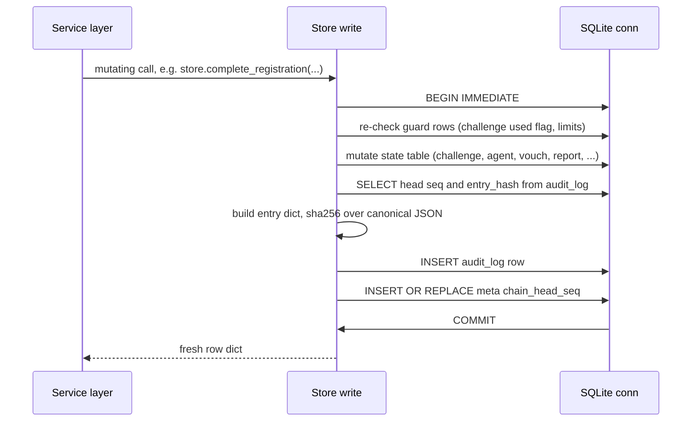
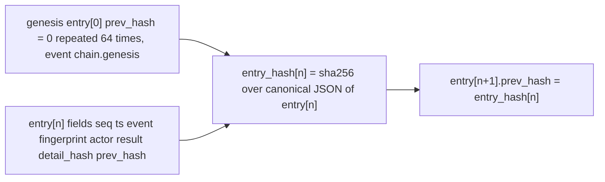

# Store & Audit Chain — SQLite Schema, Transactions and the Audit-Equals-Mutation Invariant

`Store` (`src/haap_directory/store.py`) is the directory's **only SQL owner**: all persistence SQL lives in that file, and every state change in the system — registration, heartbeats, domain verifications, vouches, reports, suspensions, appeals, expirations — lands here and is recorded in the **L5 append-only hash-chained audit log** (SPEC §3.6). The audit chain is not a post-hoc hook or an after-the-fact reporter: `_append_audit` runs **inside the same SQLite write transaction** as the mutation it describes, so "if the state change commits, the chain entry commits; there is no window where state moved without a log line" (SPEC §3.6.1). The pure chain math lives in `audit.py`; `Store` applies it at append time, and `AuditService` (`audit_service.py`) signs checkpoints over the head. Expiry, registration timestamps, and audit timestamps all read an **injected clock**, never wall time directly.

The rest of the write path is layered: `http_api.py` parses requests, `DirectoryService` and its sub-services validate and orchestrate (see [business-logic](/openwiki/architecture/business-logic.md) and [http-layer](/openwiki/architecture/http-layer.md)), and every mutating call funnels into a `Store` method that opens a serialized write transaction.

## The core invariant: audit rows == mutating state writes

> **Every mutating operation appends exactly one audit entry via `_append_audit` inside the same write transaction in which the state change happens.** No store method may mutate a state table and return without having appended its chain line; conversely no chain line exists without a state change.

The store module docstring states it outright: *"Every method that changes state also appends exactly one audit entry, so 'audit rows == mutating ops' holds by construction"* (SPEC §3.6.1, §5.3). The invariant is structural, not aspirational:

- All writes run through the `_write()` context manager, which yields a cursor inside an open `BEGIN IMMEDIATE` transaction.
- `_append_audit(cur, event, actor, result, fingerprint, detail)` inserts the chain row **with that same cursor**, so the audit insert shares the commit/rollback of the state change.
- The chain `seq` and `prev_hash` are derived by reading the current head **under the same write lock**, which — because writers are serialized — makes the log contiguous and gap-free by construction.

Consequences that follow:

- A registration that fails (e.g. `CHALLENGE_USED`, a rollback on any exception) leaves **no** chain entry; a registration that commits leaves its `register.completed`/`register.updated` entry in the same commit as the agent upsert.
- One request can legitimately produce several entries when it performs several distinct state changes: `insert_challenge` evicts the oldest pending challenge (appending `challenge.evicted`) and then inserts the new challenge (appending `register.challenge_issued`) inside one transaction; `prune_expired` appends one `agent.expired` entry per row it flips.
- The F5 acceptance framing "audit rows == ops" is tested end-to-end: registering one agent advances the head by at least 2 (`challenge_issued` + `register.completed`), and the test suite asserts the whole log is contiguous and verifiable.

Two `Store` writers intentionally do **not** extend the chain, and knowing them is part of the rule:

- `insert_checkpoint` writes a **directory-key signature over the head** into the `checkpoints` table; a checkpoint is an external attestation of the chain, not an event *in* it (appending to the chain while checkpointing it would be self-referential).
- `mark_challenge_used` mutates a challenge row without an audit append. It has **no callers** anywhere in the tree — the real paths consume challenges inside `complete_registration` / `confirm_domain_verification`, which do audit. If it is ever wired up, it must gain an append inside its transaction.

**Rule for new mutating code:** add the method on `Store`, open `with self._write() as cur:`, mutate rows through `cur`, call `self._append_audit(...)` before leaving the block, choose a stable `event` name, and add a test that the head advances. Never append outside a `_write` block and never commit in the middle of one.

## Concurrency model: one connection, one lock, no pools, no async

The model is deliberately minimal and is stated precisely in the module docstring and constructor:

- `Store.__init__` creates **exactly one `sqlite3` connection** with `check_same_thread=False`, sets `row_factory = sqlite3.Row`, and `isolation_level = None` (manual transaction control, i.e. Python-level autocommit unless a transaction is explicitly begun).
- On creation it executes `PRAGMA journal_mode=WAL`, `PRAGMA foreign_keys=ON`, `PRAGMA busy_timeout=5000`.
- **Every** database operation — read or write — is guarded by a single `threading.RLock` held on the `Store` instance.
- **Reads** run inside `with self._lock:` as plain `SELECT`s in autocommit mode; they never open a transaction and see only committed WAL state.
- **Writes** always go through the `_write()` context manager:

```python
@contextmanager
def _write(self):
    with self._lock:
        cur = self._conn.cursor()
        cur.execute("BEGIN IMMEDIATE;")
        try:
            yield cur
            self._conn.execute("COMMIT;")
        except Exception:
            self._conn.execute("ROLLBACK;")
            raise
```

`BEGIN IMMEDIATE` takes the SQLite write lock up front, so a writer never upgrades into a deadlock mid-transaction. There are **no connection pools and no async database access**: the stdlib `ThreadingHTTPServer` dispatches request threads, and every thread serializes on the RLock when it touches the database. The rationale (module docstring, SPEC §5.3): SQLite is single-writer, serializing writers behind one lock is correct and simple at v1 scale, and it is what lets the audit entry be appended in the same transaction as the mutation it records. `Store.close()` closes the single connection; `DirectoryHTTPServer.stop()` calls it after writing the final checkpoint.

Schema creation and migrations also happen under the lock but outside any manual transaction: `executescript(_SCHEMA)` auto-commits in its own transaction (it must not be nested inside a manual `BEGIN`), and each statement is `IF NOT EXISTS`, so startup is idempotent.

## Write pipeline: one transaction, one append



Caption: Every mutation and its audit entry commit or roll back together inside one `BEGIN IMMEDIATE` transaction; the chain head read that determines `seq`/`prev_hash` happens under the same write lock.

`_append_audit` (store.py) implements the mechanics:

1. Reads the head row `SELECT seq, entry_hash FROM audit_log ORDER BY seq DESC LIMIT 1` **through the caller's open transaction**. If the log is empty it starts at `seq = 0` with `prev_hash = audit.GENESIS_PREV_HASH` (`"0" * 64`); otherwise `seq = head["seq"] + 1` and `prev_hash = head["entry_hash"]`.
2. Defaults the entry timestamp to `to_rfc3339(self.now())` — i.e. the injected clock, formatted as fixed-width RFC 3339 UTC (see below) — unless the caller supplied one.
3. Builds the canonical entry dict with `audit.build_entry(...)`, computes `entry_hash = sha256(canonical_json(entry))`, and inserts the full row (`seq, ts, event, fingerprint, actor, result, detail_hash, prev_hash, entry_hash`) into `audit_log`.
4. Maintains the `meta` row `chain_head_seq` with `INSERT OR REPLACE` (SPEC §5.4 keeps a cached head for cheap checkpoint checks), and returns the entry dict including its computed `entry_hash`.

## Chain construction math (audit.py is pure)

`audit.py` is **pure functions only — no storage**. `Store` calls it at append time; `AuditService.verify` and `tests/test_audit_chain.py` call it to re-check the chain. The normative construction (SPEC §3.6.1, module docstring):

```
entry[n]      = {seq, ts, event, fingerprint, actor, result,
                 detail_hash, prev_hash}
entry_hash[n] = sha256(canonical_json(entry[n]))
entry[0]      = genesis: prev_hash = "0" * 64, event = "chain.genesis"
```

Field meanings, as stored in `audit_log`:

| Field | Meaning |
|---|---|
| `seq` | Monotonic integer, `audit_log` primary key; `0` is genesis, then contiguous. |
| `ts` | Entry time, fixed-width RFC 3339 UTC string from the injected clock. |
| `event` | Stable taxonomy name (`chain.genesis`, `register.challenge_issued`, `register.completed`, `register.updated`, `heartbeat.ok`, `heartbeat.legacy_unsigned`, `agent.expired`, `domain.verify_requested`, `domain.verified`, `vouch.created`, `vouch.revoked`, `report.recorded`, `moderator.suspend`, `moderator.takedown`, `moderator.unsuspend`, `report.auto_suspend`, `appeal.submitted`, `challenge.evicted`, ...). |
| `fingerprint` | Subject agent fingerprint (`HF-…`) or `NULL` for directory-level events (genesis, evictions). |
| `actor` | `agent:HF-…`, `moderator:HF-…`, `directory`, or a channel label. |
| `result` | `ok`, `suspended`, or a rejection/summary token. |
| `detail_hash` | `sha256(canonical_json(detail))` — see below. |
| `prev_hash` | `entry_hash[n-1]`; the link to the previous entry. |
| `entry_hash` | `sha256(canonical_json(entry[n]))`, stored so head comparison is cheap. |

The hash input is the **canonical JSON** of the entry, produced by `canonical.py`, which deliberately vendors the exact serializer the `haap` client package uses — `json.dumps(obj, sort_keys=True, separators=(",", ":"), ensure_ascii=False).encode("utf-8")` — so the directory has no hard import dependency on the client and every hash/signature is byte-compatible. `detail_hash` is the sha256 hex of the canonical JSON of the detail object (`{}` when the detail is `None`), so **sensitive bodies — manifest internals, nonces, evidence, reasons — never enter the public chain; only their hash does** (SPEC §3.6.3, verified by a test asserting every stored `detail_hash` is 64 hex chars).

`verify_chain(entries)` recomputes `entry_hash` for every row from its eight canonical fields, compares against the stored `entry_hash`, and checks that each row's `prev_hash` equals the previous row's `entry_hash`. Any modification, deletion, or reordering changes every descendant hash and the head — tampering with a single `event` field fails verification (tested). The guarantee is tamper-*evidence*, not tamper-proofness: the operator who controls the database can rewrite it, and signed checkpoints (plus independent mirrors) are what make a rewrite *detectable* by anyone who fetched a checkpoint before it happened.



Caption: Each entry's hash binds to the previous one through `prev_hash`; rewriting any entry changes every descendant hash and the head that checkpoints sign.

## SQLite schema (derived from the `_SCHEMA` constant)

`SCHEMA_VERSION = "1"`; `_migrate()` executes the idempotent `_SCHEMA` (`CREATE TABLE IF NOT EXISTS`, `CREATE INDEX IF NOT EXISTS`) at startup and records `meta.schema_version` with `INSERT OR IGNORE`. All schema evolution in v1 is additive. Nine tables:

| Table | Role | Key columns and indexes |
|---|---|---|
| `meta` | Key/value store for schema bookkeeping and the cached chain head. | `key` PK; seeded with `schema_version = "1"`; every append maintains `chain_head_seq`. |
| `agents` | Current directory state per fingerprint: manifest snapshot, liveness, listing status. | `fingerprint` PK; `status` (listed/suspended/expired), `is_history`, `expires_epoch`, `registered_at`/`registered_epoch`, `last_heartbeat*`, `endpoint_proof_at`, `suspension_json`/`suspended_at`; indexes `idx_agents_status(status)`, `idx_agents_expires(expires_epoch)`. |
| `challenges` | Single-use, short-TTL endpoint (`kind='endpoint'`) and domain (`kind='domain'`) challenges with the validated manifest captured at submit. | `challenge_id` PK; `used` flag, `expires_epoch`, bound `fingerprint`/`public_key_b64`/`endpoint`/`domain`/`nonce`; indexes `idx_challenges_fp(fingerprint)`, `idx_challenges_exp(expires_epoch)`. |
| `domain_verifications` | L2 result rows (default 90-day validity) proving domain control. | `id` PK; `fingerprint`, `domain`, `method`, `verified_at`/`expires_at` + epoch twins, `endpoint_match`, `challenge_id`; index `idx_dv_fp(fingerprint)`. |
| `vouches` | Signed, scoped, expiring vouching statements (weight defaults to 1) with the voucher's signature persisted. | `vouch_id` PK; `voucher_fingerprint`, `vouchee_fingerprint`, `scope`, `expires_epoch`, `revoked_at`, `signature_b64`; indexes `idx_vouches_vouchee`, `idx_vouches_voucher`. |
| `reports` | L4 allegations: attributed, hashed-evidence rows feeding counters/automata. | `report_id` PK; `target_fingerprint`, optional `reporter_fingerprint`, `category`, `severity`, `evidence_hash`/`description_hash` (never bodies), `counts` eligibility flag, `submitted_at`/`submitted_epoch`; indexes `idx_reports_target`, `idx_reports_reporter`. |
| `audit_log` | The L5 hash chain itself — append-only rows, `seq` is the chain index. | `seq` PK; the eight canonical fields plus stored `entry_hash`; index `idx_audit_fp(fingerprint)` for per-agent views. |
| `checkpoints` | Directory-key signatures over the chain head; `seq` is the audit head seq at signing time. | `seq` PK (= head `seq`), `entry_hash`, `ts`, `signature_b64`; written with `INSERT OR REPLACE`, so at most one checkpoint per head seq. |
| `appeals` | Agent appeals against suspensions (status open/granted/denied; only `open` is created today). | `appeal_id` PK; `fingerprint`, `statement`, `submitted_at`, `status`; index `idx_appeals_fp(fingerprint)`. |

Relationships between domain tables (e.g. `audit_log.fingerprint`, `vouches.voucher_fingerprint`, `reports.target_fingerprint`) are **by-value references, not enforced foreign keys** — no FK constraints are declared, so a `Store` method performs its own referential checks (e.g. `SIGNATURE_MISMATCH` on vouch revocation, `AGENT_NOT_FOUND` on suspend) inside its transaction.

## Time: the injected Clock and fixed-width RFC 3339

`Store(db_path, clock=system_clock)` takes the clock at construction, and every expiry/registration/audit decision reads it through `self.now()` — epoch seconds as a float. The whole service follows the same rule (see [business-logic](/openwiki/architecture/business-logic.md)): tests inject a `MutableClock` and advance it, so TTL expiry, checkpoint cadence, and decay are exercised deterministically without sleeping.

Two representations of every timestamp are stored: the **RFC 3339 UTC text** used on the wire and in signatures, and the **integer epoch** used for comparisons and index-friendly queries (`registered_epoch`, `expires_epoch`, `submitted_epoch`, `created_epoch`, `verified_epoch`). `timeutil.to_rfc3339` truncates to the integer second and formats `YYYY-MM-DDTHH:MM:SSZ`, which keeps the string fixed-width — signature-stable and lexicographically ordered == time ordered. `from_rfc3339` accepts `Z` or an explicit offset and raises `ValueError` on unparseable input (callers map that to a stable error code). Server time is authoritative for all TTLs, and the audit `ts` of an entry comes from the same injected clock as the expiry arithmetic of the mutation that appends it.

## Expiry, heartbeats and pruning

Listing state is TTL-driven, not absolute: every `agents` row stores `expires_epoch`/`expires_at`, and "live" means `status='listed'` and `is_history=0` and `expires_epoch >= int(now)` (`is_live_row`). Mutations that touch liveness:

- **Registration/refresh** — `_upsert_agent_cur` (inside `complete_registration`) sets a fresh TTL from `now`; a *live* re-registration is an UPDATE that preserves `registered_at`/`registered_epoch` (so `listed_since` survives) and is audited as `register.updated`; an expired or absent fingerprint is a fresh INSERT audited as `register.completed`.
- **Heartbeat** — `heartbeat(fingerprint, ttl_s, legacy=False)` renews `last_heartbeat*` and the TTL only when the row is still live (returns `None` otherwise), emitting `heartbeat.ok` or `heartbeat.legacy_unsigned`.
- **Pruning** — `prune_expired()` selects `status='listed' AND is_history=0 AND expires_epoch < now` and, per row, UPDATEs to `status='expired', is_history=1` and appends `agent.expired` with detail `{"at": now}` — all in one transaction. It is idempotent (an already-expired row is not touched again) and returns the number pruned. It runs on service startup (`DirectoryService.__init__`), offline via `haap-dird --prune`, and lazily at the top of `live_agents()`/`count_live()` so reads never observe stale listings.
- **Suspension** — `suspend_agent` (used by the `report.auto_suspend` automaton and by moderator `moderator.suspend`/`moderator.takedown`) stores a JSON `suspension` object (`{rule, evidence_reports, at}`) in the row and appends one entry with result `suspended`; `unsuspend_agent` restores `listed` with a fresh TTL and appends `moderator.unsuspend`.

Expired challenges, domain verifications, and vouches are **not deleted or transitioned**: readers simply filter on `expires_epoch >= now` (`active_domain_verifications`, `inbound_vouches(active_only=True)`, pending-challenge queries). Challenge rows additionally get evicted (audited as `challenge.evicted`) when a new endpoint challenge would exceed the pending cap.

## Audit reads and checkpoint persistence

`Store` exposes the read side of the chain and the checkpoint table; signing and cadence live in `AuditService` (see [audit-transparency](/openwiki/workflows/audit-transparency.md) for the consumer view):

- `audit_head()` returns `{seq, ts, entry_hash}` of the last row — the value `/v1/audit/head` signs and `/v1/audit/verify` re-computes against.
- `audit_entries(after=-1, limit=100)` pages the log in ascending `seq` order (`limit` clamped to 1000); `/v1/audit/log` serves contiguous ranges this way, and the HTTP test asserts `seqs == list(range(len(seqs)))` and `head.seq == seqs[-1]`.
- `audit_entries_for_fingerprint(fp)` returns the redacted per-agent projection (`seq, ts, event, fingerprint, actor, result, detail_hash`) — **never a detail body** — for `/v1/agents/{fp}/audit`.
- `insert_checkpoint(seq, entry_hash, ts, signature_b64)` persists one signed head snapshot per seq (`INSERT OR REPLACE`); `AuditService.create_checkpoint` signs the canonical JSON of `{seq, entry_hash, ts}` with the directory Ed25519 key, `maybe_checkpoint` enforces the cadence (`checkpoint_interval_s`, 3600 s default), a background thread in `DirectoryHTTPServer` signs on the cadence, and a **final checkpoint is written on shutdown** (`server.stop()` → `audit.create_checkpoint()` → `store.close()`), verified by a test that reopens the DB and finds a persisted checkpoint.
- Every audit/verify response body is additionally signed as a whole (`X-HAAP-Directory-Signature` header over the canonical JSON of the body), so a consumer can detect a rewrite of anything it has already seen.

## Failure semantics and extension points

Because every mutator runs inside `_write`, **failure is atomic in both directions**: if the state change raises (a `DirectoryError` such as `CHALLENGE_NOT_FOUND`, `CHALLENGE_USED`, `VOUCH_LIMIT_REACHED`, `VOUCH_EXISTS`, `REPORT_EXISTS`, `VERIFICATION_LIMIT_REACHED`, or any internal error), the whole transaction — mutation *and* audit line — rolls back and no partial state survives. Guard checks that must win races (challenge single-use, dedupe windows, caps) are therefore re-executed **under the write lock** inside the transaction, not trusted from earlier reads; `complete_registration` re-checks `challenges.used` after `BEGIN IMMEDIATE` so a replayed completion loses the race with `CHALLENGE_USED`.

Extension checklist for anyone adding a state change: put the SQL in `store.py`; mutate through a `_write` cursor; call `_append_audit` before the block ends with a stable event name from the taxonomy; keep sensitive detail out of the chain by passing a small object to hash; never write outside `_write`; add the event to tests asserting head growth and chain verification.

## Focused tests

- `tests/test_store.py` — genesis creation on an empty DB (seq 0, `chain.genesis`, `prev_hash == "0"*64`), persistence across restart, health/config precedence, live counting after registration.
- `tests/test_audit_chain.py` — every mutation advances the head, the chain links and re-verifies, `/v1/audit/log` is contiguous with a consistent head, tampering with one entry breaks `verify_chain`, and every `detail_hash` is a 64-hex hash with no detail body stored.
- `tests/test_checkpoints.py` — the head and checkpoint signatures verify against the directory key, `maybe_checkpoint` respects the configured cadence under an injected clock, `/v1/audit/verify` recomputes the head hash, per-agent audit is redacted (`detail_hash` present, `detail` absent), and shutdown persists a final checkpoint.

Related: [business-logic](/openwiki/architecture/business-logic.md) (who calls `Store`), [http-layer](/openwiki/architecture/http-layer.md) (endpoint wiring, signed responses), [signed-wire-format](/openwiki/concepts/signed-wire-format.md) (canonical JSON parity), [audit-transparency](/openwiki/workflows/audit-transparency.md) (checkpoint verification and mirroring), [runbook](/openwiki/operations/runbook.md) (backup/operate), [test-suite](/openwiki/testing/test-suite.md).
