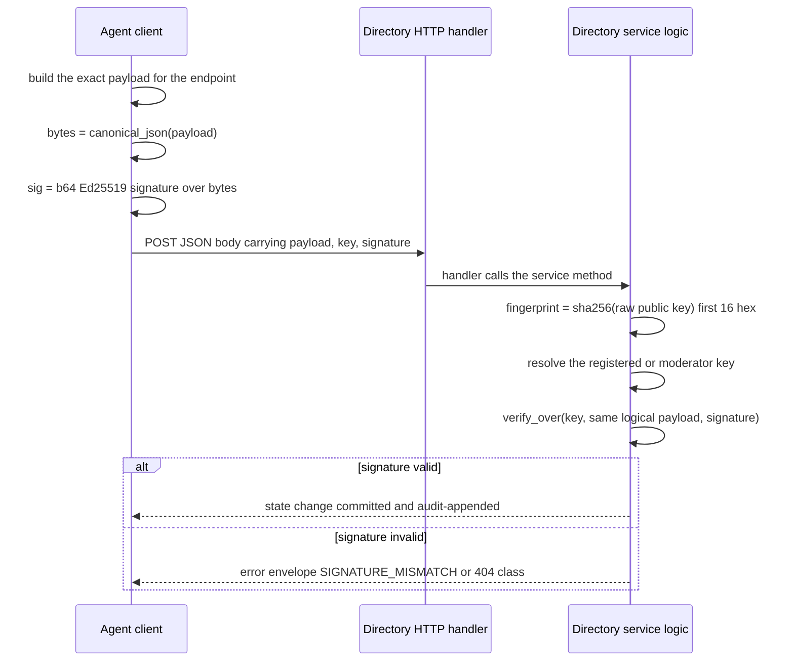

# Signed Wire Format — Canonical JSON, Ed25519 Conventions & Frozen Contracts

The HAAP directory's whole trust model rests on one idea: an agent's **Ed25519 public key is its identity**, and every state-changing claim arrives as a signature over an exact byte string. If two parties ever disagree about what those bytes are — key encoding, JSON serialization, which body fields are covered — verification silently breaks and trust dissolves. This page records the parts of that substrate that must never drift:

1. the **frozen canonical-JSON serialization** (`src/haap_directory/canonical.py`),
2. the **Ed25519 / base64 / fingerprint conventions** (`crypto.py`, `identity.py`),
3. the **request-signing pattern** — `verify_over` / `subset` in `signing.py` and the exact signed bytes each mutating endpoint demands,
4. the **manifest hard rules** that protect the signed bytes (`manifest.py`),
5. the **stable error-code contract** (`errors.py`) every rejection surfaces.

These are contracts with the unmodified `haap` client package, so most of them are *frozen*: "improving" the serialization or renaming an error code is a breaking change, not a cleanup. The runtime plumbing that consumes this format lives on the [HTTP layer](/openwiki/architecture/http-layer.md) (route table, error envelope serialization, body caps) and [store and audit](/openwiki/architecture/store-and-audit.md) (persistence of canonical manifests and signed checkpoints); per-flow details live on the [registration lifecycle](/openwiki/workflows/registration-lifecycle.md), [domain verification](/openwiki/workflows/domain-verification.md), [vouching](/openwiki/workflows/vouching.md), and [reputation](/openwiki/workflows/reputation.md) pages.

## The one serialization: canonical JSON (frozen)

Every signature in the system — agent manifest signatures, endpoint proofs, heartbeats where applicable, L2/L3/L4 body signatures, moderator signatures, and the directory's own audit/checkpoint signatures — is computed over bytes produced by exactly one function (SPEC §2.7.1, verified against `haap/envelope.py` and `haap/registry_client.py`):

```python
def canonical_json(obj: Any) -> bytes:
    return json.dumps(
        obj, sort_keys=True, separators=(",", ":"), ensure_ascii=False
    ).encode("utf-8")
```

Properties of this form, all of which matter for cross-implementation verification:

- **`sort_keys=True`** — dict keys are emitted in sorted order at every nesting level, so the signer and verifier need not agree on insertion order;
- **`separators=(",", ":")`** — no whitespace after `,` or `:` (this differs from Python's default pretty-ish output and from most formatters);
- **`ensure_ascii=False`** — non-ASCII characters (e.g. `Peluquería`) are emitted as literal UTF-8, not `\uXXXX` escapes, then the whole string is `.encode("utf-8")`;
- output is **bytes**, and the byte string — not a Python object — is what Ed25519 signs and what hashes consume.

A `canonical_str(obj)` twin returns the same serialization as `str` for hashing/logging convenience (`src/haap_directory/canonical.py`). The function is **deliberately vendored** in the directory rather than imported from the `haap` package so the directory has no hard import dependency on the client code — but the contract is that both produce identical bytes. SPEC is explicit that any deviation breaks signature verification and must not be "improved". Because floats serialize differently across platforms/implementations and break canonical round-tripping, **the signed form forbids floats entirely** — see manifest rules below.

## Ed25519 and base64 conventions

`crypto.py` is a thin, verification-first wrapper over the `cryptography` library that reproduces the `haap` client's exact encoding conventions:

- public and private keys are **raw 32-byte** keys (no DER/PEM wrapping on the wire);
- all on-the-wire keys and signatures are **standard base64** (`b64e`/`b64d` — RFC 4648 alphabet, `=` padding, no URL-safe variants);
- `verify_with(raw_pub, data, signature)` returns `bool` and **never raises** on a bad signature, malformed key, or malformed signature — callers therefore cannot accidentally leak crypto internals in an error path;
- `KeyPair` (generate / from_private_bytes / sign / verify) is used by the directory only for its own single **directory key**: signing challenge nonces on the legacy register route and signing L5 audit checkpoints and responses. The directory verifies agent signatures; it never signs on an agent's behalf.

## Fingerprints: derived, never claimed

```python
FINGERPRINT_PREFIX = "HF-"
FINGERPRINT_HEX_LEN = 16
FINGERPRINT_RE = re.compile(r"^HF-[0-9a-f]{16}$")

def fingerprint_of_public_key(pub_raw: bytes) -> str:
    digest = hashlib.sha256(pub_raw).hexdigest()
    return FINGERPRINT_PREFIX + digest[:FINGERPRINT_HEX_LEN]
```

So **fingerprint = `"HF-"` + first 16 hex chars of `sha256(raw 32-byte public key)`**, matching `^HF-[0-9a-f]{16}$` (`identity.py`, identical semantics to `haap.identity`). The directory **never trusts a client-supplied fingerprint**: every place a fingerprint is asserted, the server recomputes it from the public key it actually verifies against and rejects any mismatch:

- registration recomputes `fingerprint_of_public_key(raw_pub)` from the presented `public_key_b64` and compares it with `manifest.agent.fingerprint` → `FINGERPRINT_MISMATCH` (`service.py` L94–L95);
- registration completion re-checks that the challenge's stored fingerprint matches and that any re-supplied `public_key_b64` equals the challenge-bound key → `KEY_MISMATCH`;
- heartbeats and L2/L3/L4 actions never accept a fingerprint as authority for *which key* signs — they look the key up from the store row (or moderator config) by fingerprint and verify with that key.

## How mutating requests are signed: the key is the credential

There is **no session auth** in the directory. Mutating agent endpoints authenticate by requiring a signature from the Ed25519 key that owns the affected identity (SPEC §4.0: "the key is the credential"). Two helpers centralize the check so every handler enforces it identically (`signing.py`):

```python
def verify_over(pubkey_b64: str, payload: Any, signature_b64: str) -> bool:
    raw_pub = b64d(pubkey_b64)
    sig = b64d(signature_b64)
    return verify_with(raw_pub, canonical_json(payload), sig)

def subset(body: dict, fields: tuple[str, ...]) -> dict:
    return {k: body[k] for k in fields if k in body}
```

`verify_over` base64-decodes the key and signature, canonicalizes the payload, and verifies. `subset` builds the exact signed object from **only the named fields that are present** — this is how a handler signs a defined logical subset of a body without ever including the `signature` carrier itself (or other out-of-band fields) in the signed bytes. This is the *whole* authz check: fields outside the signed subset are outside the signature's protection, which is why each endpoint's subset is part of the frozen contract below.



### The exact signed bytes per mutating endpoint

| Endpoint | Which key signs | Signed bytes (b64 Ed25519 over) | Failure |
|---|---|---|---|
| `POST /v1/register` | presented `public_key_b64` | `canonical_json(manifest)` — the **full manifest object** (`manifest_signature`) | `SIGNATURE_MISMATCH`, `FINGERPRINT_MISMATCH` |
| `POST /v1/register/complete` | key bound to the challenge at step 1 | ASCII bytes of the challenge `nonce` (prefix `v1:register:` + hex) — `endpoint_proof` | `PROOF_INVALID`, `CHALLENGE_*`, `KEY_MISMATCH` |
| `POST /v1/heartbeat` | agent's registered (live) key | ASCII `"heartbeat:{fingerprint}:{timestamp}"` | `STALE_TIMESTAMP` (> ±300 s), `UNKNOWN_OR_EXPIRED` |
| `POST /v1/verify-domain` | live agent's registered key | `canonical_json(subset(body, ("fingerprint","domain","method")))` | `SIGNATURE_MISMATCH`, `AGENT_NOT_LISTED` |
| `POST /v1/verify-domain/confirm` | live agent's registered key | `canonical_json(subset(body, ("fingerprint","verification_id")))` | `SIGNATURE_MISMATCH` |
| `POST /v1/vouches` | voucher's live registered key | `canonical_json(whole body minus "signature")` | `SIGNATURE_MISMATCH`, `VOUCHER_NOT_LISTED` |
| `DELETE /v1/vouches/{id}` | voucher's registered key | `canonical_json({"voucher_fingerprint", "revoked_at"})` | `SIGNATURE_MISMATCH` |
| `POST /v1/reports` | reporter's live registered key | `canonical_json(whole body minus "signature")` | `SIGNATURE_MISMATCH`, `REPORTER_NOT_ELIGIBLE` |
| `POST /v1/reports/{id}/takedown`, `POST /v1/agents/{fp}/suspend` / `unsuspend` | operator moderator key from `config.moderator_keys` | `canonical_json(server-constructed dict)` — e.g. `{moderator_fingerprint, report_id, reason}`, `{moderator_fingerprint, fingerprint, reason}`, `{moderator_fingerprint, fingerprint}` | `MODERATOR_UNKNOWN`, `TAKEDOWN_UNAUTHORIZED` |
| `POST /v1/agents/{fp}/appeal` | the agent's registered key | `canonical_json({"fingerprint", "statement"})` | `SIGNATURE_MISMATCH` |

Two patterns appear across this table:

- **Named-subset signing** (L2): the handler calls `subset()` with an explicit field tuple, so extra body fields sent by the client are *ignored for verification* — only the named fields are authenticated. Adding a field to an endpoint's signed subset is a breaking wire change for existing signers.
- **Whole-body-minus-signature signing** (L3/L4): the handler reconstructs `{k: v for k, v in body.items() if k != "signature"}` and verifies that, so *everything* except the signature carrier is authenticated. Because canonical JSON sorts keys, key order in the client's dict never matters.
- **Server-constructed dicts** (moderator actions, revocation, appeals): the directory assembles the exact object it will verify, mixing body fields with path parameters, so a client can never widen what is signed.

### Worked examples in the test kit

`tests/conftest.py` mirrors the wire signing conventions exactly and is the reference worked example for clients:

- `Agent.sign_manifest(manifest)` computes `json.dumps(manifest, sort_keys=True, separators=(",", ":"), ensure_ascii=False).encode("utf-8")`, signs with the agent's Ed25519 key, and returns standard base64 — identical to what `manifest_signature` must be;
- `Agent.sign_payload(payload)` signs the canonical JSON of an arbitrary request object — the L2/L3/L4 body-subset shape;
- `Agent.sign_nonce(nonce)` signs the raw ASCII nonce bytes — the endpoint-proof shape;
- `register_agent(url, agent)` then drives the full 3-step v1 registration using exactly those signatures and asserts on the response.

The companion-package test (`tests/test_compat_client.py`, run only when a `haap` checkout exists via `HAAP_REPO`) proves the other direction: the **unmodified** `haap.registry_client` registers, heartbeats, and searches against this server.

## Manifest validation: protecting the signed bytes

An agent registers a `haap-public-manifest-v1` object whose canonical bytes it has already signed. Validation (`manifest.py`) enforces the hard rules that keep that object verifiable, in a deliberately fixed order:

1. the manifest is a JSON object whose `format == "haap-public-manifest-v1"` and whose `agent` is an object, else `INVALID_SCHEMA`;
2. `agent.fingerprint` is a string matching `^HF-[0-9a-f]{16}$`, else `INVALID_SCHEMA` (the *binding* to the actual key is the `FINGERPRINT_MISMATCH` recompute in the service layer);
3. a recursive scan rejects **any forbidden field — `private_key`, `signature`, `nonce` — at any depth** (`FORBIDDEN_FIELD`) and **any float value anywhere** (`FLOAT_FORBIDDEN`); this scan runs before endpoint checks so a float or forbidden field always wins its dedicated stable code;
4. `agent.endpoint` must be `http://` or `https://` with a host and **no query, no fragment, no URL credentials** (`ENDPOINT_INVALID`);
5. shape checks on optional lists (`roles_accepted` list of strings, `services` list of objects with string `id`).

The float rule is the subtle one (SPEC §5.1 correction): because the *whole manifest* is signed and canonical-JSON-serialized, floats are forbidden **anywhere** in it — including `geo` latitude/longitude, which must be expressed as integer micro-degrees (`geo.lat_microdeg`/`lon_microdeg`), and prices, which are numeric strings or integers. This is the single most common v1 schema bug.

Crucially, **validation never mutates the manifest**: `validate_manifest` inspects and returns the same dict, because the stored form must stay byte-identical to what the agent signed. The service layer caps the manifest by the *canonical bytes* it will verify (`len(canonical_json(manifest)) > config.max_manifest_bytes` → `MANIFEST_TOO_LARGE`, default 256 KiB, under the 512 KiB HTTP body cap) and stores the canonical UTF-8 text in the challenge and later the agent row — the canonical form is also the storage form (SPEC §5.1 "wire + storage canonical"). Float and forbidden-field rejections are exercised by `tests/test_registration.py` (`test_float_price_rejected`, `test_forbidden_field_rejected`).

## Directory-side signatures

The same canonical form backs the directory's own signatures, which are the only directory-side authority and are themselves audited:

- legacy `POST /register` responses add `registry_signature` = b64 Ed25519 over the ASCII challenge nonce by the directory key, plus `registry_fingerprint`/`directory_fingerprint`;
- audit responses (`GET /v1/audit/*`) and the hourly/on-shutdown checkpoints are signed by the directory key over `canonical_json(body)`; the HTTP layer attaches `X-HAAP-Directory-Signature: <b64(sig)>` and `X-HAAP-Directory-Fingerprint` so consumers can detect rewrites of anything they have already seen (`audit_service.sign_body`, `http_api._send_signed`).

## Stable error codes and the error envelope

Every rejection surfaces the same envelope (SPEC §2.7.6, §4.10):

```json
{"error": {"code": "UPPER_SNAKE", "message": "short human text", "request_id": "req_..."}}
```

`errors.py` is the master contract:

- **`ERROR_STATUS` is the master add-only table**: it maps every stable code to a fixed HTTP status. Codes are API — never renamed, never removed, **add only** — and the table is pre-seeded with the L2/L3/L4 codes (vouching, reputation, verification, moderation) so it stays complete as handlers wire in;
- `DirectoryError(code, message, retry_after)` carries the code's status, a short default message from `_DEFAULT_MESSAGES` when none is supplied, and an optional `retry_after` (seconds) attached to 429 responses;
- `to_wire(request_id)` renders the envelope; the HTTP layer sets `Retry-After` and rate-limit headers and writes the body;
- **messages must not leak internals**: default messages are generic one-liners, and any non-`DirectoryError` exception escaping a handler is converted to `INTERNAL_ERROR` (500) by the HTTP layer, with details confined to server logs.

Codes by family (full mapping lives in `ERROR_STATUS`; the [HTTP layer](/openwiki/architecture/http-layer.md) documents the envelope mechanics):

| Family | Codes (status) |
|---|---|
| Shape & format (400) | `INVALID_JSON`, `INVALID_SCHEMA`, `FORBIDDEN_FIELD`, `FLOAT_FORBIDDEN`, `SIGNATURE_MISMATCH`, `FINGERPRINT_MISMATCH`, `ENDPOINT_INVALID`, `DOMAIN_INVALID`, `KEY_MISMATCH`, `PROOF_INVALID`, `STALE_TIMESTAMP`, `VOUCH_INVALID`, `REPORT_INVALID`, `UNSUPPORTED_VERSION` |
| Size (413) | `MANIFEST_TOO_LARGE`, `PAYLOAD_TOO_LARGE` |
| Challenge & verification lifecycle | `CHALLENGE_NOT_FOUND` (404), `CHALLENGE_EXPIRED` (410), `CHALLENGE_USED` (409), `VERIFICATION_NOT_FOUND` (404), `VERIFICATION_EXPIRED` (410), `VERIFICATION_USED` (409), `VERIFICATION_LIMIT_REACHED` (429) |
| Agent state | `AGENT_NOT_FOUND` (404), `AGENT_NOT_LISTED` (404), `UNKNOWN_OR_EXPIRED` (404), `TARGET_NOT_LISTED` (404), `VOUCHEE_NOT_LISTED` (404), `DIRECTORY_FULL` (503) |
| L3/L4 (vouching, reporting, moderation) | `VOUCHER_NOT_LISTED` (400), `VOUCH_EXISTS` (409), `VOUCH_NOT_FOUND` (404), `VOUCH_EXPIRED` (400), `VOUCH_LIMIT_REACHED` (429), `REPORT_EXISTS` (409), `REPORT_LIMIT_REACHED` (429), `REPORTER_NOT_ELIGIBLE` (403), `MODERATOR_UNKNOWN` (403), `TAKEDOWN_UNAUTHORIZED` (403) |
| Domain-control checks (422) | `DNS_TXT_NOT_FOUND`, `WELL_KNOWN_NOT_FOUND`, `WELL_KNOWN_MISMATCH`, `DOMAIN_ENDPOINT_MISMATCH` (plus `DNS_ERROR_TEMPORARY` 503) |
| Transport & infra | `RATE_LIMITED` (429, must carry `Retry-After`), `METHOD_NOT_ALLOWED` (405), `NOT_FOUND` (404), `INTERNAL_ERROR` (500), `UNAVAILABLE` (503) |

## The frozen-contract checklist

When changing anything that touches signatures, verify each invariant:

- **Canonical bytes are byte-for-byte frozen**: `json.dumps(obj, sort_keys=True, separators=(",", ":"), ensure_ascii=False).encode("utf-8")`. Any "improvement" silently breaks verification against the `haap` client.
- **Fingerprints are derived, never trusted**: recompute from the verified public key; mismatch → `FINGERPRINT_MISMATCH`.
- **The key is the credential**: there is no session auth; the signing key is looked up from the agent's stored row or moderator config, never from the client.
- **Sign the defined subset, never more, never less**: L2 handlers sign `subset()` fields; L3/L4 sign whole-body-minus-`signature`; the `signature` carrier is never inside signed content, and signed manifests must not contain `signature`/`private_key`/`nonce` at any depth.
- **No floats, ever, inside a signed object** — including geo and prices in manifests (`FLOAT_FORBIDDEN`).
- **Validation never mutates the manifest**; canonical bytes are both the wire form and the stored form.
- **Errors are a stable, add-only API** with the fixed envelope and generic messages that never leak internals.
