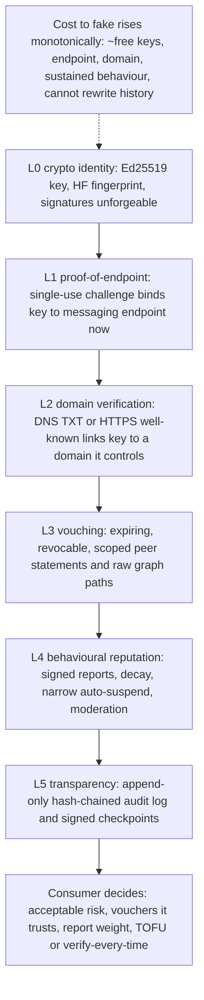

# Trust Model — The L0–L5 Ladder and "Phone Book, Not Notary"

The HAAP Public Directory's trust model is the answer to one design problem: *Ed25519 keypairs are free and bulk-generatable, so "anyone with a key" is a trivially Sybil-flooded list, and a directory that claims to know who is "trustworthy" is either lying, doing KYC (out of scope), or about to be gamed.* The solution the whole service is built on is not a score — it is a **ladder of increasingly expensive-to-fake labelled signals** (L0–L5), delivered to the party that bears the risk: the consumer. This page is the condensed map of `docs/SPEC.md` §3 (the normative heart of the spec) and of the code that enforces it. Per-mechanism detail lives on the [registration lifecycle](/openwiki/workflows/registration-lifecycle.md), [domain verification](/openwiki/workflows/domain-verification.md), [vouching](/openwiki/workflows/vouching.md), [reputation](/openwiki/workflows/reputation.md), [moderation appeals](/openwiki/workflows/moderation-appeals.md) and [audit transparency](/openwiki/workflows/audit-transparency.md) pages; the module layout is on the [system overview](/openwiki/architecture/overview.md) and [service layer](/openwiki/architecture/business-logic.md).

## The one invariant: phone book, not notary — never a judge

> **The directory is a phone book, not a notary — and never a judge.**

Identity lives in the agents' Ed25519 keys, **not** in the directory. The directory indexes signed manifests and verifies endpoint control; its compromise must never allow impersonation. What a compromised directory can do is *lie about listings* — it cannot *sign as an agent*. Concretely (`AGENTS.md` "the one principle you may not violate", `docs/SPEC.md` §2.2):

- the directory returns **labelled signals with provenance** — `domain_verified` with method and timestamp, `vouches_in` edges, raw `reports` counters, `status`, `block_recommendation`, `audit_verifiable` — and **never** a "safe/trusted" verdict and never a collapsed trust score;
- no mechanism in the system proves an agent is *trustworthy*; trustworthiness is behaviour over time, judged by the consumer;
- if a change would make the directory *assert* trust rather than *report* facts, it is wrong.

Five rules govern every layer (§3.0, mirrored in the code):

- **R1 — Labels, not verdicts.** Each layer is a claim the directory verifies as far as cryptography and protocol allow, then labels with its method and timestamp. Higher layers never upgrade a label into a verdict.
- **R2 — No erasure.** Higher layers do not erase lower-layer facts: a domain-verified agent that misbehaves keeps its L0–L2 signals and gains L4 negatives; consumers see both sides at once. The trust block carries *all* layers for one listing simultaneously.
- **R3 — Honest limitations.** Every layer must state what it does not guarantee and how an attacker bypasses it. The table below is that honesty, condensed.
- **R4 — Consumer decides.** Directory decisions are limited to: what to index (L0/L1 compliance), what to expose (all signals), and what to restrict under its terms of service for *abuse classes* (L4 suspensions, moderator takedowns) — never "trustworthiness".
- **R5 — No shared secrets.** No layer depends on a secret the directory holds; everything is public-key cryptography and public records.

Caption — the L0–L5 ladder: each layer attaches cost and attribution to an unforgeable pseudonym, and the consumer, not the directory, renders the final judgement.

## How the model materializes in code

**The trust block is the §3.7 decision matrix as data.** Every search result and every v1 profile response carries a machine-readable `trust` object assembled by `DirectoryService.build_trust_block` (`src/haap_directory/service.py#L257-L317`) from exactly the signals that exist for that row:

- L1: `listed_since`/`age_days`, `last_heartbeat`/`fresh`, `endpoint_proof_at` — read from the store row;
- L2: `domain_verified` + `domain_verification` — surfaced only when `DomainService.primary_verification` finds a live verification whose domain covers the manifest's endpoint host;
- L3: `vouches_in` (each edge with `voucher_tenure_hours`) and `vouch_annotations` (raw structural hints, e.g. mutual-vouch density);
- L4: `reports` counters, `status`, `suspension`, `block_recommendation` — raw facts plus a pure-function advisory;
- L5: `audit_verifiable` — that every one of those events is in the public hash chain.

Absence is reported honestly: fields with no signal yet keep honest defaults (e.g. `reputation_history: []`, an empty `vouches_in`), never a fabricated negative or a score. The assembled object has **no aggregate field, no rating, no verdict** — `build_trust_block` has nothing to return for "is this agent safe?", because that field does not exist.

**Search exposes signals and lets the consumer filter; it never ranks by trust.** `search()` first matches the manifest (capability, free-text AND, geo) and then applies only consumer-chosen trust thresholds through `_passes_trust_filters` (`service.py#L422-L434`): `min_age_hours`, `domain_verified=true`, `not_suspended` (default `true`, so suspended entries are excluded), `min_vouches_in` (counts *visible edges*, explicitly not quality) and `recent_reports_max` (on `unique_reporters`). These filters gate **inclusion** only — results stay in store order, are never ranked or scored by trust, and v1 returns each match as `{manifest, trust}` plus `directory_fingerprint`; the legacy alias returns bare manifests so the unmodified `haap` client keeps working (`http_api.py#L327-L339`). Trust parameters arrive as plain query strings parsed in the search handler (`http_api.py#L304-L326`); there is no hidden server-side "quality" adjustment.

**The only trust-related hiding is abuse-class suspension.** A suspended or expired entry is never confirmed to anonymous callers: profile lookup answers `404 AGENT_NOT_LISTED` without distinguishing suspension from expiry (`service.py#L248-L255`), and an unsigned/invalid heartbeat is answered `UNKNOWN_OR_EXPIRED` rather than with an existence-confirming error (`service.py#L188-L217`). Suspension is a published, appealable abuse filter — never a public "guilty" verdict.

The mechanics behind the labels are public `DirectoryConfig` numbers (`src/haap_directory/config.py#L25-L68`) — challenge TTL, verification validity, vouch cap and expiry, reporter tenure, suspension threshold and window, decay window, checkpoint cadence — so every automaton below is a published rule anyone can replay from config plus the audit log. No directory-held secret and no ML participates anywhere in the ladder.

## The L0–L5 ladder (condensed map of SPEC §3)

| Layer | Protocol as built | Does prove | Explicitly does NOT prove | Who decides | Bypass |
|---|---|---|---|---|---|
| **L0 — crypto identity** (Ed25519) | Registration presents `public_key_b64` + manifest signed by that key; the server recomputes the fingerprint and compares (`FINGERPRINT_MISMATCH`); heartbeats verify over ASCII strings. | Signature math holds; a listing is bound to the key that can sign for it — no one can *register as* another's fingerprint without the key. | A key is not a person, a business or a reputation. Keys are free and bulk-mintable: L0 alone is fully Sybil-vulnerable. | Directory: math yes/no only. Consumer: whether a bare key is worth contacting. | Mint keys in bulk — expected; L0 exists for *attribution*, and the answer lives at L1+. |
| **L1 — proof-of-endpoint** | Two-step single-use challenge (`POST /v1/register` → `202` challenge, TTL 120 s, bound to the exact public key → `POST /v1/register/complete` signing the nonce with that key → live listing). Signed heartbeats renew the TTL. The directory never contacts the endpoint itself. | At that moment the key holder demonstrably received a challenge addressed to its declared endpoint and answered with a signature only that key makes: key and endpoint are under the same control *now*. | Ongoing control (the endpoint can be sold an hour later); that the endpoint is not a honeypot; that the operator is honest. | Directory: yes/no gate for listing. Consumer: whether to message a live-but-unverified endpoint. | Rent N cheap endpoints (wildcard subdomains, ephemeral VPS) and complete N challenges — cheap, but each persona is now enumerable and sinkable at L2+. |
| **L2 — domain/business verification** | Directory-issued 128-bit token; the agent publishes a TXT record at `_haap.<domain>` or places a file at `https://<domain>/.well-known/haap-verify.txt` (or `.json`); the **directory performs the DNS/TLS check itself** through an injectable resolver. Validity 90 days; the endpoint host must equal the domain or a subdomain at confirm (`DOMAIN_ENDPOINT_MISMATCH`). | At `verified_at` the key holder could write DNS records for the domain or place files under its `/.well-known/` — control of a renewable real-world asset. | Not KYC, not legal identity, not honesty/quality/solvency; not typosquat-safety; not permanence; DNS/TLS trust limits apply; a scammer happily verifies their own scam domain. | Directory: mechanical token match only. Consumer: eyeballs the domain string and decides what a verified domain is worth (e.g. require it for real-money tasks). | Buy cheap/expired domains, typosquat adjacent names, use subdomains of one owned domain per persona. Cost ≈ US$10 + time per verified identity; each fake persona is traceable to a domain the community can sink. |
| **L3 — vouching** | Signed, scoped statements by *live, listed* vouchers (`VOUCHER_NOT_LISTED`/`VOUCHEE_NOT_LISTED` otherwise); mandatory future `expires_at` ≤ 180 days; cap of 10 active outgoing vouches; signed revocation; per-vouch `voucher_tenure_hours` label; served as raw inbound edges, annotations, and ≤ 2-hop BFS paths. | A currently live L0+L1-verified agent signed a scoped, expiring statement about another and cannot later deny it — a reputation *stake*, not a comment box. | Vouches are opinions with signatures, not facts; no transitive trust (paths are raw edges, not certifications); no offline identity; no prediction of future behaviour. | Vouchers decide what to sign; directory decides eligibility mechanics only. Consumers apply *their own* trust set — e.g. paths from their own fingerprint. | Collusion rings and sock-puppet vouchers. Counter: no aggregate to game; rings are visible as annotations and young-voucher labels; L4 outlives them; L5 makes them provable. |
| **L4 — behavioural reputation** | Signed, categorised reports with structured evidence; counting eligibility (reporter live, listed ≥ 72 h, unique within a 24 h duplicate window); raw counters with `first_at`/`last_at`; decay (reports > 180 days stop counting); deterministic auto-suspend when ≥ 3 unique eligible reporters accuse in an abuse class within a rolling 7-day window; moderator-key takedown/suspend/unsuspend and appeals; `block_recommendation` as a pure function of counters. | N signed, attributed, audited allegations exist, with exactly the counters shown; the automation is a published rule replayable from the audit log. | Reports are allegations, not findings; counts ≠ guilt; no protection against coordinated lying (griefing has a real but bounded, reversible window of harm); a clean record is not a promise. | Reporters decide to report; directory runs the published automata; moderators (operator keys) decide takedowns and appeals — the only human judgement, fully audited. Consumers weigh counters or contact anyway. | Build a long-lived sock-puppet army (weeks of heartbeats) to grief a target or inflate vouches. Counter: L2 makes members sinkable, `report_abuse` turns the same automaton on liars, decay + appeal bound permanent damage. |
| **L5 — transparency** | Append-only hash-chained audit log: one entry per state change, appended **in the same SQLite transaction** as the mutation; genesis with `prev_hash = "0"*64`; `entry_hash[n] = sha256(canonical_json(entry[n]))`; only `detail_hash` of sensitive bodies enters the chain; the directory key signs the head hourly and on shutdown; `/v1/audit/*` responses are directory-signed. | Tamper-*evidence*: any rewrite, deletion or reordering changes every descendant hash and the head, which signed checkpoints and independent mirrors expose. Every directory decision that matters — suspensions, takedowns, rejections — is public with its actor key and reason. | Not tamper-proof (the operator can rewrite before anyone fetches a checkpoint); not completeness against omission; not secret-free by magic; consumers who never fetch checkpoints get no protection. | Directory decides what to log (everything that changes state); the verifier — consumer, mirror, researcher — decides whether the log is consistent. | Rewrite the DB and chain together before a checkpoint escapes; omit events; run an evil operator from day one. Counter: mirrors/federation and consumer choice of directory. |

Code homes and wire signals, layer by layer: L0 `crypto.py`, `identity.py`, manifest signature checks in `service.py.submit_registration`; L1 `service.py` + `store.py` (challenge rows); L2 `domain.py`, `verify.py`, `resolver.py`; L3 `vouching.py`; L4 `reputation.py`, `moderation.py`; L5 `audit.py`, `audit_service.py`, `store.py` audit chain. The public surface of the ladder is the trust block (§5.2 of the SPEC, fields enumerated above) plus the graph and audit endpoints (`/v1/agents/{fp}/vouches`, `/v1/trust/paths`, `/v1/agents/{fp}/reports`, `/v1/audit/*`).

## Where the directory may decide — and where it may not

The directory's whole decision budget, per §2.2/R4:

1. **What to index** — L0/L1 compliance is a gate: no verified signature math, no valid fingerprint binding, no proof-of-endpoint ⇒ no listing (`submit_registration`/`complete_registration` in `service.py`).
2. **What to expose** — every signal, with provenance, labelled exactly as measured. This is the "no verdict" half: `build_trust_block` (`service.py#L257-L317`) and `_passes_trust_filters` (`service.py#L422-L434`) only ever copy or threshold raw fields; there is no code path that emits "safe", "trusted", a score, or a collapsed rating.
3. **What to restrict for abuse classes** — the published auto-suspend automaton (`reputation.py#L106-L124`) and moderator-key takedowns/suspensions, both fully audited and appealable; the entry is *hidden*, not condemned — heartbeats stay accepted so the agent keeps its key alive and can appeal, and anonymous callers cannot even learn the entry exists (`service.py#L248-L255`).

`block_recommendation` deserves its own note: it is a **pure function of raw counters** — e.g. `{"default_max_contact_rate_h": 1}` when ≥ 2 recent unique eligible reporters appear in the `fraud`/`payment_fraud` classes within the 7-day window (`reputation.py#L132-L141`). It is advisory data a consumer client *may* ingest to throttle first contact; it enforces nothing and blocks no one.

## The consumer's job: read the signals, re-verify out of band

The decision matrix (§3.7) fixes what each visible field means — and only that. `age_days` means the key held a listing that long, not legitimacy; `fresh` means a process answered a heartbeat, not that it is honest or reachable *from you now*; `domain_verified` means domain control at a timestamp, never "verified business"; `vouches_in` means these live agents signed scoped statements, never that the vouchee is trustworthy; `status:"suspended"` means the published automaton or a moderator hid the entry, not a court finding; `directory_fingerprint` on every response says *which* directory's view this is, since directories may differ.

The operator runbook states the trust boundaries consumers must respect (`docs/OPERATE.md` "Trust boundaries"):

- the directory verifies signature math, fingerprint↔key binding and endpoint control at registration time; it does **not** vouch for an agent's honesty, quality or reachability-from-you;
- a hostile operator can lie about listings but **cannot sign as an agent** — consumers MUST re-verify an agent's own `/.well-known/haap.json` against the fingerprint before trusting a listing (SPEC §3.7 M3);
- the audit chain is *tamper-evident, not tamper-proof*: it detects a rewrite only for parties who fetched a signed checkpoint before the rewrite — consumers who care should poll `/v1/audit/head` (and, later, run a mirror via `haap_directory.mirror.ingest_chain`).

## Sybil economics in one paragraph

The cost per *effective* fake persona is the product of the layers an attacker wants to clear: L0 ≈ 0 (mint keys); +L1 ≈ one endpoint per identity; +L2 ≈ one domain plus minutes and a durable, correlatable paper trail; +L3 ≈ time and the difficulty of getting *your* vouchers trusted inside *the consumer's* trust set; +L4 ≈ sustained behaviour, because counters decay and require liveness; +L5 adds nothing to the attacker's cost — it just makes the whole operation public. The directory's design goal is that the marginal cost of the next fake persona rises **monotonically with the credibility the attacker wants**, and that every fake persona leaves a permanent, correlatable trail — while the residual risks (funded attackers, griefing windows, evil operators) are named honestly instead of being hidden behind a fake "trust score". The ladder never declares victory; it makes lying expensive and lying *detectable*.

## How the invariant is pinned by tests

The suite asserts the labelled-signal contract directly rather than any verdict: profiles and search results carry the `trust` block with `endpoint_proof_at` (`tests/test_registration.py#L36-L41`); `domain_verified` appears with its method in the block and drives the `domain_verified=true` search filter, then downgrades to `false` after the 90-day validity expires (`tests/test_domain.py#L53-L57`, `#L152-L162`); vouch edges surface in the profile trust block (`tests/test_vouching.py#L37-L42`); reports by a young reporter are recorded but `counts_toward_automation: false`, three eligible abuse-class reports hide the target from anonymous profile lookups and search while non-abuse classes never auto-suspend (`tests/test_reputation.py#L33-L39`, `#L59-L96`); and the audit tests verify chain linkage and checkpoint signing from the raw entries (`tests/test_audit_chain.py`, `tests/test_checkpoints.py`).

## Related pages

- [System overview — topology, trust ladder and build phases](/openwiki/architecture/overview.md)
- [Service layer — orchestration and trust-signal assembly](/openwiki/architecture/business-logic.md)
- [Store and audit — persistence and the L5 chain](/openwiki/architecture/store-and-audit.md)
- [Signed wire format — canonical JSON, Ed25519, fingerprints](/openwiki/concepts/signed-wire-format.md)
- Workflows: [registration lifecycle](/openwiki/workflows/registration-lifecycle.md), [domain verification](/openwiki/workflows/domain-verification.md), [vouching](/openwiki/workflows/vouching.md), [reputation](/openwiki/workflows/reputation.md), [moderation appeals](/openwiki/workflows/moderation-appeals.md), [audit transparency](/openwiki/workflows/audit-transparency.md)
