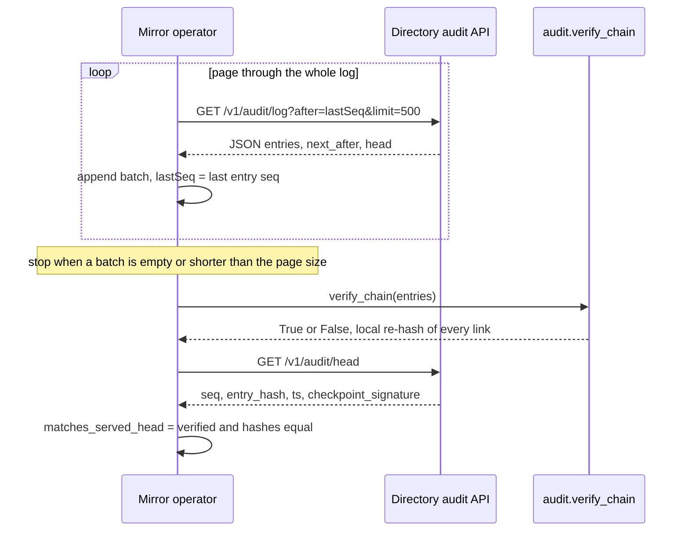

# Federation & Mirrors — Consuming the Audit Chain Externally

The HAAP Public Directory is **single-directory at v1** — there is no directory-of-directories and no central registry that ranks registries — yet it is built to be *federated by consumption*: every instance owns one Ed25519 "directory key", appends every state change to a public, hash-chained audit log, and signs the log head on a cadence. That surface (`/v1/audit/head`, `/v1/audit/log`, `/v1/audit/checkpoints`) is the seam through which an **independent mirror operator** can pull the whole chain, verify it locally, and reproduce an identical head. This page is that operator's view: how `haap_directory.mirror.ingest_chain` works, what a verified-and-matching head actually proves, the wire contract a from-scratch mirror would implement, and the trust steps that stay on the *consumer* side even after a mirror agrees with the directory. Chain *construction* (the store-side append invariant, `entry_hash` math, checkpoint persistence) is documented on [store-and-audit](/openwiki/architecture/store-and-audit.md); this page documents the *external* consumption of the same chain.

## What a mirror is — and the one property it buys

The mirror seam is defined in one place, `src/haap_directory/mirror.py`, whose module docstring is the normative statement of the whole idea:

> A mirror ingests a directory's public hash chain (`/v1/audit/log`), verifies its linkage locally, and reproduces the head. Two independent operators whose mirrors agree on a head prove they saw the same ordered world — federation without a central registry-of-directories. This is deliberately read-only and dependency-free (stdlib HTTP + the local chain verifier).

Three honesty properties follow directly and should be read as *the contract of the feature*, not as decoration:

1. **Head equality across independent mirrors = "same ordered world".** The chain is a total order of events (`seq` 0 = genesis, then contiguous). If two operators each download the full log, re-hash every entry locally, and arrive at the same `entry_hash` for the same `seq`, then the directory served both of them the identical contiguous history — neither was handed a divergent rewrite. That agreed head is also the value any *later* rewrite must contradict, so an operator who rewrites history after a mirror has published its head is provably inconsistent with the world that mirror recorded.
2. **There is no central registry-of-directories.** Each directory is authoritative for its own index; another instance may ingest a chain and re-serve it with an identical head (SPEC §6.4, F6). Nothing in the protocol tells a consumer which directory to use, or that one directory's view is "the" view.
3. **Multi-directory trust is a consumer decision.** The directory labels every response with `directory_fingerprint` (trust-matrix row **M12**: "which directory's view this is — directories may differ"). A consumer that wants resilience against one bad operator queries several directories and takes intersections/unions itself; v1 deliberately ships no aggregation.

What a mirror is **not**: a second authoritative directory, a notary, or a judge. It is a read-only *verifier with a copy*. The full trust framing — "phone book, not notary — and never a judge", labelled signals, consumer decides — is on [trust-model](/openwiki/concepts/trust-model.md) and is the backdrop for every consumer-side duty in this page.

## `mirror.ingest_chain`: the reference ingestion

`haap_directory.mirror.ingest_chain(base_url, page=500) -> dict` is the reference implementation of a mirror run. It performs three phases against one live directory:

Caption: `ingest_chain` pages `/v1/audit/log` until a short or empty batch, verifies the concatenated list locally with `audit.verify_chain`, then fetches the served head and compares hashes.

Concretely (`repo://src/haap_directory/mirror.py#L25-L54`):

1. **Page the log.** `base = base_url.rstrip("/")`. With `after = -1` it requests `{base}/v1/audit/log?after={after}&limit={page}` (default `page = 500`), appends each batch to `entries`, advances `after` to the last fetched `seq` (`batch[-1]["seq"]`), and stops when a batch is empty or shorter than the requested page size. Starting at `after = -1` means the first page begins at genesis (`seq` 0), because the store serves `seq > after` in ascending order.
2. **Verify linkage locally.** `verified = audit.verify_chain(entries)` re-computes the hash of every entry from its eight canonical fields (`seq`, `ts`, `event`, `fingerprint`, `actor`, `result`, `detail_hash`, `prev_hash`), compares it to the stored `entry_hash`, and checks that each entry's `prev_hash` equals the *previous* entry's `entry_hash`. Any modification, deletion or reordering in the served bytes fails this and yields `verified: False`.
3. **Compare with the served head.** It then GETs `{base}/v1/audit/head`, takes the local head hash from `entries[-1]["entry_hash"]`, and reports whether verification passed **and** the two hashes are equal.

The returned object is exactly the documented contract `{seq, entry_hash, entries, verified, matches_served_head}`:

| Field | Meaning |
|---|---|
| `seq` | Local head sequence — `entries[-1]["seq"]`, or `-1` when the log came back empty. |
| `entry_hash` | Local head hash — `entries[-1]["entry_hash"]`, or `None` when empty. |
| `entries` | The full contiguous list of raw audit rows as served (each row carries `entry_hash`), which the caller may persist if it wants a durable copy. |
| `verified` | `audit.verify_chain` result over `entries`: linkage is internally consistent. |
| `matches_served_head` | `True` only when `verified` **and** the local head hash equals the `entry_hash` served by `/v1/audit/head`. |

The helper is deliberately **read-only and dependency-free**: `_get` is stdlib `urllib.request.urlopen` with a 10 s timeout plus `json.loads` (`mirror.py#L20-L22`), and the only import beyond that is the local `audit` module — no `cryptography`, no client package, no database. `ingest_chain` has no persistence of its own and is not wired into the daemon anywhere; it is a *seam* for operators, exercised in the suite only by the federation test (see [Focused tests](#focused-tests)). An operator who wants a durable archive keeps the `entries` list (or its head + a copy of the log) and re-runs on a schedule.

### What `verified` and `matches_served_head` do — and do not — prove

The two booleans answer different questions, and the gap between them is the honest limit of a single mirror run:

- `verified: True` proves the served log is **internally consistent**: every `entry_hash` is the sha256 of its own canonical JSON and every link `prev_hash` is intact. It says nothing about the *directory's identity*: `_get` reads only the JSON body and discards the response headers, so **`ingest_chain` never cryptographically verifies the `X-HAAP-Directory-Signature`** that every `/v1/audit/*` response carries (SPEC §2.7.9). A mirror that wants signature-level assurance must obtain the directory's public key out-of-band and check the header itself; the helper's assurance is "the bytes link up", not "the bytes were signed by the key I trust".
- `matches_served_head: True` proves the locally verified chain ends exactly where the directory *currently* claims it ends — but the head is fetched **after** pagination completes and from the **same** server. That ordering has two consequences worth internalising:
  - A mirror run is a point-in-time snapshot. On a live directory, an entry appended between the last log page and the head fetch makes `matches_served_head` `False` **without any tampering**; the correct response is to re-run (or reconcile against a fresh head), not to conclude the directory misbehaved.
<!-- openwiki: broken internal link [#the-tamper-evidence-limit-and-the-consumers-duty-to-poll] heading anchor "the-tamper-evidence-limit-and-the-consumers-duty-to-poll" does not exist in /openwiki/integrations/federation-mirror.md. Fix the href or restore the target, then delete this comment. -->
  - Comparing against a head fetched seconds earlier cannot anchor a *previous* state. The property that actually deters a hostile rewrite is that **the rewrite contradicts a checkpoint (or earlier mirror copy) fetched before the rewrite** — see [the tamper-evidence limit](#the-tamper-evidence-limit-and-the-consumers-duty-to-poll).

SPEC §3.6.2 says why the mirror exists at all: "An independent operator can run a mirror that ingests the chain and serves it, making 'the directory rewrote history' detectable even against a hostile operator." That is a statement about a *running, periodic* mirror with retained history — not about a single one-shot `ingest_chain` call.

## The wire contract an external mirror implements

`ingest_chain` is the reference, but the seam is the API, and any consumer may implement the same protocol against any compliant directory. The normative contracts (SPEC §4.8) as built (`repo://src/haap_directory/http_api.py#L255-L294`):

| Endpoint | Response shape | Notes |
|---|---|---|
| `GET /v1/audit/head` | `{"seq", "entry_hash", "ts", "checkpoint_signature"}` | `checkpoint_signature` is the b64 Ed25519 signature of the directory key over the canonical JSON of `{seq, entry_hash, ts}` — i.e. the head is *always* presented as a signed checkpoint, not just a bare hash. |
| `GET /v1/audit/log?after=<seq>&limit=<n>` | `{"entries": [...], "next_after": <seq>, "head": {"seq", "entry_hash", "ts"}}` | Contiguous, ascending; see pagination details below. |
| `GET /v1/audit/checkpoints` | `{"checkpoints": [{seq, entry_hash, ts, signature_b64}, ...]}` | The persisted hourly/shutdown signed head snapshots, oldest first (up to 1000). |
| `GET /v1/audit/verify?seq=<n>` | `{"valid": bool, "computed_head": "…"}` | Directory-side recompute — a *convenience*; SPEC says clients SHOULD verify locally from raw entries, which is what `ingest_chain` does. |
| `GET /v1/agents/{fp}/audit` | `{"fingerprint", "entries": [...]}` | Redacted per-agent projection — `detail_hash` only, never a detail body. |

Pagination semantics that any mirror implementer must match (`repo://src/haap_directory/http_api.py#L350-L361`, `repo://src/haap_directory/store.py#L283-L290`):

- `after` defaults to `-1`; the store serves `WHERE seq > ? ORDER BY seq ASC LIMIT ?`, so `after=-1` starts at genesis (`seq` 0) and every page is gap-free.
- `limit` is clamped server-side to the range 1–1000 (`max(1, min(limit, 1000))`), so an external pager cannot force a huge page; `page=500` in `ingest_chain` is inside the clamp.
- A page shorter than the requested `limit` (or empty) means the log is exhausted — the client-side stop rule `ingest_chain` uses.
- Each page's `head` mirrors the current head at serve time; a pager should not trust it for linkage (entries must be re-hashed), only for a cheap early sanity check.
- Every audit response — including `/v1/audit/log` pages — is sent through `_send_signed`, which adds `X-HAAP-Directory-Signature` (b64 Ed25519 over the canonical JSON of the exact body, via `AuditService.sign_body`) and `X-HAAP-Directory-Fingerprint` headers (`repo://src/haap_directory/http_api.py#L160-L166`). Endpoint wiring and signature semantics are detailed on [http-layer](/openwiki/architecture/http-layer.md).

Genesis and entry format for local re-hashing: `entry[0]` is the genesis row (`event: "chain.genesis"`, `prev_hash: "0"*64`, seq 0, created at first boot), and `entry_hash[n] = sha256(canonical_json(entry[n]))` where canonical JSON is the vendored serializer in `canonical.py` (`json.dumps(obj, sort_keys=True, separators=(",", ":"), ensure_ascii=False).encode("utf-8")`) — byte-identical to the serializer the `haap` client package uses, so directory and consumer always hash the same bytes. The chain contains only `detail_hash` values, never detail bodies, so raw verification needs no secrets. Full construction math is on [store-and-audit](/openwiki/architecture/store-and-audit.md).

## The tamper-evidence limit — and the consumer's duty to poll

The chain's guarantee is *tamper-evidence*, explicitly **not** tamper-proofness (SPEC §3.6.3, §8 T-D07):

- The operator controls the database and *can* rewrite it. The hash chain guarantees only that a rewrite is **detectable by anyone who fetched a checkpoint before the rewrite** — a consumer or mirror holding an earlier signed head can prove the new chain contradicts it; a party that never fetched anything before the rewrite sees only a consistent-looking history.
- Checkpoints are the anchor: the directory key signs `{seq, entry_hash, ts}` every `checkpoint_interval_s` (default **3600 s** = hourly, `config.py#L65`) from a background thread in `DirectoryHTTPServer`, and writes a **final checkpoint on shutdown** (`repo://src/haap_directory/http_api.py#L94-L105`; see [store-and-audit](/openwiki/architecture/store-and-audit.md) for the shutdown path). The gap between a checkpoint and a later rewrite is therefore at most the polling interval of the party that cares.
- Omission is not caught by any amount of mirroring: an operator that never logs an event signs a consistent chain that simply lacks the event. Checkpoints sign the chain, not the world.

The operator-facing duty follows directly and is stated verbatim in OPERATE.md's trust boundaries (`repo://docs/OPERATE.md#L74-L82`):

> The audit chain is *tamper-evident*, not tamper-proof: it detects a rewrite only for parties who fetched a checkpoint before the rewrite. Consumers who care should poll `/v1/audit/head` and, later, run a mirror.

And SPEC §3.6.1's mirror guidance sharpens the cadence requirement: mirror operators SHOULD download the full chain periodically and **compare heads against the operator's out-of-band checkpoint publication** — i.e. the directory's key/endpoint and its signed checkpoints published somewhere other than the chain itself, so that a rewritten directory cannot also rewrite the publication the mirror compares against. In practice, a defensible consumer posture is: poll `/v1/audit/head` at least as often as the checkpoint cadence, retain every verified head you have seen, and let a periodic `ingest_chain` mirror (with retained `entries` and cross-checked checkpoints) be the escalation that makes "rewrote history" provable rather than merely suspicious. Trust-matrix row **M10** (`audit_verifiable`) says exactly this: the signal means "all of the above events are in the public hash chain — not that the operator is honest"; the consumer lever is "poll checkpoints; run a mirror for real assurance".

## Consumer-side trust actions that no mirror replaces

A mirror proves the *chain* is consistent and unchanged since your last checkpoint — it does **not** prove any *listing* is trustworthy, because listings are the directory's assertions about agents. The rule that governs all of this, from OPERATE.md's trust boundaries and SPEC §3.7 M3:

> A hostile operator can lie about *listings* but **cannot sign as an agent**: consumers MUST re-verify an agent's own `/.well-known/haap.json` against the fingerprint before trusting a listing (SPEC §3.7 M3, §8 T-D07).

Why: identity lives in the agents' Ed25519 keys, not in the directory (README: "phone book, not a notary"). The directory verifies signature math, fingerprint↔key binding and endpoint control *at registration time*; it does not vouch for an agent's honesty, quality or reachability-from-you. Concretely, the consumer-side steps the docs pin down:

1. **Re-verify the agent's own `/.well-known/haap.json`.** The listing's `endpoint_proof_at` (row **M3**) proves the key holder completed proof-of-endpoint at that moment — it is *not* ongoing control. Before trusting a listing, fetch the agent's own well-known manifest from its declared domain and check it against the fingerprint the directory returned. A compromised or lying directory can remove, reorder, or mislabel listings; it cannot produce an agent's signature. (The directory itself never contacts agent endpoints during registration — this check is purely consumer-initiated.)
2. **Read labels as labels.** `domain_verified` is a control signal with method + timestamp, never "verified business" or KYC; `vouches_in` are signed opinions, not transitive truth; `reports` are raw signed allegations, not findings. Absent signals are reported as absent. The trust block is data with provenance, assembled by `DirectoryService.build_trust_block`; details are on [trust-model](/openwiki/concepts/trust-model.md) and [business-logic](/openwiki/architecture/business-logic.md).
3. **Cross-check directories for high stakes (M12).** Because directories may differ and multi-directory trust is a consumer decision, the `directory_fingerprint` on every response is the handle a consumer uses to ask "whose view is this?" and to take intersections/unions across several directories. This is the documented anti-lock-in lever (threat **T-D10**: "consumer can't leave a bad directory" is mitigated by federation seams + fingerprint + portable signed manifests).
4. **Poll or mirror** as described above — a consumer who never fetches checkpoints gets no rewrite protection at all (SPEC §3.6.3: "Consumers who never fetch checkpoints get no protection at all").

## Federation honesty properties (v1 semantics)

SPEC §6.4 and OPERATE.md's "Federation & mirrors" section fix the exact v1 posture (`repo://docs/SPEC.md#L1082-L1084`, `repo://docs/OPERATE.md#L111-L119`):

- **v1 is single-directory** — but designed so it doesn't paint into a corner: the L5 chain + `directory_fingerprint` on responses + mirror/ingest mean another instance can ingest and re-serve a chain with an **identical head** — federation *without* a central registry-of-directories.
- **Each directory is authoritative for its own index.** There is no protocol-level reconciliation, no voting, no shared ledger. Agreement between mirrors is a *consumer-relevant fact* ("both got the same ordered world"), not a consensus mechanism.
- **Do NOT build a directory-of-directories in v1** — that is an explicit open question, not a feature. What *is* recommended for good operators: publish the directory public key + endpoint in a `.well-known` so mirrors can verify signatures out-of-band.
- The F6 build phase's acceptance criterion is exactly the mirror seam: "a mirror process ingests the chain and reproduces identical head" (SPEC §7 F6) — implemented by `mirror.py` and pinned by the federation test.

## Operating a mirror (in practice)

There is no mirror daemon in the repository — `ingest_chain` is a function to call from your own scheduler. A workable operator pattern, given the semantics above:

1. **Ingest on a cadence** (at least as often as you want your rewrite-detection window to be): `result = haap_directory.mirror.ingest_chain("https://directory.example")`.
2. **Treat a mismatch as retry, not verdict.** Because the head is fetched after paging on a live chain, `matches_served_head: False` is expected under concurrent writes; re-run shortly afterwards. Persistent mismatch on a quiet directory is the signal to investigate.
3. **Keep history.** Store the verified `(seq, entry_hash)` per run (and optionally the `entries`) so that a later rewrite contradicts a head you actually observed; compare periodically against the operator's out-of-band checkpoint publication and against the directory's `X-HAAP-Directory-Signature` if you hold its public key (the helper itself does not check signatures).
4. **Do not let the mirror grow trust by itself.** Whatever the chain says, agent listings still require the consumer-side `/.well-known/haap.json` re-verification and the label-reading discipline above.

## Focused tests

- `tests/test_ops_federation.py::test_mirror_reproduces_head` — end-to-end over real HTTP: three registrations, then `mirror.ingest_chain(running.url)` returns `verified is True` and `matches_served_head is True`, and the local `seq`/`entry_hash` equal the values served by `GET /v1/audit/head` (`repo://tests/test_ops_federation.py#L69-L77`). This is the F6 acceptance criterion as a test.
- `tests/test_audit_chain.py` — the linkage properties the mirror depends on: every mutation appends, the log is contiguous and re-verifies from raw entries, and flipping a single `event` field makes `audit.verify_chain` return `False` (`repo://tests/test_audit_chain.py#L41-L47`).
- `tests/test_checkpoints.py` — head and checkpoint signatures verify against the directory key, cadence enforcement under an injected clock, `/v1/audit/verify` recompute, redacted per-agent audit, and the persisted shutdown checkpoint (the anchors a mirror compares against).

## Related pages

- [store-and-audit](/openwiki/architecture/store-and-audit.md) — chain construction, the audit-equals-mutation invariant, checkpoint persistence (the store side of everything a mirror consumes).
- [trust-model](/openwiki/concepts/trust-model.md) — L0–L5 ladder, labelled signals, "consumer decides", M3/M10/M12 semantics.
- [http-layer](/openwiki/architecture/http-layer.md) — endpoint wiring and the signed audit responses (`_send_signed`) a mirror reads.
- [audit-transparency](/openwiki/workflows/audit-transparency.md) — checkpoint verification and the consumer workflow (polling posture).
- [runbook](/openwiki/operations/runbook.md) — operator duties, backup/restore, trust boundaries to communicate.
- [legacy-client](/openwiki/integrations/legacy-client.md) — the wire-compatible client surface the same API serves.
- [overview](/openwiki/architecture/overview.md) and [business-logic](/openwiki/architecture/business-logic.md) — module layout and service-layer orchestration.
