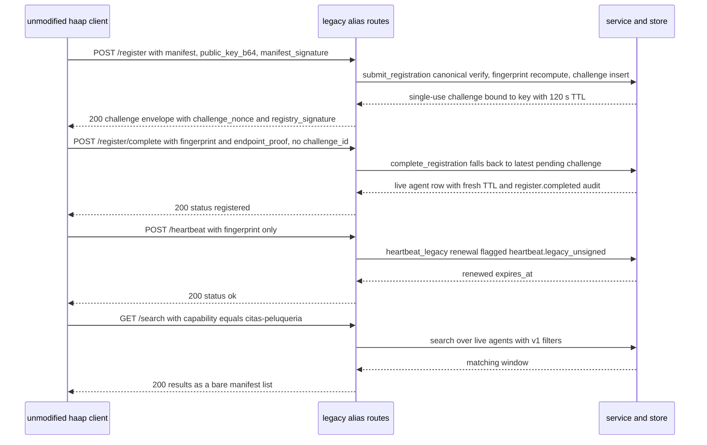

# Legacy haap Client Compatibility — Wire Contract

The HAAP ecosystem shipped an in-memory reference registry *inside* the `haap` client package, and tools already in the field drive it through `haap/registry_client.py` — `register()`, `search()`, `heartbeat()`. This directory is the production, SQLite-backed evolution of that registry, and the one non-negotiable property of the rewrite is that **those unmodified client functions keep working against it unchanged**. Legacy compatibility is a hard, spec-mandated constraint, not a courtesy feature: objective **O8** ("Stay wire-compatible"), **SPEC §4.9** ("Legacy compatibility aliases (hard requirement)") and **§6.3** (the compatibility contract with `haap/`) all fix it in writing, and the phased build plan makes the unmodified haap test suite an acceptance gate in **every phase from F1 on**.

This page documents that contract precisely: the exact legacy surface (routes, status codes, body shapes), the mapping rule that makes `/v1/*` and the legacy aliases two serializations of the *same* service semantics, the vendored canonical JSON that keeps signatures byte-compatible without an import dependency, and the compat test that enforces it all by running the real, unmodified client against a live server. Sibling pages cover the surrounding mechanics: the [http-layer](/openwiki/architecture/http-layer.md) page has the full route table and error-envelope transport, [business-logic](/openwiki/architecture/business-logic.md) has the service orchestration behind registration/heartbeat/search, [signed-wire-format](/openwiki/concepts/signed-wire-format.md) has the signing rules, and [registration-lifecycle](/openwiki/workflows/registration-lifecycle.md) has the two-step state machine. This page's job is the *client-facing wire*: what a legacy consumer may rely on, and what a change to this server may never break.

## The compatibility constraint is a hard one

Three places in the specification make the constraint normative rather than aspirational (`repo://docs/SPEC.md#L75`, `repo://docs/SPEC.md#L762-L774`, `repo://docs/SPEC.md#L1068-L1080`):

1. **Objective O8** — "Legacy routes (`POST /register`, `POST /register/complete`, `POST /heartbeat`, client search route) keep working so the unmodified `registry_client.py` and existing tests pass (§4.9, §6.5)."
2. **§4.9 opens with the requirement** — "The unmodified `haap/registry_client.py` (and the unmodified haap test suite) must keep working. Legacy routes are thin aliases with identical semantics; the authoritative route table is the haap repo's `tests/test_registry_client.py`, which MUST pass unchanged in every phase from F1 on."
3. **§6.3 fixes the ownership boundary** — the client keeps identity, envelope signing, the PoE *client* flow, the heartbeat loop and manifest generation; the directory keeps the *server* side. "The haap client + its full unmodified test suite MUST keep working against this directory unmodified."

The consequence for anyone changing this codebase: **a change that alters legacy route semantics, legacy response fields, legacy status codes, or the canonical serialization is a breaking change and must not ship**, no matter how defensible it looks on the v1 side. Compatibility is additionally proven only by the unmodified client itself — the directory's own test suite never re-implements the client's calls (that would test the server against itself); it imports `haap.registry_client` from a companion checkout and runs it against a real running server. The README documents running the suite that way (`HAAP_REPO=/path/to/haap python -m pytest -q`, `repo://README.md#L97-L116`).

## The legacy surface: five aliases plus `/health`

The handlers in `src/haap_directory/http_api.py` dispatch legacy paths and their `/v1` twins to the **same method**, with a `versioned: bool` argument that changes only the HTTP status code and the response serialization — never the validation, the service call, or the state transition. The fingerprint pattern `HF-[0-9a-f]{16}` is shared by one regex (`_AGENT_RE`) that accepts both the prefixed and the bare agent path (`repo://src/haap_directory/http_api.py#L37-L47`). The precise surface (module docstring, `repo://src/haap_directory/http_api.py#L2-L16`; dispatch sites `repo://src/haap_directory/http_api.py#L249-L254`, `repo://src/haap_directory/http_api.py#L295-L298`, `repo://src/haap_directory/http_api.py#L381-L394`):

| Legacy route | `/v1` twin | Handler | What differs on the legacy side |
|---|---|---|---|
| `POST /register` | `POST /v1/register` | `_handle_register(versioned=False)` | Status **200** (v1: 202) and the legacy challenge envelope (§ below); request body and validation identical |
| `POST /register/complete` | `POST /v1/register/complete` (and `/v1/register/challenge`, tolerated) | `_handle_complete(versioned=False)` | Status **200** (v1: 201); `challenge_id` optional (latest-pending fallback) |
| `POST /heartbeat` | `POST /v1/heartbeat` | `_handle_heartbeat(versioned=False)` | Unsigned `{fingerprint}` body honored (audit-flagged); signed bodies verified on either route |
| `GET /search` | `GET /v1/search` | `_handle_search(versioned=False)` | `results` is a bare manifest list (no per-result trust, no `total`/`limit`/`offset` envelope) |
| `GET /agents/{fp}` | `GET /v1/agents/{fp}` | `_handle_agent(versioned=False)` | Bare manifest body (no `trust` block) |
| `GET /health` | — (unversioned by design) | shared | Same JSON contract as the reference |

The completion aliases deserve a note: the canonical v1 second step is `/v1/register/complete`, `/v1/register/challenge` is *additionally tolerated* by the same handler for tolerance with older working notes, and the machine-readable statement of which completion alias this server accepts is advertised in `/health` under `api.completion_route` (`repo://src/haap_directory/service.py#L319-L333`).

How a complete unmodified-client session looks against the legacy surface:



Caption: the unmodified `haap.registry_client` flow — every call lands on a legacy alias, each of which delegates to the same service method its `/v1` twin uses and only re-serializes the response.

## POST /register — the legacy challenge envelope

`POST /register` takes exactly the v1 request body — `{manifest, public_key_b64, manifest_signature}` — and runs the identical `submit_registration` pipeline: schema and forbidden-field/float validation, canonical-JSON size cap, fingerprint recomputed from the presented key (`FINGERPRINT_MISMATCH`), manifest signature verified over canonical bytes (`SIGNATURE_MISMATCH`), capacity check, then insertion of a single-use challenge (TTL `config.challenge_ttl_s`, default **120 s**) bound to the public key, endpoint and canonical manifest snapshot (`repo://src/haap_directory/service.py#L80-L132`, `repo://src/haap_directory/config.py#L32`). The only difference is the response the HTTP layer serializes (`repo://src/haap_directory/http_api.py#L483-L506`):

```json
{
  "challenge_nonce": "v1:register:9f86d081884c7d65...",
  "nonce": "v1:register:9f86d081884c7d65...",
  "challenge_id": "ch_01J2...",
  "registry_fingerprint": "HF-<directory fingerprint>",
  "directory_fingerprint": "HF-<directory fingerprint>",
  "registry_signature": "<b64 Ed25519 over the ASCII nonce by the directory key>",
  "expires_at": "2026-09-04T12:02:00Z"
}
```

Three properties of this envelope are contract, not decoration:

- The code comment is explicit about which field the legacy client consumes: "Legacy body: the client reads only `challenge_nonce`" (`repo://src/haap_directory/http_api.py#L494`). That field must stay, byte-for-byte the nonce whose ASCII bytes the agent will sign for the proof-of-endpoint step.
- `registry_signature` is a **directory-key** signature over the raw ASCII nonce (`b64e(server.service.keypair.sign(nonce.encode("ascii")))`). The directory key's role as "signs challenge nonces (legacy compatibility) and, from L5, audit checkpoints" is stated in the `keystore.py` contract (`repo://src/haap_directory/keystore.py#L1-L8`).
- Both `registry_fingerprint` and `directory_fingerprint` are the directory instance's own fingerprint — the reference registry's vocabulary for "the registry's identity" and this server's canonical vocabulary for the same fact are emitted together, additively.

The v1 route serializes the *same* underlying service result (`challenge_id`, `nonce`, `registry_fingerprint`, `directory_fingerprint`, `expires_at`, plus `algorithm: "ed25519"` and `ttl_seconds`) at status **202** — the legacy envelope omits those two fields and adds `challenge_nonce` + `registry_signature` instead. Both shapes derive from one `submit_registration` call, so a legacy submit and a v1 submit produce the same challenge state in the store.

## POST /register/complete — legacy needs no challenge_id

The unmodified client's `register()` drives completion without a `challenge_id`: it presents `{fingerprint, endpoint_proof}` (the agent's Ed25519 signature over the challenge nonce bytes from step 1). `complete_registration` treats a missing `challenge_id` as the legacy selector and falls back to `store.latest_pending_challenge(fingerprint)` — the most recent *unused* pending endpoint challenge for that fingerprint (`repo://src/haap_directory/service.py#L141-L159`, `repo://src/haap_directory/store.py#L357-L365`). Everything else is the shared v1 semantics: fingerprint must match the challenge, the challenge must be unused and unexpired, an optional presented `public_key_b64` must equal the key bound at submit, and the proof must verify against that bound key; the atomic completion (re-check used under the write lock, mark used, upsert the live agent row with a fresh 24 h TTL, append the `register.completed`/`register.updated` audit entry) is one code path for both routes.

The legacy alias answers status **200** (v1 answers **201**) with the shared completion body (`repo://src/haap_directory/http_api.py#L508-L518`):

```json
{"status": "registered", "agent_url": "/v1/agents/HF-...", "expires_at": "...",
 "directory_fingerprint": "HF-...", "ttl_seconds": 86400}
```

`status: "registered"` is the field the client asserts on — `resp["status"] == "registered"` in the compat test (`repo://tests/test_compat_client.py#L56-L62`). It must never be renamed, and the legacy status must stay 200 (a client that checks for 200 would treat a promoted 201 as an error).

## POST /heartbeat — the unsigned legacy form, audit-flagged

`_handle_heartbeat` gates on `if versioned or signed:` — i.e. a request to `/v1/heartbeat`, *or* any body carrying both `signature` and `timestamp`, is forced into the signed `heartbeat_v1` verification (RFC 3339 timestamp within ±300 s, Ed25519 over the ASCII string `heartbeat:{fingerprint}:{timestamp}`, verified against the stored key; failures answer `UNKNOWN_OR_EXPIRED` and never confirm fingerprint existence). Only an **unsigned `{fingerprint}` body on the legacy alias** `POST /heartbeat` reaches `heartbeat_legacy` (`repo://src/haap_directory/http_api.py#L520-L537`):

- On success the entry's TTL is renewed through the *same* `store.heartbeat` write path as a signed heartbeat, but with the `legacy=True` flag, which selects the audit event **`heartbeat.legacy_unsigned`** instead of `heartbeat.ok` (`repo://src/haap_directory/store.py#L490-L521`) — so the transparency chain records *how* an entry was kept alive, and unsigned renewals are distinguishable from signed ones by any consumer of the L5 log.
- The success response is `200 {"status": "ok"}`; `heartbeat_legacy` returns a bool, and the unmodified client's `heartbeat()` returns `True` on it (`repo://tests/test_compat_client.py#L64-L65`).
- An unknown, suspended, or expired fingerprint renews nothing and answers `404 {"error": {"code": "UNKNOWN_OR_EXPIRED", ...}}` (`repo://src/haap_directory/service.py#L219-L222`).

Because the `versioned` gate forces the signed path on `/v1/heartbeat`, the unsigned legacy form only succeeds on the alias route — a legacy `{fingerprint}` body sent to `/v1/heartbeat` is treated as a v1 request with empty `signature`/`timestamp` and cannot renew the entry.

## GET /search and GET /agents/{fp} — bare-manifest projections

Search and profile are where v1 and legacy differ most in *shape* while sharing every bit of semantics:

- `GET /search` parses the exact same query surface as `GET /v1/search` — `capability`, `q`, `geo`, `limit`/`offset` (clamped 0–100/≥0), plus the trust filters `min_age_hours`, `domain_verified`, `not_suspended`, `min_vouches_in`, `recent_reports_max` — through the same `SearchQuery` object and the same `DirectoryService.search` pass. The legacy handler then serializes `result["manifests"]`, the bare-manifest projection that `search()` exposes alongside the v1-shaped `results`, as `{"results": [manifest, ...]}` (`repo://src/haap_directory/http_api.py#L304-L339`, `repo://src/haap_directory/service.py#L239-L246`). The v1 route instead wraps each match as `{manifest, trust}` and adds `total`/`limit`/`offset`/`directory_fingerprint`. A legacy consumer therefore reads `agent.fingerprint`, `agent.endpoint`, etc. directly off each result element — exactly what the compat test asserts (`results[0]["agent"]["fingerprint"]`, `results[0]["agent"]["endpoint"]`, `repo://tests/test_compat_client.py#L68-L74`) — while a v1 consumer gets the trust block it needs for the layered-trust decision model. Both routes sit behind the same per-IP search token bucket (`repo://src/haap_directory/http_api.py#L249-L254`).
- `GET /agents/{fp}` (bare prefix, matched by the same regex as `/v1/agents/{fp}`) serializes `get_agent`'s manifest alone — `data["manifest"]` — where the v1 route returns the full `{manifest, trust}` object (`repo://src/haap_directory/http_api.py#L341-L348`). Both share `AGENT_NOT_FOUND` (never registered) and `AGENT_NOT_LISTED` (suspended or expired) as 404s from the service layer (`repo://src/haap_directory/service.py#L248-L255`).

Note that legacy responses are **not** merely "v1 minus fields": the legacy search deliberately drops the trust block that v1 attaches, because the old client's data model predates the L0–L5 trust architecture. Consumers wanting labelled signals must move to the `/v1` routes; the legacy routes exist to keep the installed client population working, not to carry the full signal set.

## Canonical JSON: vendored, byte-identical, frozen

Both signature directions on the register flow depend on one byte-for-byte serialization: the agent signs the canonical JSON of its manifest with its own serializer, and the directory re-computes canonical JSON over the parsed manifest and verifies (`repo://src/haap_directory/service.py#L83-L101`). If the two serializers ever disagreed — key order, spacing, escaping, encoding — every existing agent's registration would fail with `SIGNATURE_MISMATCH`. The contract is therefore frozen:

> `json.dumps(obj, sort_keys=True, separators=(",", ":"), ensure_ascii=False).encode("utf-8")`

`src/haap_directory/canonical.py` is that form, deliberately **vendored** rather than imported from the client package (`repo://src/haap_directory/canonical.py#L1-L31`): its docstring states that it "MUST be byte-for-byte identical to the canonical form used by the haap client package (`haap/registry_client.py` and `haap/envelope.py`)", that "any deviation breaks signature verification", and that vendoring exists "so the directory has no hard import dependency on the client package — see SPEC §6.3". SPEC §6.3 endorses exactly that strategy — "vendor a tiny `canonical_json()` here and in haap (both tested identical), avoiding cross-package import fragility" (`repo://docs/SPEC.md#L1080`) — and the runtime dependency list confirms the boundary: the only hard dependency of `haap-directory` is `cryptography` (`repo://pyproject.toml#L13-L17`). Byte parity is not assumed, it is *proved*: the end-to-end compat test makes the unmodified client sign with the haap serializer and this directory verify with its vendored copy — registration only succeeds if the bytes are identical.

## The compat test contract

`tests/test_compat_client.py` is the machine-checkable enforcement of everything above, and its module docstring states the terms: the standalone directory must serve the legacy routes so the unmodified `haap.registry_client` (register/search/heartbeat) keeps working without changes (SPEC §4.9, §6.3). Its mechanics:

- **Discovery and skip** (`repo://tests/test_compat_client.py#L24-L43`): `_find_haap_repo()` checks the `HAAP_REPO` environment variable first, then the sibling checkout at `Path(__file__).parents[2] / "haap"`; a candidate is valid only if `haap/registry_client.py` exists under it. With no candidate the whole module is skipped at collection with the explicit reason `"companion haap client package not found (set HAAP_REPO or place ../haap)"` — the test *cannot* run without the companion package, and the suite must not pretend otherwise. When found, the haap repo is inserted on `sys.path` so `from haap.registry_client import register, search, heartbeat` imports the genuine, unmodified client.
- **The live-server fixture**: the test runs against the shared `running` fixture (`repo://tests/conftest.py#L204-L241`), which boots a real `DirectoryHTTPServer` on an ephemeral `127.0.0.1` port with generous rate limits and an injectable clock — no mocks, no in-process shortcuts.
- **What the single test asserts** (`repo://tests/test_compat_client.py#L45-L74`): a business is created with the client's own `haap.identity.IdentityStore`, `register()` completes with `resp["status"] == "registered"` (proving the legacy two-step submit→complete with *no* `challenge_id` end to end), the legacy unsigned `heartbeat()` returns `True` for that fingerprint, and both capability search (`capability="citas-peluqueria"`) and free-text search (`q="peluqueria"`) return exactly one bare manifest whose `agent.fingerprint` and `agent.endpoint` match — a complete round trip of the legacy wire contract through the real client code.

The in-repo compat test pins register + heartbeat + search — the three operations the shipped client performs. The remaining authoritative coverage is the haap repo's own 41-test suite (`tests/test_registry.py`, `tests/test_registry_client.py`), which SPEC §7 requires to stay green unchanged against this service in every phase; that suite lives in the companion repo and is run where the client checkout exists (see the [test-suite](/openwiki/testing/test-suite.md) page). The base suite of this repo never depends on the haap package — `pytest` without `HAAP_REPO` runs everything else and reports the compat module as skipped.

## Guardrails for changing this code

Read the following as the breaking-change list — each item would silently break the unmodified client and is therefore barred:

- **Renaming or removing a legacy path**, or demoting an alias so it no longer reaches the same handler as its `/v1` twin.
- **Changing legacy status codes** (register and complete must answer 200 on the alias; v1 keeps 202/201).
- **Removing or renaming any field a legacy client reads**: `challenge_nonce` (and the companion `nonce`, `challenge_id`, `registry_fingerprint`, `registry_signature`, `expires_at`), `status: "registered"`, the bare-manifest `results` list on search, and the manifest shape itself (`agent.fingerprint`, `agent.endpoint`).
- **Tightening the register/complete flow for the legacy path**: the no-`challenge_id` latest-pending fallback, the bound-key proof over the ASCII nonce, or the 120 s single-use challenge semantics.
- **Rejecting the unsigned heartbeat on `POST /heartbeat`** or un-flagging its audit event `heartbeat.legacy_unsigned`.
- **Altering `canonical_json`** in any byte-producing way, or changing what the directory verifies signatures over.

Additions are the safe direction and are explicitly endorsed: SPEC §4.9's additive rule — legacy aliases return the same bodies "(plus `directory_fingerprint` where the reference did not) — additive fields only, never removed" — and the http-layer change discipline restates it as "legacy aliases must map onto the same handler with identical semantics and only additive response fields" (`repo://docs/SPEC.md#L774`). When in doubt, add a field to both serializations or add a new v1-only endpoint rather than reshaping what ships.

## Focused tests

- `tests/test_compat_client.py` — the unmodified `haap` client (`IdentityStore` + `registry_client.register`/`heartbeat`/`search`) against a real server on an ephemeral port; skipped with an explicit reason when no `HAAP_REPO`/`../haap` checkout exists (`repo://tests/test_compat_client.py#L24-L74`).
- `tests/test_search_heartbeat.py::test_legacy_unsigned_heartbeat` — the alias-route unsigned heartbeat answers `200 {"status": "ok"}` for a live fingerprint (`repo://tests/test_search_heartbeat.py#L131-L135`), alongside the v1 signed-renewal, stale-timestamp, and non-confirmation tests that pin the `versioned or signed` gate.
- `tests/test_registration.py` — the submit/complete validation and status/body shape guarantees (202/201 v1 shapes, challenge single-use/expiry/bound-key rejections with stable codes) that the legacy routes share by delegation.
- `tests/test_audit_chain.py` / `tests/test_checkpoints.py` — assert the mutation-appends-audit invariant, which is what makes a legacy unsigned heartbeat visible in the chain as `heartbeat.legacy_unsigned` (see [store-and-audit](/openwiki/architecture/store-and-audit.md)).

## Related pages

- [http-layer](/openwiki/architecture/http-layer.md) — route dispatch, the versioned-flag mechanics, error envelope and per-IP buckets shared by v1 and legacy.
- [business-logic](/openwiki/architecture/business-logic.md) — `submit_registration`/`complete_registration`/`search` orchestration behind both surfaces.
- [signed-wire-format](/openwiki/concepts/signed-wire-format.md) — canonical JSON, the ASCII-nonce endpoint proof, `registry_signature` and the frozen-contract checklist.
- [registration-lifecycle](/openwiki/workflows/registration-lifecycle.md) — the two-step proof-of-endpoint state machine both route families drive.
- [test-suite](/openwiki/testing/test-suite.md) — how the compat test and the companion-package suite fit into the overall test matrix.
- [quickstart](/openwiki/quickstart.md) — running the directory and pointing a `haap` client at it.
- [overview](/openwiki/architecture/overview.md) — module layout and where `http_api.py` sits in the stack.
