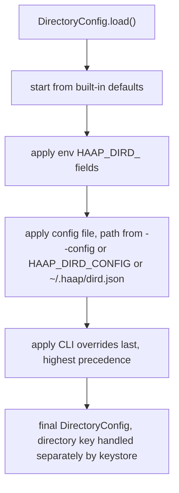
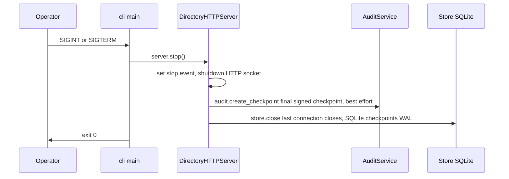

# Operations Runbook — Run, Configure, Deploy & Operate a Directory Instance

This page is the operator guide for one `haap-directory` instance (SPEC §9, mirroring `docs/OPERATE.md`). Every statement was re-checked against `cli.py`, `config.py`, `keystore.py`, `http_api.py`, `service.py`, `store.py`, `telemetry.py`, `rate_limit.py`, `moderation.py`, `verify.py` and the `Dockerfile`; where the doc and the code disagree, the implemented behavior is documented and the divergence flagged. The HTTP surface, route table and request semantics live on the [http layer](/openwiki/architecture/http-layer.md); the SQLite write model, audit chain and expiry rules on [store and audit](/openwiki/architecture/store-and-audit.md); trust reasoning for consumers on the [trust model](/openwiki/concepts/trust-model.md).

## What an operator runs

The service is one process: a stdlib `ThreadingHTTPServer` that owns a `Store` (single SQLite connection, WAL mode), a `DirectoryService`, a `RateLimiterSet` and one background checkpoint thread. Two entrypoints are equivalent:

- **Installed console script** `haap-dird` (`[project.scripts] haap-dird = "haap_directory.cli:main"`), or
- **Source launcher** `python haap_dird.py`, which inserts `src` on `sys.path` and calls the same `cli.main()`.

Python ≥ 3.10; the only hard dependency is `cryptography` (`pip install -e .`; `-e '.[dev]'` adds pytest). The process speaks **plain HTTP** on `config.host:config.port` (defaults `0.0.0.0:8444`); TLS is always terminated in front by a reverse proxy or CDN — endpoint proofs and manifests are signed regardless of transport, so TLS protects transport privacy, not the trust model.

## Run

```bash
haap-dird --db /var/lib/haap/dird.db --host 0.0.0.0 --port 8444 \
    --ttl-hours 24 --max-agents 10000
# from a source checkout without installing:
python haap_dird.py --db ./dird.db --port 8444
```

The CLI actions beyond serving are offline utilities:

- `haap-dird --prune` — open the DB, flip listed entries past their TTL to `expired` (audited `agent.expired`), print how many were pruned, exit. Requires only the DB, not the key.
- `haap-dird --gen-key` — load (or mint) the directory key at the resolved key path and print `directory_fingerprint` and `key_path`, then exit. Useful for publishing/pinning the instance fingerprint.
- `haap-dird --version`.

Note that when run as a server (`cli.main` without `--prune`/`--gen-key`) the process prints a one-line startup banner with version, bind address, DB path and `directory_fingerprint`, installs `SIGINT`/`SIGTERM` handlers, and calls `serve_forever()`.

## Configuration reference and precedence

Highest wins: **CLI flags > `~/.haap/dird.json` > env `HAAP_DIRD_*` > built-in defaults**.

The mechanism is `DirectoryConfig.load(cli_overrides, config_path, environ)` (SPEC §9.1):

1. Start from the dataclass defaults (already set on a fresh `DirectoryConfig`).
2. Apply environment variables whose names begin `HAAP_DIRD_`.
3. Apply the JSON config file — path chosen as `--config`, else `HAAP_DIRD_CONFIG`, else `~/.haap/dird.json` (default `DEFAULT_CONFIG_PATH = ~/.haap/dird.json`).
4. Apply the CLI overrides last (highest precedence).

Each value is coerced to the type of the existing default via `_coerce` (int, float, bool; booleans from strings accept `1/true/yes/on`; lists pass through unchanged). Invalid scalar values (e.g. `HAAP_DIRD_PORT=abc`) therefore raise at load time — configuration errors are fail-fast at process start, not silently ignored at request time.



Caption: `DirectoryConfig.load` composes defaults, then env, then file, then CLI so each layer overrides the previous one; the directory signing key is deliberately never part of this config object.

**Environment naming rule:** `HAAP_DIRD_` + the upper-snake dataclass field name, e.g. `HAAP_DIRD_PORT=8444`, `HAAP_DIRD_TTL_HOURS=24`, `HAAP_DIRD_MAX_AGENTS=10000`, `HAAP_DIRD_TRUST_PROXY_HEADERS=true`. `HAAP_DIRD_CONFIG` is special: it selects the config file path and is not itself treated as a field. The config file is a flat JSON object using the **same field names** as the dataclass.

**Field set** (defaults from `config.py`; CLI flags cover only the first six):

| Group | Field | Default | Notes |
|---|---|---|---|
| Serve | `db_path` | `"dird.db"` | SQLite file; parent dir auto-created |
| | `host` | `"0.0.0.0"` | bind address (plain HTTP) |
| | `port` | `8444` | `0` = ephemeral (used by tests) |
| | `ttl_hours` | `24.0` | entry TTL; heartbeat renews from now |
| | `max_agents` | `10_000` | listed-agent cap → `DIRECTORY_FULL` |
| | `key_path` | `""` | `""` → resolved alongside the DB |
| | `trust_proxy_headers` | `false` | trust `CF-Connecting-IP`/`X-Forwarded-For` only from loopback peers |
| Size/limits | `challenge_ttl_s` | `120` | endpoint challenge lifetime |
| | `max_pending_challenges` | `5_000` | global pending-challenge cap with audited eviction |
| | `max_manifest_bytes` | `256 * 1024` | canonical manifest cap → `MANIFEST_TOO_LARGE` |
| | `max_body_bytes` | `512 * 1024` | HTTP body cap → `PAYLOAD_TOO_LARGE` |
| Rate limits | `rate_search_per_min` | `60` | anonymous search per IP |
| | `rate_register_per_hour` | `5` | anonymous register/verify-domain per IP |
| L2 domain | `domain_token_ttl_s` | `1800` | 30 min single-use verification token |
| | `domain_verification_ttl_days` | `90` | confirmed verification validity |
| | `max_pending_verifications` | `5` | pending verifications per agent → `VERIFICATION_LIMIT_REACHED` |
| L3 vouching | `vouch_max_outgoing` | `10` | active outgoing vouch cap |
| | `vouch_max_expiry_days` | `180` | vouch lifetime cap |
| | `vouch_young_hours` | `72` | youth window used by vouching rules |
| L4 reputation | `report_tenure_hours` | `72` | reporter min listed age to count |
| | `report_window_days` | `7` | rolling auto-suspend window |
| | `report_decay_days` | `180` | reports older than this stop counting |
| | `report_dup_window_hours` | `24` | duplicate reporter+target+category window |
| | `auto_suspend_threshold` | `3` | unique eligible reporters for auto-suspend |
| | `report_war_days` | `30` | mutual-report annotation window |
| L5 audit | `checkpoint_interval_s` | `3600` | signed checkpoint cadence |
| Moderation | `moderator_keys` | `[]` | list of base64 Ed25519 **public** keys |

Operational caveats that follow from the implementation:

- **`moderator_keys` is a JSON list and must come from `dird.json` (or code):** `_coerce` passes list-typed values through unchanged, so an env string would reach `ModerationService` as a string that gets iterated character-by-character — every derived fingerprint is malformed and all moderators silently vanish. Set it in the config file only.
- **A missing *or malformed* config file is silently treated as empty** (`_from_file` returns `{}` on `OSError`/`ValueError`/non-dict). If `dird.json` contains bad JSON you get defaults, not an error — verify with `--gen-key`/startup banner that the values you intend are active.
- Only six flags exist on the CLI (`--db`, `--host`, `--port`, `--ttl-hours`, `--max-agents`, `--key`, plus `--config`/`--prune`/`--gen-key`/`--version`); every other field is configured by file or env.

## The directory key

The instance owns one Ed25519 signing key pair, managed by `keystore.load_or_create_key` — **never** by the config object (config is plain operational settings only):

- **Location:** `config.resolved_key_path()` — `key_path` if set, otherwise `<db>.dirkey.json`, i.e. `os.path.splitext(abspath(db_path))[0] + ".dirkey.json"`. DB `/data/dird.db` ⇒ key `/data/dird.dirkey.json`.
- **Creation:** minted on first run (first `load_or_create_key` call) and written atomically via a `path.tmp` file + `os.replace`, then chmodded **`0600`**.
- **Format:** JSON `{"format": "haap-directory-key-v1", "fingerprint": "HF-…", "public_key": "<b64>", "private_key": "<b64>"}`. Loading validates the `format` marker and rejects anything else.
- **Identity:** `fingerprint` = `fingerprint_of_public_key` = `"HF-"` + first 16 hex chars of `sha256(raw 32-byte public key)`. This is the `directory_fingerprint` surfaced by `/health`, embedded in every search/profile response, and echoed as `X-HAAP-Directory-Fingerprint` on signed audit responses.
- **What it signs:** the legacy registration challenge nonce (`registry_signature` for the unmodified client), L5 audit checkpoints (`AuditService.create_checkpoint` signs `{seq, entry_hash, ts}` over the chain head), and each `/v1/audit/*` response body (`X-HAAP-Directory-Signature` over the canonical JSON of the body).

**Operational rules: back the key file up separately from the DB and never commit it, never put it in config, never mount it where it can be read by another uid.** The key file is *not* inside the SQLite database; restoring a DB backup without the key restores listings under a different directory identity. Losing the key invalidates previously issued challenge signatures and makes old checkpoints unverifiable — consumers pin `directory_fingerprint`, so a silent key rotation breaks their verification. `haap-dird --gen-key` prints the fingerprint + path without exposing the private key, which is the safe way to confirm/publish an instance identity. In the Docker image the key resolves inside the `/data` volume, so it survives container restarts only if that volume persists (see below).

## Process lifecycle: start, serve, shutdown

Startup ordering (implemented behavior):

1. `Store(db_path)` connects (`PRAGMA journal_mode=WAL`, `foreign_keys=ON`, `busy_timeout=5000`), creates the schema idempotently (`CREATE … IF NOT EXISTS`, records `meta.schema_version = "1"`), and ensures the **genesis audit entry** (`seq 0`, event `chain.genesis`) exists.
2. `DirectoryService.__init__` runs `store.prune_expired()` — **startup auto-prunes** listed entries past their TTL into `expired` (each audited `agent.expired`), then wires L2–L5 sub-services.
3. `DirectoryHTTPServer.serve_forever()` binds the socket and starts the background **checkpoint thread**, which calls `audit.maybe_checkpoint()` every `max(1, checkpoint_interval_s)` seconds (default 3600 s) and never crashes the loop on error.
4. `live_agents()`/`count_live()` also prune lazily before reads, so reads never observe stale listings.

Shutdown is graceful by design (SPEC §3.6.1):



Caption: The `cli.main` signal handler calls `server.stop()`; that signs one final L5 checkpoint over the chain head and then closes the store, so a clean stop ends with a persisted checkpoint the next start can attest to.

`server.stop()` sets the stop event, shuts the socket down, signs a final checkpoint (`audit.create_checkpoint()`, best-effort try/except), then `store.close()` closes the single SQLite connection. There is **no explicit `PRAGMA wal_checkpoint` anywhere in the code**: on a clean stop the WAL is checkpointed by SQLite when the last connection closes, so `dird.db` alone is then self-contained. A `SIGKILL`/power loss simply leaves committed transactions in the `-wal` file; SQLite replays them automatically at next open. A clean stop also means the *next* startup does not need to recover a long WAL.

## Health and metrics

- **`GET /health`** → 200 JSON, no sensitive data; also satisfies the legacy `/health` contract as a superset of `{status, agents}`. Fields as implemented by `service.health`:

| Field | Meaning |
|---|---|
| `status` | `"ok"` while the process serves |
| `version`, `protocol_version` | package version and wire protocol (`haap_directory.__version__`, `PROTOCOL_VERSION`) |
| `agents` | `store.count_live()` — currently listed, non-expired agents |
| `suspended` | `store.count_suspended()` |
| `pending_verifications` | **always `0` — hard-coded in `service.health`, not computed** (flagged divergence from the field list in `docs/OPERATE.md`) |
| `chain_seq` | current audit-chain head sequence (`store.audit_head().seq`) — the authoritative mutation counter |
| `uptime_s` | server uptime from the injected clock |
| `directory_fingerprint` | instance identity (the key fingerprint) |
| `api.completion_route` | `"/v1/register/complete"` |

- **`GET /metrics`** → plain-text Prometheus exposition (`text/plain; version=0.0.4`), rendered by `telemetry.render_metrics` with no client library:

| Metric | Type | Meaning |
|---|---|---|
| `haapd_agents_listed` | gauge | `store.count_live()` |
| `haapd_agents_suspended` | gauge | `store.count_suspended()` |
| `haapd_agents_total` | gauge | all agent rows **including history** (`count_total_agents`) |
| `haapd_audit_seq` | counter | audit-chain head `seq` |
| `haapd_ops_total` | counter | total HTTP requests handled (any outcome) |
| `haapd_uptime_seconds` | gauge | process uptime |
| `haapd_rejections_total{code="…"}` | counter | rejections per stable error code, e.g. `code="RATE_LIMITED"` |

- Every response carries `X-Request-Id` (client-supplied and echoed, or generated `req_<hex>`). Rejections use the stable envelope `{"error": {code, message, request_id}}` (code→HTTP table in `errors.py`); `429` responses additionally carry `Retry-After` in whole seconds. Any unexpected exception inside a handler is converted to `INTERNAL_ERROR` so internals never leak.
- The **append-only audit chain is the authoritative record of every state change**: `GET /v1/audit/head`, `/v1/audit/log`, `/v1/audit/checkpoints`, `/v1/audit/verify`, `/v1/agents/{fp}/audit`, all served with a directory signature over the body. `chain_seq` in `/health` and `haapd_audit_seq` in `/metrics` expose the same head. Alert on `haapd_rejections_total` by code, on `haapd_agents_listed` approaching `max_agents`, and on `haapd_audit_seq` jumping backward after a restore.

## Persistence, backup and restore

All state lives in **one SQLite database in WAL mode**; the directory key is a separate file. Because the L5 audit entry for a mutation is appended **inside the same `BEGIN IMMEDIATE` transaction** as the state change it records (the core store invariant — see [store and audit](/openwiki/architecture/store-and-audit.md)), a consistent snapshot of the database is by construction a consistent snapshot of the audit chain: there is no state-without-audit-line state to tear.

- **Backup (online, consistent):** use the SQLite backup API, not a file copy:

  ```bash
  sqlite3 dird.db ".backup '/backup/dird-$(date +%F).db'"
  ```

  `.backup` produces a consistent snapshot even while the server is writing and regardless of un-checkpointed WAL content. Copy the snapshot to a separate filesystem; retain several daily backups plus one monthly. **Also back up the `.dirkey.json` file separately** (same retention) — a DB backup without the key is a listing snapshot under the wrong directory identity.
- **Restore:** stop the service cleanly (SIGTERM), verify the process exited, replace `dird.db` with the backup (after a clean stop the WAL is checkpointed, so `dird.db` is self-contained; if you restore over a crashed instance, remove stale `-wal`/`-shm` files or copy them alongside from the same backup generation), restore the key file if needed, then start. Startup auto-prunes entries that expired while offline (each transition audited `agent.expired` at restart time — no chain entries exist for the offline period because no writes occurred; the chain stays contiguous).
- Rotation/capacity: expired agents are transitioned to `expired` rows, never deleted; `haapd_agents_total` therefore grows monotonically with churn. There is no built-in VACUUM cadence — after heavy churn, `VACUUM` offline (service stopped) reclaims space.

## Abuse controls and caps

All caps are implemented and enforced as follows:

- **Per-IP token buckets** (`rate_limit.py`, in-memory, per single instance): anonymous `search` is limited by `limiters.search` (capacity `rate_search_per_min` = 60/min default), and `register`, `verify-domain` request/confirm by `limiters.register` (capacity `rate_register_per_hour` = 5/hr default). Buckets refill continuously; a denied request gets `429 RATE_LIMITED` with `Retry-After` in whole seconds. The rate limiter key is the TCP peer address **unless** `trust_proxy_headers` is enabled and the TCP peer is loopback (`127.0.0.1`/`::1`), in which case `CF-Connecting-IP` (then `X-Forwarded-For`) first entry is used — forwarding headers from any non-loopback peer are ignored as spoofable. Limiters are **in-memory only**: they reset on restart and protect one instance; multi-instance deployments must put a shared limiter/WAF in front.
- **Payload caps:** request bodies larger than `max_body_bytes` (512 KiB default) are rejected with `PAYLOAD_TOO_LARGE` (413) from the `Content-Length` header before reading; a canonical manifest larger than `max_manifest_bytes` (256 KiB default) is rejected with `MANIFEST_TOO_LARGE` (413) at registration.
- **Listed-agent cap:** a registration for a fingerprint that is not currently live is refused with `DIRECTORY_FULL` (503) when `count_live() >= max_agents` (default 10 000); a *live* fingerprint re-registering is exempt.
- **Challenge tables are capped:** endpoint challenges share a global pending cap `max_pending_challenges` (5000 default) — inserting beyond it evicts the **oldest pending challenge** (by `created_epoch`) and the eviction is **audited** (`challenge.evicted`) inside the same transaction as the new insert. Domain challenges are capped **per agent** at `max_pending_verifications` (5 default) → `VERIFICATION_LIMIT_REACHED`. Challenges are single-use, short-TTL, and their nonces/proofs never leak into the audit chain.
- Other audited caps follow the same pattern: outgoing vouches ≤ `vouch_max_outgoing`, duplicate reports within `report_dup_window_hours`, report dedupe and reporter tenure rules — all re-checked under the write lock inside the transaction that records the mutation.

## Moderator keys

Moderation is the only human judgement in the hot path, and **every moderator action is L5-audited** with the moderator key fingerprint and reason. Moderators are operator-held Ed25519 keys; configure their **public** keys (standard base64) in `~/.haap/dird.json`:

```json
{ "moderator_keys": ["<b64 ed25519 public key>", "..."] }
```

`ModerationService` derives each configured key's `HF-…` fingerprint at startup (malformed entries are skipped). An unknown fingerprint → `MODERATOR_UNKNOWN` (403); a valid key with a bad signature → `TAKEDOWN_UNAUTHORIZED` (403). Signed actions and routes: takedown `POST /v1/reports/{report_id}/takedown`, suspend/unsuspend `POST /v1/agents/{fp}/suspend|/unsuspend`, agent-signed appeal `POST /v1/agents/{fp}/appeal`; signatures are Ed25519 over the canonical JSON of the payload subset. Keep moderator **private** keys off the directory host — sign requests on a separate operator workstation. Full runbook, thresholds and the appeal flow: [moderation appeals](/openwiki/workflows/moderation-appeals.md). Because `moderator_keys` is a list-typed field, it must come from the config file (see configuration caveats above).

## L2 domain verification and the dig dependency

Domain-control checks are performed **by the directory itself** (`verify.py` through the injectable `Resolver` seam), never trusted from the agent's claim:

- **`dns_txt`** shells out to the system `dig` binary — `dig +noall +answer TXT _haap.<domain>`, 10 s timeout. The token must appear verbatim (or as `haap-verify=<token>`) in an answer TXT record; a CNAME that leaves the (approximated two-label) registrable domain is rejected (`DNS_TXT_NOT_FOUND`). **The host needs `dig` installed: Debian/Ubuntu package `bind9-dnsutils`** (the Docker image installs it). A missing/failing `dig` surfaces as `DNS_ERROR_TEMPORARY` (503) — an operator who enables `dns_txt` without the binary will see transient failures, not a configuration error.
- **`https_well_known`** uses only the stdlib: fetch `https://<domain>/.well-known/haap-verify.txt` (falling back to `.json` with field `haap_verify_token`), follow redirects only within the same registrable domain, cap the response at 4 KiB, 10 s timeout, and require the exact token.
- Confirmed verifications last `domain_verification_ttl_days` (90 days) and require the verified domain to cover the manifest's endpoint host (`DOMAIN_ENDPOINT_MISMATCH` otherwise). `domain_verified` is a control signal with provenance — never "verified business", never KYC. Request/confirm/status routes and the flow are documented on the [domain verification](/openwiki/workflows/domain-verification.md) page.

## Docker deployment

A single-container image is provided (`Dockerfile`): `python:3.11-slim`, `dnsutils` installed for `dig`, package installed via pip, then runs `haap-dird` as **non-root user `haap` (uid 10001)** with the SQLite index *and* the derived directory key on a `/data` volume:

```bash
docker build -t haap-dird .
docker run -p 8444:8444 -v haap-data:/data haap-dird
```

Implementation notes:

- `ENV HAAP_DIRD_DB_PATH=/data/dird.db`, `HAAP_DIRD_HOST=0.0.0.0`, `HAAP_DIRD_PORT=8444` are set, and `CMD ["--db", "/data/dird.db", "--host", "0.0.0.0", "--port", "8444"]` passes the same values as flags — CLI wins, so both agree.
- With `--db /data/dird.db`, the key resolves to `/data/dird.dirkey.json`, so **both DB and key live on the mounted volume**. Recreating the container without the volume (or with a fresh volume) mints a new key and a new `directory_fingerprint` — a silent identity change that invalidates previously issued challenge signatures and breaks consumers who pinned the old fingerprint. Mount `/data` persistently and back it up as a unit.
- `/data` must be writable by uid 10001 at runtime (the image `chown haap /data`s its own volume, but host-mounted directories need matching permissions).
- Offline utilities in the container: `docker run --rm -v haap-data:/data haap-dird --prune` and `docker run --rm -v haap-data:/data haap-dird --gen-key`.

## Reverse proxy / TLS guidance

The service binds plain HTTP and is designed to sit behind a TLS-terminating reverse proxy or CDN:

- Terminate TLS at the proxy (`https://` → `http://127.0.0.1:8444`); do not expose the raw port publicly.
- For correct per-client rate limiting behind a proxy, run the proxy on the same host (loopback peer) and set `trust_proxy_headers: true` in `dird.json`. The implementation only consults `CF-Connecting-IP`/`X-Forwarded-For` when the TCP peer is `127.0.0.1` or `::1`, so headers cannot be spoofed from the internet.
- Rate limiters are per-process and in-memory; a load-balanced multi-instance deployment needs a shared limiter/WAF and a single-writer or shared-storage strategy for SQLite (the store serializes writers on one connection — v1 scale assumes one instance owns the DB; mirrors are the sanctioned read fan-out, see [federation mirror](/openwiki/integrations/federation-mirror.md)).

## Trust boundaries (communicate these to consumers)

What an operator must be able to state about any directory instance:

- The directory verifies signature math, the fingerprint↔public-key binding, and endpoint control at registration time. It does **not** vouch for an agent's honesty, quality, or reachability from any particular consumer; it returns labelled signals with provenance (`domain_verified`, `vouches_in`, `reports`, `status`, `block_recommendation`, `audit_verifiable`), never a "safe/trusted" verdict.
- **A hostile or compromised operator can lie about listings but cannot sign as an agent.** Identity lives in the agents' Ed25519 keys, not in the directory. Consumers MUST re-verify an agent's own `/.well-known/haap.json` against the fingerprint from a listing before trusting it.
- **The audit chain is tamper-evident, not tamper-proof.** A rewrite is detected only by parties who fetched a signed checkpoint (or ran a mirror) *before* the rewrite. Consumers who care should poll `/v1/audit/head`, verify `/v1/audit/verify`, and run an independent mirror that ingests `/v1/audit/log` and reproduces an identical head ([federation mirror](/openwiki/integrations/federation-mirror.md)). Every audit response is signed (`X-HAAP-Directory-Signature` + `X-HAAP-Directory-Fingerprint`), and `/health`/metrics expose the same chain head as a monotonic `chain_seq`.
- The directory performs domain-control checks itself but its `dns_txt` method depends on the system `dig` binary and network resolution at confirm time — DNS failures are honest `DNS_ERROR_TEMPORARY` signals, not proof of wrongdoing.

## Documented divergences between `docs/OPERATE.md` and the implementation

- **`/health.pending_verifications` is a constant `0`.** `OPERATE.md` lists the field; the implemented `service.health()` hard-codes it and never counts pending domain challenges.
- **"WAL is checkpointed on close"** is accurate only via SQLite's automatic checkpoint when the last connection closes; the code has no explicit `PRAGMA wal_checkpoint`. A crash therefore leaves `-wal`/`-shm` files that SQLite replays on next open; a clean SIGTERM stop checkpoints them. Backups should use `sqlite3 .backup`, which is consistent in either case.
- **Config-file failures are silent.** `DirectoryConfig._from_file` returns `{}` for a missing *or unparseable/non-dict* file, so a corrupt `dird.json` quietly yields defaults instead of failing startup.
- **`moderator_keys` cannot be set via environment.** List-typed fields are passed through `_coerce` unvalidated; only the JSON file (or code) can configure moderators, while `OPERATE.md`'s prose could be read to imply any config channel works.
- `OPERATE.md` recommends `bind9-dnsutils`; the Dockerfile installs Debian's `dnsutils` meta-package, which provides the same `dig` binary.

## Focused tests an operator should keep green

- `tests/test_store.py` — health payload on an empty instance, config precedence (CLI > file > env), persistence across restart, live counting after registration.
- `tests/test_ops_federation.py` — `/metrics` content (`haapd_agents_listed`, `haapd_audit_seq`, `haapd_ops_total`), register flood → `429` + `Retry-After`, rejections counted per code (`haapd_rejections_total{code="RATE_LIMITED"}`), mirror reproduces the served head.
- `tests/test_proxy_headers.py` — spoofed `X-Forwarded-For` ignored by default (shared bucket per loopback peer) and honored only when `trust_proxy_headers` is on.
- `tests/test_checkpoints.py` — signed head/checkpoint verification against the directory key, cadence via injected clock, per-agent audit redaction, and `server.stop()` persisting a final checkpoint that a reopened store sees.
- `tests/test_domain_verification.py` — L2 request/confirm through a stub resolver (no real `dig`/network in CI).
- `tests/test_search_heartbeat.py`, `tests/test_registration.py`, `tests/test_reputation.py` — TTL expiry/prune behavior under the injected clock, registration state machine and capacity errors, report automata.

Related: [http layer](/openwiki/architecture/http-layer.md), [store and audit](/openwiki/architecture/store-and-audit.md), [business logic](/openwiki/architecture/business-logic.md), [federation mirror](/openwiki/integrations/federation-mirror.md), [legacy client](/openwiki/integrations/legacy-client.md), [domain verification](/openwiki/workflows/domain-verification.md), [moderation appeals](/openwiki/workflows/moderation-appeals.md), [quickstart](/openwiki/quickstart.md), [test suite](/openwiki/testing/test-suite.md).
