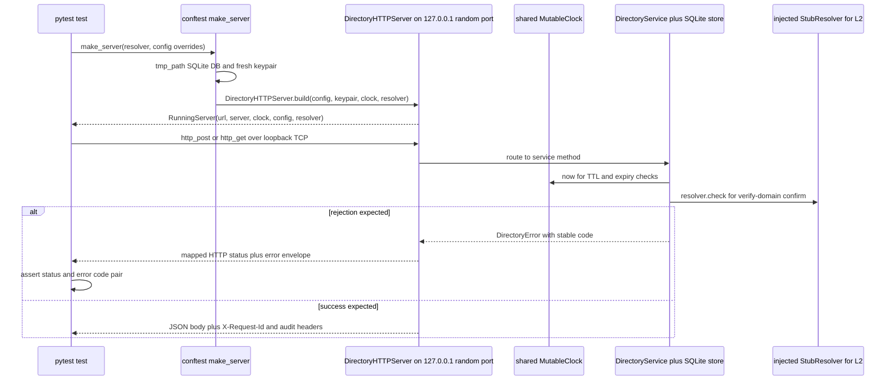

# Test Suite — Fixtures, Seams & Phase Mapping

Correctness in `haap-directory` is enforced **by the pytest suite**, not by linters or type checkers. `tests/conftest.py` supplies the shared scaffolding: each test boots a **real** `DirectoryHTTPServer` on `127.0.0.1` at an OS-assigned ephemeral port, with a per-test SQLite database, an injected `MutableClock` (no real sleeps), and an optional injected L2 `StubResolver` (no real DNS or network). An `Agent` kit signs manifests, nonces and request subsets exactly the way the wire expects, and `http_post` / `http_get` / `register_agent` helpers keep rejection assertions to a one-line status-plus-code check. Test files are named after feature phases (F0–F6, the build plan in `README.md`'s status table); `test_compat_client.py` additionally proves the **unmodified** companion `haap` client works against this service and is skipped when that package is not on disk.

## Baseline: pytest is the only gate

- There is **no linter/type-checker configured** — `AGENTS.md` states it plainly: *correctness is enforced by the test suite* ([AGENTS.md](/AGENTS.md "AGENTS.md")). `pyproject.toml` declares only `pytest>=7.0` under the `dev` extra and points pytest at the tests directory (`testpaths = ["tests"]`).
- Standard invocations, from the repo root:
  ```bash
  python -m pytest -q                          # full suite
  HAAP_REPO=/path/to/haap python -m pytest -q  # + compat test against the real client
  ```
- The suite is deliberately **network-free and sleep-free**: all time flows through an injected `Clock`; all L2 lookups flow through an injectable resolver (see [Hard rules](#hard-rules)).

## The conftest fixtures and seams

`tests/conftest.py` is the single source of shared fixtures. It also makes the suite runnable from a plain checkout: on import it does `sys.path.insert(0, <repo>/src)` so `haap_directory` resolves without `pip install -e .`. Each phase test file repeats the same insertion at its top, so individual files stay runnable in isolation.

| Fixture / helper | Shape | Purpose |
|---|---|---|
| `clock` | `MutableClock` | Fresh controllable clock per test; shared by every server that test builds |
| `make_server` | factory `(resolver=None, **config_overrides) -> RunningServer` | Boots one directory per call: tmp dir SQLite DB, real HTTP on ephemeral port |
| `running` | `RunningServer` | `make_server()` — the default single-server test |
| `running_full` | `RunningServer` | `make_server(max_agents=1)` for the `DIRECTORY_FULL` path |
| `RunningServer` | dataclass | `url`, `server`, `clock`, `config`, `resolver` — HTTP in, internals out |
| `StubResolver` | object | Implements the `Resolver.check` seam with in-memory TXT/well-known maps |
| `Agent` / `make_agent` | dataclass / factory | Keypair + fingerprint + manifest builder + three signing helpers |
| `http_post` / `http_get` | `(url, payload) -> (status, dict)` | urllib helpers that also decode `HTTPError` into a status + parsed body |
| `register_agent` | `(url, agent) -> dict` | Full three-step `/v1` registration; returns the completion body |

### RunningServer / make_server — real HTTP, ephemeral port

`make_server(tmp_path, clock)` is a factory fixture: each call allocates the next numbered SQLite DB under the test's `tmp_path`, builds a `DirectoryConfig` from keyword overrides on top of **generous default rate limits** (`rate_register_per_hour=100_000`, `rate_search_per_min=100_000` — the conftest comment says dedicated abuse tests set their own low limits), generates a fresh directory `KeyPair`, then calls the **same production constructor** `DirectoryHTTPServer.build(config, keypair, clock=clock, resolver=resolver)` and `server.start()`, which binds `127.0.0.1:0`. Every server the fixture created is stopped in teardown. The port comes back in `RunningServer.url`, e.g. `http://127.0.0.1:49231`.

Because it is a real server over loopback TCP, the suite exercises the genuine HTTP surface (routing, body caps, per-IP rate limiting, `X-Request-Id`, signed audit headers) end to end; because `config` is injected, tests steer capacity (`max_agents`), TTLs (`ttl_hours`, e.g. the `LONG_TTL = {"ttl_hours": 10_000}` kept in `test_reputation.py` so agents survive the 72 h tenure window), moderation keys (`moderator_keys=[...]`), rate limits and proxy-header trust without touching any external service. Tests reach *inside* only to observe: `running.server.service.store`, `running.server.service.keypair`, `running.config`, `running.clock` are all common assertion targets.

### MutableClock — no real sleeps

`MutableClock(start=1_700_000_000.0)` is a callable whose `__call__` returns the current epoch seconds and whose `advance(seconds)` moves it forward. Store, service and sub-services read "now" exclusively through the injected `Clock` callable (`timeutil.system_clock` is the production default), so TTL expiry, challenge/token expiry, report decay and checkpoint cadence are all advanced deterministically. All servers built inside one test share the single function-scoped `clock` fixture — that is what makes the restart test in `test_search_heartbeat.py` meaningful: advance the clock past `ttl_seconds`, boot a fresh `make_server(db_path=...)` on the same DB with the same clock, and `DirectoryService.__init__`'s startup `store.prune_expired()` shows zero live agents.

### StubResolver — the L2 seam

`resolver.py` defines the injectable seam as a `Resolver` Protocol with one method, `check(domain, method, token) -> None`, raising `DirectoryError` on failure; production's `SystemResolver` delegates to `verify.check_dns_txt` (system `dig`) or `verify.check_https_well_known` (stdlib TLS). `StubResolver` implements that same seam in memory:

- `txt` — dict keyed by `_haap.<domain>` whose records may be the bare token or `haap-verify=<token>`;
- `well_known` — dict keyed by domain, accepting the exact token or a JSON body with `haap_verify_token`;
- `txt_temporary` — set of names that force the transient-DNS `DNS_ERROR_TEMPORARY` path.

Failures raise the same stable codes the real checks raise (`DNS_TXT_NOT_FOUND`, `WELL_KNOWN_NOT_FOUND`, `WELL_KNOWN_MISMATCH`), so confirm-path tests are indistinguishable in shape from production behavior. Tests publish a token by writing into `running.resolver.txt[...]` between the 202 request and the confirm call.

### Agent — the signing kit

`Agent` (and the `make_agent(name, endpoint)` factory, which always mints a fresh `KeyPair`) models a directory participant:

- `fingerprint` / `public_key_b64` derive from the Ed25519 keypair;
- `manifest(**overrides)` builds a valid `haap-public-manifest-v1` document (format, protocol version, agent block with fingerprint/name/speciality/endpoint, message types, skills, tools) and merges overrides — including the `agent=` sub-dict;
- `sign_manifest(m)` signs the **frozen canonical JSON** — `json.dumps(sort_keys=True, separators=(",", ":"), ensure_ascii=False)` — byte-identical to the vendored `canonical.py` the server verifies with;
- `sign_nonce(s)` signs a UTF-8 string (register challenge proof, signed heartbeats);
- `sign_payload(dict)` signs the canonical JSON of the **request subset** the server actually verifies for the L2/L3/L4 endpoints (`verify-domain`, vouches, reports, takedown, suspend/appeal bodies).

`KeyPair` comes from `haap_directory.crypto` (raw 32-byte keys, standard base64 — the same encoding conventions as the `haap` client).

### HTTP helpers and full-flow registration

`http_post(url, payload)` and `http_get(url)` wrap `urllib` with a 5 s timeout and return `(status, parsed_body)` for both success and `HTTPError` — so a rejection test reads naturally:

```python
status, resp = _submit(running.url, agent, manifest_signature=fake)
assert status == 400
assert resp["error"]["code"] == "SIGNATURE_MISMATCH"
```

`register_agent(url, agent)` performs the complete three-step `/v1` flow — submit the signed manifest, sign the returned nonce, complete with the endpoint proof — and returns the final completion body; the many tests that need a listed agent call it once per participant.



Caption: how a conftest-backed test drives the real server with injected clock and resolver, then asserts success or the stable rejection pair.

## Phase-mapped test files

Naming maps directly to the F0–F6 build plan (`README.md` status table). Two files share phase F3 (server flow + parser units) and two share F4 (vouching + reputation/moderation); `test_audit_chain.py` and `test_checkpoints.py` together cover F5.

| File | Phase / subsystem |
|---|---|
| `tests/conftest.py` | Shared fixtures, seams and helpers (above) |
| `tests/test_store.py` | F0 — persistent store, `/health`, config precedence, audit genesis |
| `tests/test_registration.py` | F1 — proof-of-endpoint registration, rejection cases, update vs fresh |
| `tests/test_search_heartbeat.py` | F2 — search semantics, heartbeat (v1 + legacy), expiry with injected clock |
| `tests/test_domain.py` | F3 — L2 server flow (DNS TXT + HTTPS well-known) over `StubResolver` |
| `tests/test_domain_verification.py` | F3 — `verify.py` parser units (no network) + HTTP-flow edge cases |
| `tests/test_vouching.py` | F4 — L3 vouching: graph, revoke, paths, caps, rules |
| `tests/test_reputation.py` | F4 — L4 reports, eligibility, auto-suspend automaton, moderation, appeal |
| `tests/test_audit_chain.py` | F5 — hash chain: append-per-mutation, linkage, tamper evidence, redaction |
| `tests/test_checkpoints.py` | F5 — signed checkpoints, verify endpoint, agent audit, response signing |
| `tests/test_ops_federation.py` | F6 — `/metrics`, rate-limit flood, mirror chain ingest |
| `tests/test_proxy_headers.py` | Standalone — proxy-header trust for per-IP rate limiting |
| `tests/test_compat_client.py` | Gated — unmodified `haap` client register/search/heartbeat |

### F0 — store, health, config (`test_store.py`)

`/health` boots empty (`status`, `agents == 0`, `version`, `directory_fingerprint` starting `HF-`, canonical `completion_route`); opening a fresh `Store` writes the genesis audit entry (`seq == 0`, `chain.genesis`, `prev_hash == "0"*64`); challenges survive a close/reopen (and challenge rows never leak a `private_key`); `DirectoryConfig.load` precedence is CLI > file > env (`HAAP_DIRD_*`) exercised via `cli_overrides`, a written `dird.json` and `monkeypatch`ed env vars; `count_live()` reflects one completed registration.

### F1 — registration (`test_registration.py`)

The happy path registers, is findable by search and by `/v1/agents/{fp}` with a trust block carrying `endpoint_proof_at`. Rejection cases — each asserting its exact code + HTTP status — cover `SIGNATURE_MISMATCH` (400), `FINGERPRINT_MISMATCH` (400), `FORBIDDEN_FIELD` (400), `FLOAT_FORBIDDEN` (400), `INVALID_JSON` (400), `ENDPOINT_INVALID` for both a non-http scheme and a query string (400), `MANIFEST_TOO_LARGE` (413), `CHALLENGE_EXPIRED` (410), `CHALLENGE_USED` (409), `PROOF_INVALID` (400, and the agent is not listed afterwards), `KEY_MISMATCH` (400) and `DIRECTORY_FULL` (503 via `running_full`). Lifecycle semantics: re-registering a live agent is an **update**, not a duplicate (`count_live() == 1`), while re-registering after TTL expiry is a **fresh** registration that re-lists.

### F2 — search and heartbeat (`test_search_heartbeat.py`)

Free-text search treats space-separated words as **AND**; geo search filters by micro-degree radius and silently excludes agents without geo; pagination reports `total`/`limit`/`offset` and `limit` clamps to 100 (default 20, shape asserted for empty results). A `/v1/heartbeat` signed over `heartbeat:{fp}:{rfc3339}` renews the TTL (proven by advancing the clock twice); stale timestamps outside the ±300 s window get `STALE_TIMESTAMP` (400); unknown fingerprints get `UNKNOWN_OR_EXPIRED` (404) and are never confirmed; the **legacy unsigned** `/heartbeat` still renews. Expiry is lazy-pruned on read (a 404 profile GET drops `count_live()` to 0) and pruned at startup when a server restarts on the same DB after the TTL elapses.

### F3 — domain verification (`test_domain.py` + `test_domain_verification.py`)

`test_domain.py` runs the whole protocol over `StubResolver`: request returns 202 with a token and `verification_id`; publishing the TXT (or well-known body) and confirming returns `verified` with `endpoint_match`, flips `trust.domain_verified` in the profile, makes the agent appear under `search?domain_verified=true`, and marks the verification `primary` on `/v1/verify-domain/status` when the domain hosts the endpoint. Failure/edge flows: missing TXT → `DNS_TXT_NOT_FOUND` (422), verifying a domain the endpoint does not live under → `DOMAIN_ENDPOINT_MISMATCH` (422), token expiry → `VERIFICATION_EXPIRED` (410), single use → `VERIFICATION_USED` (409), bad signature → `SIGNATURE_MISMATCH` (400), per-agent pending cap → `VERIFICATION_LIMIT_REACHED` (429), and the 90-day validity downgrade (heartbeats keep the entry alive past the verification TTL, so `domain_verified` flips back to `false`).

`test_domain_verification.py` unit-tests the **real parsers without network**: `validate_domain` normalization plus `DOMAIN_INVALID` variants (scheme, port, spaces, single label, `@`), `registrable_domain` last-two-label approximation, and the `dig` answer-line parsing loop over a static sample string. HTTP edge cases assert `DOMAIN_INVALID` (400), unknown method → `INVALID_SCHEMA` (400), unregistered fingerprint → `AGENT_NOT_LISTED` (404), and that **confirm is retryable** — a failed confirm (422) does not consume the `verification_id`, so publishing the token and retrying verifies.

### F4 — vouching and reputation (`test_vouching.py` + `test_reputation.py`)

`test_vouching.py`: create/read (`/v1/vouches` 201 → `vouches_in` on the graph and profile) and signed `DELETE` revocation; `VOUCHEE_NOT_LISTED` (404); past expiry → `VOUCH_EXPIRED` (400); expiry beyond `vouch_max_expiry_days` → `VOUCH_INVALID` (400); duplicate active vouch → `VOUCH_EXISTS` (409); the outgoing cap of `vouch_max_outgoing` (10) → `VOUCH_LIMIT_REACHED` (429); `/v1/trust/paths` finds the depth-2 path `a→b→c` and returns none in reverse.

`test_reputation.py` uses `make_server(**LONG_TTL)` so agents stay listed through the 72 h tenure window. A young reporter's report is recorded (202) but answers `counts_toward_automation: false`; duplicates → `REPORT_EXISTS` (409); unlisted target → `TARGET_NOT_LISTED` (404). After ageing reporters past `report_tenure_hours`, **three eligible abuse-class reports auto-suspend** the target: the anonymous profile GET turns 404, `/health` reports `suspended == 1`, and search excludes the target while its reporters still appear; the non-abuse class (`abusive_content`) never auto-suspends. Moderation: takedown by a configured `moderator_keys` signer suspends (`MODERATOR_UNKNOWN` 403 for strangers, `TAKEDOWN_UNAUTHORIZED` 403 for a bad signature), and the suspend → agent appeal (202 `open`) → unsuspend cycle re-lists the agent.

### F5 — audit chain and checkpoints (`test_audit_chain.py` + `test_checkpoints.py`)

`test_audit_chain.py`: one registration appends at least two entries (`challenge_issued` + completed) in the same transactions; the chain starts at genesis, `audit.verify_chain(entries)` recomputes every hash and linkage; `/v1/audit/log` is contiguous with a consistent head; **tampering with any stored field breaks verification**; every entry stores only a 64-hex `detail_hash`, never a detail body.

`test_checkpoints.py`: `/v1/audit/head` is signed by the directory key (verifiable over `{seq, entry_hash, ts}`), and audit responses carry `X-HAAP-Directory-Signature` plus `X-HAAP-Directory-Fingerprint` headers; `create_checkpoint` persists a signature that re-verifies; `maybe_checkpoint` respects the cadence (`checkpoint_interval_s`, advanced via the clock, `force=True` supported); `/v1/audit/verify?seq=` reports `valid` with the computed head; the per-agent audit view is redacted (`detail_hash` yes, `detail` never); and `server.stop()` writes a final checkpoint that a reopened `Store` can read back.

### F6 — metrics, rate limits, mirror (`test_ops_federation.py`)

`/metrics` renders Prometheus text including `haapd_agents_listed`, `haapd_audit_seq`, `haapd_ops_total`, and per-code rejection counters such as `haapd_rejections_total{code="RATE_LIMITED"}`. A dedicated `make_server(rate_register_per_hour=2)` floods `/v1/register` to prove the third request returns **429 with a `Retry-After` header**, and a rejected flood is itself counted in metrics. `mirror.ingest_chain(running.url)` downloads the served `/v1/audit/log`, verifies linkage locally, and reports `verified` plus `matches_served_head` against `/v1/audit/head`.

### Proxy headers (`test_proxy_headers.py`)

Per-IP rate-limit keying: with the default `trust_proxy_headers: false`, spoofed `X-Forwarded-For` values all share the one loopback bucket and get throttled together (the header is ignored because it is spoofable). With `trust_proxy_headers: true`, forwarding headers are honored **only when the TCP peer is loopback** (`127.0.0.1`/`::1` in `http_api._client_ip`): each distinct `9.9.9.9`/`8.8.8.8` keeps its own bucket, and a headerless request falls back to the loopback peer.

## The compat test: skip semantics

`test_compat_client.py` is a backwards-compatibility proof that the **unmodified** `haap` client works against this service (SPEC §4.9, §6.3): it creates an identity with `haap.identity.IdentityStore`, then calls the real `haap.registry_client.register`, `heartbeat` and `search` over the running server and asserts registration status, the legacy unsigned heartbeat renewal, and capability/free-text discovery returning bare manifests.

It needs the companion client package on disk, located by `_find_haap_repo()` from (1) the `HAAP_REPO` environment variable or (2) the sibling `../haap` checkout — verified by the presence of `haap/registry_client.py`. When neither exists the whole module is skipped via `pytestmark = pytest.mark.skipif(..., reason="companion haap client package not found (set HAAP_REPO or place ../haap)")`. **A skip is not a failure**: the default `python -m pytest -q` run passes with the compat test skipped, and `HAAP_REPO=/path/to/haap python -m pytest -q` turns it on. When present, the found checkout is inserted into `sys.path` (after conftest has already made `src/` importable) so `haap.*` resolves against that checkout.

## Hard rules

- **No real DNS or network in tests.** The L2 `dns_txt` path shells out to the system `dig` binary in production (`verify.check_dns_txt`) and must never be contacted: end-to-end L2 runs only through the injectable `Resolver` seam (`StubResolver`), and the real parser code is unit-tested on static `dig`-output text and in-memory bodies. HTTP is exercised only against the loopback test server.
- **Expiry/decay run on the injected clock.** TTL expiry, challenge and verification-token expiry, the report tenure window, the 90-day domain downgrade and checkpoint cadence are all moved with `MutableClock.advance(...)`; the suite never sleeps real TTLs.
- **Every rejection asserts its stable code and HTTP status.** Rejection tests check the exact `(status, error.code)` pair, backed by the add-only `errors.py:ERROR_STATUS` code table that maps each `DirectoryError` code to its fixed HTTP status.

## Extending the suite

To test a new capability, mirror the existing shape: name the file for its phase (or extend the matching file), consume `running`/`make_server`, and pass any new knobs through `DirectoryConfig` overrides — the same dataclass production loads via CLI/file/env precedence, so a knob that needs a test simply becomes another `make_server(**override)` keyword. Register participants with `make_agent` + `register_agent`; drive signed L2/L3/L4 calls with `agent.sign_payload(<exact subset>)` and `http_post`; steer time with `running.clock.advance`; fake L2 with the `StubResolver` maps; and for every failure branch assert the stable code/status pair from `errors.py`. Mutating tests that touch the audit chain need no extra bookkeeping: the store appends each entry in the same transaction as the mutation.

## Related pages

- [HTTP Layer — Routing, Errors, Rate Limits & Observability Endpoints](/openwiki/architecture/http-layer.md)
- [Store and Audit — SQLite, Transactions, Hash Chain](/openwiki/architecture/store-and-audit.md)
- [Legacy Client Compatibility](/openwiki/integrations/legacy-client.md)
- [Quickstart](/openwiki/quickstart.md)
- [Audit Transparency](/openwiki/workflows/audit-transparency.md)
- [Domain Verification](/openwiki/workflows/domain-verification.md)
- [Registration Lifecycle](/openwiki/workflows/registration-lifecycle.md)
- [Reputation](/openwiki/workflows/reputation.md)
- [Vouching](/openwiki/workflows/vouching.md)
