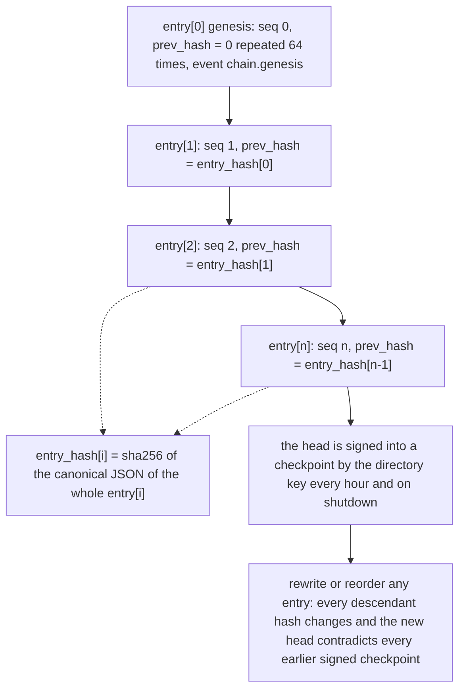
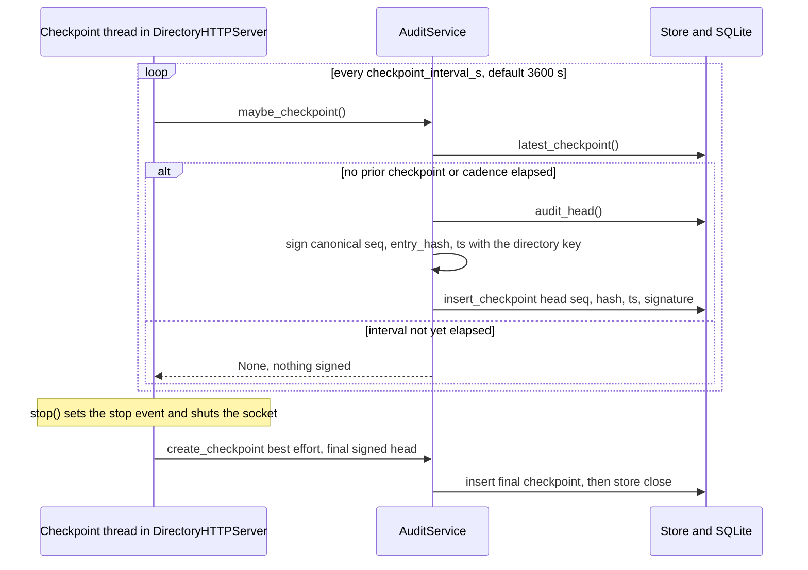

# Audit Transparency (L5) — Chain Endpoints, Checkpoints & Signed Responses

L5 in the trust ladder (see [trust-model](/openwiki/concepts/trust-model.md)) answers a question no lower layer can: *"can anyone verify that the directory itself behaved — that this listing, this suspension, this vouch, this report really happened, in this order, and that the log has not been rewritten?"* The answer is an **append-only, hash-chained audit log** (SPEC §3.6) that the directory publishes and signs. Every state change — registration accepted or rejected, proof-of-endpoint completions, heartbeats, expirations, domain verifications, vouches, revocations, reports, auto-suspensions, moderator takedowns, appeals, operator config changes — is appended as one chain entry inside the **same SQLite transaction** as the state change it records, then served publicly.

This page is the **external face of that chain**: what the serving endpoints return and mean, how the directory signs its responses and checkpoints, the mechanics of the hourly and shutdown checkpoint cadence, the tamper-evidence property stated honestly, and the consumer polling workflow that turns the property into protection. Adjacent pages deliberately own the other slices:

- [store-and-audit](/openwiki/architecture/store-and-audit.md) — the store-side append invariant ("audit rows == mutating ops"), `entry_hash` construction math, the SQLite schema, and checkpoint persistence.
- [federation-mirror](/openwiki/integrations/federation-mirror.md) — the ingest-side consumption of the same endpoints by an independent mirror operator (`mirror.ingest_chain`).
- [http-layer](/openwiki/architecture/http-layer.md) — route wiring, error envelope, and general response-signing headers.
- [business-logic](/openwiki/architecture/business-logic.md) — which service calls append what.

The chain itself is built in `store.py` from pure helpers in `audit.py`; the endpoint-facing logic lives in `audit_service.py` (`AuditService`) and `http_api.py` (`DirectoryHTTPServer`). `AuditService` owns checkpoint signing, verification, and response signing over the head.

## Chain construction and linkage

Chain construction is normative SPEC §3.6.1 and is computed with pure functions in `src/haap_directory/audit.py` (no storage):

```
entry[n]      = {seq, ts, event, fingerprint, actor, result,
                 detail_hash, prev_hash}
entry_hash[n] = sha256(canonical_json(entry[n]))
entry[0]      = genesis: prev_hash = "0" * 64, event = "chain.genesis"
```

Each entry's hash binds to the previous entry through `prev_hash`, so the log is a single linked sequence: `seq` 0 (genesis) then contiguous integers; a rewrite of any entry changes every descendant hash and the head that checkpoints sign.



Caption: `prev_hash` chains every entry to its predecessor; `entry_hash` is a self-hash of the full canonical entry; signed checkpoints anchor the current head so any later rewrite is provably inconsistent with what earlier checkpoints recorded.

Field meanings and the full event taxonomy are on [store-and-audit](/openwiki/architecture/store-and-audit.md); the parts that matter for the public face are:

- **`detail_hash`** is `sha256(canonical_json(detail))` over a small detail object (`{}` when none). Sensitive detail bodies — manifest internals, challenge nonces, report evidence — **never enter the chain; only their hash does** (SPEC §3.6.3, enforced by a test asserting every stored `detail_hash` is 64 hex characters).
- The chain row count **equals mutating ops by construction**: every state-changing `Store` write appends exactly one entry in its transaction, so a registration request typically advances the head by at least two (`register.challenge_issued`, then `register.completed` or `register.updated`). A request that fails validation leaves no entry at all.
- The hash input and every signature input use the vendored canonical serializer (`canonical.py`): `json.dumps(obj, sort_keys=True, separators=(",", ":"), ensure_ascii=False).encode("utf-8")` — byte-identical to the `haap` client package, so directory, consumer, and mirror always hash and sign the same bytes.

## Checkpoint mechanics

A **checkpoint** is a directory-key signature over the chain head at a point in time: the canonical JSON of `{seq, entry_hash, ts}` where `ts` is the head entry's RFC 3339 UTC timestamp. Checkpoints are the anchors that make rewrites *provable* rather than merely suspicious. Three mechanisms create them:

1. **Genesis.** On first boot of a database, `Store._ensure_genesis` opens a write transaction and, when `audit_log` is empty, appends the genesis entry (`seq` 0, `prev_hash` `"0" * 64`, `event` `"chain.genesis"`, actor `directory`, detail `{"schema_version": SCHEMA_VERSION}`). Every chain therefore starts at seq 0 with a well-defined, re-hashable first block.
2. **Hourly cadence from a background thread.** `DirectoryHTTPServer.start()` (and `serve_forever()`) launches a daemon checkpoint thread that wakes every `config.checkpoint_interval_s` (default **3600 s** = hourly) and calls `audit.maybe_checkpoint()`. `maybe_checkpoint` reads the latest persisted checkpoint and only signs a new one when the elapsed time since that checkpoint's `ts` reaches the interval (`force=True` bypasses the wait); exceptions inside the loop are swallowed so the server never crashes over a signing hiccup. The first wake happens one interval after start, because the loop sleeps before its first check.
3. **Final checkpoint on shutdown.** `DirectoryHTTPServer.stop()` sets the stop event, shuts down the HTTP socket, then calls `audit.create_checkpoint()` best-effort before `store.close()`. A clean shutdown therefore always leaves a signed snapshot of the final head, so downtime boundaries are checkpointed too. `tests/test_checkpoints.py::test_shutdown_writes_final_checkpoint` reopens the database after `stop()` and asserts a checkpoint was persisted.



Caption: `AuditService.maybe_checkpoint` enforces the cadence against the latest persisted checkpoint's timestamp; a forced, unconditional `create_checkpoint` runs once on shutdown.

Checkpoint persistence (`store.py`, table `checkpoints`) is deliberately **outside the chain**: `insert_checkpoint(seq, entry_hash, ts, signature_b64)` writes with `INSERT OR REPLACE` keyed by `seq` (the audit head seq at signing time), so at most one checkpoint exists per head seq, and a checkpoint is an *attestation of* the chain, never an event *in* it (appending to the chain while checkpointing it would be self-referential). Signing input and stored signature follow the same rule everywhere: Ed25519 over the canonical JSON of `{seq, entry_hash, ts}`, base64-encoded.

## Serving endpoints and their semantics

The audit surface is four `/v1/audit/*` routes plus the per-agent projection, all public, unauthenticated GETs served through `DirectoryHTTPServer` (SPEC §4.8):

| Endpoint | Response | Semantics |
|---|---|---|
| `GET /v1/audit/head` | `{"seq", "entry_hash", "ts", "checkpoint_signature"}` | The chain head **always presented as a signed checkpoint payload**: `checkpoint_signature` is the b64 Ed25519 signature of the directory key over the canonical JSON of `{seq, entry_hash, ts}` (`AuditService.head`). |
| `GET /v1/audit/log?after=<seq>&limit=<n>` | `{"entries": [...], "next_after": <seq>, "head": {seq, entry_hash, ts}}` | Contiguous, ascending page of full chain rows (each includes its stored `entry_hash`), `head` mirroring the current head at serve time. |
| `GET /v1/audit/checkpoints` | `{"checkpoints": [{seq, entry_hash, ts, signature_b64}, ...]}` | All persisted signed head snapshots, oldest first, up to 1000 (`store.list_checkpoints`). |
| `GET /v1/audit/verify?seq=<n>` | `{"valid": bool, "computed_head": "…"}` | Directory-side recompute: re-hash and linkage-check the chain prefix up to `seq`. A convenience — clients SHOULD verify locally from raw entries. |
| `GET /v1/agents/{fp}/audit` | `{"fingerprint": "HF-…", "entries": [...]}` | Redacted per-agent view of chain rows whose `fingerprint` matches (v1-only route). |

Pagination semantics that consumers and mirrors rely on (`http_api._handle_audit_log`, `store.audit_entries`):

- `after` defaults to `-1`; the store serves `WHERE seq > ? ORDER BY seq ASC LIMIT ?`, so `after=-1` starts at genesis (seq 0) and every page is gap-free.
- `limit` defaults to 100 and is clamped server-side to the range 1–1000, so an external pager cannot force a huge page.
- `next_after` is the last served `seq` (or the requested `after` when the page is empty) — the paging cursor for the next request; a page shorter than the requested `limit`, or empty, means the log is exhausted.
- Each `/v1/audit/log` page's rows are the **full stored rows** (`SELECT *`) including `prev_hash` and `entry_hash`, so a client can re-hash every entry locally and continue linkage from a previously retained head. The per-page `head` field is a cheap sanity check, not a substitute for re-hashing.

`/v1/audit/verify` implements its recompute by paging full entries from genesis (1000 per page) until it passes `seq`, then running the pure `audit.verify_chain` over that prefix; `computed_head` is the `entry_hash` of the last entry ≤ `seq`. When `seq` equals the served head and the chain is intact, `valid` is `True` and `computed_head` equals the head's `entry_hash`.

The per-agent view is **redacted by projection**: each row carries only `seq`, `ts`, `event`, `fingerprint`, `actor`, `result`, and `detail_hash` — no `prev_hash`/`entry_hash` and, critically, no detail body (tested: `"detail" not in e`). It returns up to 200 matching rows in ascending `seq` order (`audit_entries_for_fingerprint`). Because the projection omits the linkage columns, the rows cannot be re-chained in isolation: to verify an agent's history, cross-reference the returned `seq`s against `/v1/audit/log`. Detail bodies stay private by design — producers who hold the original detail object can reveal and prove it off-band by matching its `detail_hash`.

## Signed responses

Every audit response — head, log pages, checkpoints, verify, and the per-agent audit — is served through `http_api._send_signed`, which attaches two headers:

- `X-HAAP-Directory-Signature`: `AuditService.sign_body(body)` — the b64 Ed25519 signature of the directory key over the canonical JSON of the **exact response body**.
- `X-HAAP-Directory-Fingerprint`: `fingerprint_of_public_key(directory_public_key)` — which directory key signed it (trust-matrix row M12: "whose view is this?").

Consumers SHOULD verify audit responses before trusting them (SPEC §2.7.9). Verification is: re-serialize the body you received with the canonical serializer, verify the header signature against the directory's public key (obtained out-of-band — the fingerprint in the header labels the key; operators hold it in the 0600 `*.dirkey.json` file and are encouraged to publish the public key), and for `/v1/audit/head` additionally verify the inner `checkpoint_signature` over `{seq, entry_hash, ts}`. Two layers of signature exist because they answer different questions:

- the **header signature** proves the exact bytes of *this response* (this page of entries, this head, this checkpoint list) came from the directory key — it detects a rewrite of anything the consumer already fetched (an attacker who rewrites stored entries must also re-sign every subsequent response with the directory key, which it cannot);
- the **`checkpoint_signature` in `/v1/audit/head` bodies** (and the `signature_b64` in persisted checkpoints) is the *retainable anchor* — a signed, timestamped `(seq, entry_hash)` pair the consumer stores and compares against later fetches.

## Tamper-evidence: what the chain does and does not guarantee

The honest framing (SPEC §3.6.2–3.6.3, restated in OPERATE.md's trust boundaries) is: **the chain is tamper-evident, not tamper-proof**. Concretely:

- The operator controls the database and *can* rewrite it. The hash chain guarantees only that a rewrite is **detectable by anyone who fetched a signed checkpoint before the rewrite** — a consumer or mirror holding an earlier signed head can prove the new chain contradicts it.
- **Detection window = polling interval.** Checkpoints are signed hourly (default `checkpoint_interval_s` 3600) and on shutdown; a rewrite performed between two checkpoints is provable only once the victim's next poll compares against a pre-rewrite anchor. The gap between a checkpoint and a later rewrite is at most the polling interval of the party that cares.
- **Not completeness against omission.** An operator that never logs an event signs a perfectly consistent chain that simply lacks the event; checkpoints sign the chain, not the world.
- **No protection without polling.** "Consumers who never fetch checkpoints get no protection at all" (SPEC §3.6.3). A party that fetches the chain only after a rewrite sees a consistent-looking history and cannot tell.
- **No secrets, by construction.** Entries carry only hashes of details, never private keys, tokens, nonces, or report bodies — so the public chain can be fully re-verified by anyone without leaking sensitive evidence (SPEC §3.6.3).
- **Omission/rewrite of listings is separate from the chain.** Even a fully honest chain does not make a listing trustworthy; consumers still re-verify an agent's own `/.well-known/haap.json` against its fingerprint (see [federation-mirror](/openwiki/integrations/federation-mirror.md) and [trust-model](/openwiki/concepts/trust-model.md)).

## Consumer workflow: polling and local verification

The workflow that turns tamper-evidence into protection is entirely client-side — there is no directory feature that "watches" the directory:

1. **Obtain the directory public key out-of-band once**, and confirm it matches the `X-HAAP-Directory-Fingerprint` / `directory_fingerprint` headers on responses.
2. **Fetch `/v1/audit/head` on a cadence** at least as often as the checkpoint interval (hourly by default). Verify the response header signature over the body, verify the inner `checkpoint_signature`, and **retain** the verified `(seq, entry_hash)`.
3. **Page `/v1/audit/log?after=<last seen seq>`** on the next poll and re-hash locally: for each served row, recompute `entry_hash` from its eight canonical fields and confirm it matches the stored `entry_hash`, and confirm the first new row's `prev_hash` equals the previously retained `entry_hash`. `audit.verify_chain` is the reference implementation of exactly this linkage check (`audit.py`); `mirror.ingest_chain` shows the full paging loop.
4. **Treat a contradiction as a rewrite.** If served entries no longer link to a retained head (a `prev_hash` mismatch, a reordered `seq`, or a head that contradicts an earlier checkpoint), you have *proof* the chain changed since that checkpoint — retain the evidence.
5. **Escalate to a periodic mirror** for durable, independently re-served history and out-of-band checkpoint comparison; see [federation-mirror](/openwiki/integrations/federation-mirror.md). Spot checks can use `GET /v1/audit/verify?seq=<n>` for the directory's own recompute — but treat it as a convenience, never as the sole verification, since it re-reads the same database being audited.

Operators get a cheap observation surface without the HTTP API: `/health` reports `chain_seq`, and `/metrics` exposes `haapd_audit_seq`, both read straight from `store.audit_head()` (see [runbook](/openwiki/operations/runbook.md)).

## How the chain supports mirrors

The serving endpoints above are exactly the seam a mirror implements: an independent operator downloads the full chain via paged `/v1/audit/log`, verifies linkage locally, and reproduces the head; a served `/v1/audit/head` is then comparable to the mirror's local head, and signed checkpoints give both sides retainable anchors. Two independent mirrors that agree on a head prove they saw the same ordered world — federation without a central registry-of-directories. The reference ingest (`haap_directory.mirror.ingest_chain(base_url, page=500)`) pages the log until a short or empty batch, runs `audit.verify_chain` over the concatenated entries, fetches the served head, and reports `{seq, entry_hash, entries, verified, matches_served_head}`. It is read-only and dependency-free, but it does **not** cryptographically verify the `X-HAAP-Directory-Signature` headers — a mirror that wants signature-level assurance must hold the directory public key and check the headers itself. Full ingest-side semantics, retry guidance (`matches_served_head: False` can simply mean the head advanced mid-run), and consumer-side trust actions live on [federation-mirror](/openwiki/integrations/federation-mirror.md).

## Focused tests

- `tests/test_audit_chain.py` — L5 foundation over real HTTP: every mutation advances the head (`test_every_mutation_appends_one_entry`), the log is contiguous and re-verifies from genesis (`test_chain_links_and_verifies`, `test_audit_log_endpoint_contiguous`), flipping a single `event` field makes `audit.verify_chain` return `False` (`test_tampering_breaks_verification`), and no entry ever stores a detail body — only a 64-hex `detail_hash` (`test_detail_hash_carries_no_secret_body`).
- `tests/test_checkpoints.py` — the checkpoint contract: `/v1/audit/head`'s inner `checkpoint_signature` and the outer `X-HAAP-Directory-Signature` header both verify against the directory key; persisted checkpoint signatures verify over `{seq, entry_hash, ts}`; `maybe_checkpoint` respects the cadence under an injected clock (`MutableClock.advance(checkpoint_interval_s + 1)`); `/v1/audit/verify` recomputes the head; the per-agent audit is redacted; and a clean shutdown persists a final checkpoint that survives reopening the DB.
- `tests/test_ops_federation.py::test_mirror_reproduces_head` — the mirror seam end-to-end: three registrations, then `mirror.ingest_chain(url)` reports `verified is True`, `matches_served_head is True`, and its `seq`/`entry_hash` equal `/v1/audit/head`'s.

## Related pages

- [store-and-audit](/openwiki/architecture/store-and-audit.md) — chain construction math, audit-equals-mutation invariant, checkpoint persistence.
- [federation-mirror](/openwiki/integrations/federation-mirror.md) — ingest-side consumption of these endpoints by independent mirrors.
- [trust-model](/openwiki/concepts/trust-model.md) — the L0–L5 ladder and "consumer decides" framing this chain exists to serve.
- [http-layer](/openwiki/architecture/http-layer.md) — route wiring and the `_send_signed` headers shared with other signed responses.
- [business-logic](/openwiki/architecture/business-logic.md) — service-layer orchestration that funnels mutations into the store.
- [signed-wire-format](/openwiki/concepts/signed-wire-format.md) — canonical JSON parity behind every hash and signature.
- [runbook](/openwiki/operations/runbook.md) — operator duties, backup/restore (a consistent DB snapshot is a consistent chain), trust boundaries.
- [test-suite](/openwiki/testing/test-suite.md) — where the audit/checkpoint/mirror tests fit in the full suite.
- [quickstart](/openwiki/quickstart.md) — running a directory and pointing clients at it.
