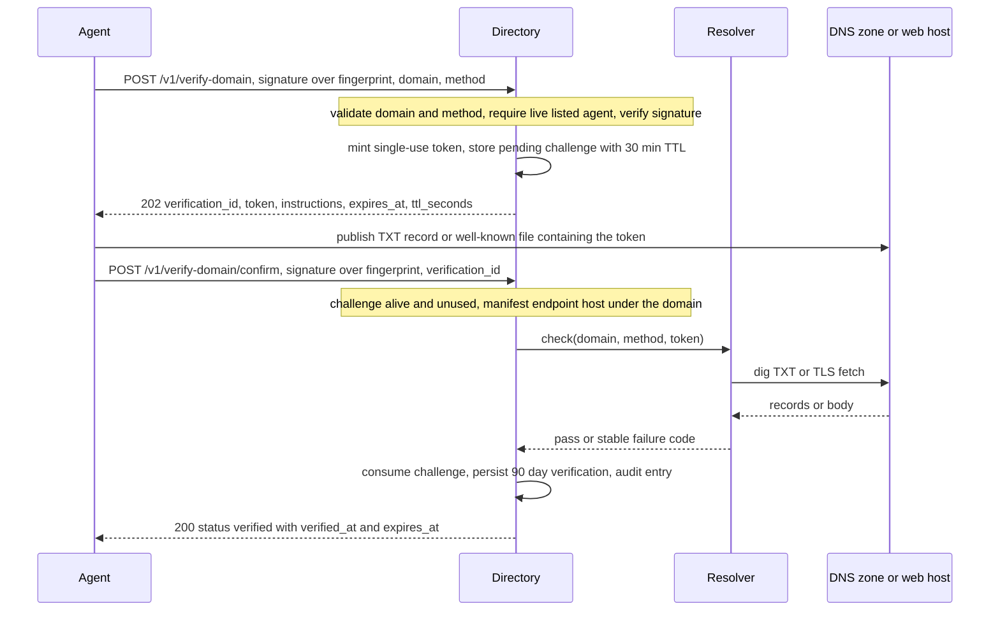

# Domain Verification (L2) — Server-Side Domain-Control Checks

L2 in the trust ladder (see [trust-model](/openwiki/concepts/trust-model.md)) answers one question: *"can the key holder prove control of the domain they claim as their business home?"* It anchors the pseudonymous Ed25519 identity to a real-world, renewable, publicly auditable name — the cheapest durable real-world identifier the protocol verifies without KYC (SPEC §3.3). The directory proves domain control with one of two challenge-response methods, then labels the fact `domain_verified` with method and timestamps; it never turns that fact into "verified business" or a quality verdict.

This page documents the full mechanism: the three HTTP endpoints, the signature subsets and single-use token lifecycle, the exact server-side checks in `src/haap_directory/verify.py`, the endpoint-match rule that makes a verification mean something, the 90-day validity and immediate time-filtered downgrade, and the injectable `Resolver` seam that keeps tests off the real network.

Ownership boundaries: `DomainService` (`src/haap_directory/domain.py`) implements the protocol and issues the signals; the actual control checks live in `src/haap_directory/verify.py` (pure checkers, no storage) and are reached only through the `Resolver` seam (`src/haap_directory/resolver.py`); challenge/verification persistence and audit rows live in `Store` (`src/haap_directory/store.py`); the routes are wired in `src/haap_directory/http_api.py`. Sibling pages own the other slices: [business-logic](/openwiki/architecture/business-logic.md) (service wiring and the trust block), [store-and-audit](/openwiki/architecture/store-and-audit.md) (schema and the in-transaction audit invariant), [http-layer](/openwiki/architecture/http-layer.md) (routing and the error envelope), and [signed-wire-format](/openwiki/concepts/signed-wire-format.md) (the canonical-JSON signature inputs).

## The core stance: the directory checks, never the agent

The agent **never reports its own success**. Both checks are executed by the directory itself, server-side, after a token has been issued and the agent claims to have published it:

- `DomainService.confirm` performs the check by delegating to an injected `Resolver` (`src/haap_directory/domain.py`), never to anything the client controls;
- production wires `SystemResolver`, which dispatches to `verify.check_dns_txt` / `verify.check_https_well_known` (`src/haap_directory/resolver.py`);
- a failed check surfaces as a stable `DirectoryError` code, and the challenge is **not** consumed, so `confirm` is retryable until the token is actually observable;
- only a directory-side success can flip the persisted signal, and both the request and the success are appended to the L5 audit chain in the same transaction as the state change.

The seam is a three-argument protocol `check(domain, method, token) -> None` that raises on failure. That is the extension point tests exploit: `StubResolver` in `tests/conftest.py` implements the identical seam with in-memory maps, so the end-to-end flow is exercised deterministically and the real `dig`/network code is never contacted in CI.

## Protocol — request, publish, confirm

The protocol is three steps: the listed agent signs a request for a challenge, publishes the token on the domain it controls, then signs a confirm asking the directory to verify server-side.



Caption — the directory issues a single-use token at request, the agent publishes it on the domain it claims, and `confirm` makes the directory itself verify the token through the resolver seam before persisting a 90-day verification.

### Request — `POST /v1/verify-domain` → 202

`DomainService.request_verification` (`src/haap_directory/domain.py`):

1. resolves the claimed `fingerprint` and requires a **currently listed, non-expired** agent row (`_live_agent`, else `AGENT_NOT_LISTED`);
2. validates the domain (`DOMAIN_INVALID`) and the method — exactly `dns_txt` or `https_well_known`, anything else is `INVALID_SCHEMA`;
3. verifies the agent's Ed25519 signature over the canonical JSON of the body subset `(fingerprint, domain, method)` (`verify_over` + `subset`), else `SIGNATURE_MISMATCH`;
4. mints `verification_id = "vd_" + token_hex(16)` and a 256-bit token (`secrets.token_hex(32)`), and stores a pending challenge row bound to the fingerprint with TTL `config.domain_token_ttl_s` (default 1800 s), enforcing the per-agent pending cap (default 5) → `VERIFICATION_LIMIT_REACHED` (429).

The 202 body carries `verification_id`, `domain`, `method`, `token`, human-readable `instructions` (TXT publish with `haap-verify=<token>`, TTL ≤ 300 recommended; or serving the well-known file), `expires_at`, and `ttl_seconds`.

### Publish

The agent places the token where the directory will look:

- `dns_txt`: a TXT record at `_haap.<domain>` whose value is the token verbatim or starts with `haap-verify=<token>` (so the record can coexist with other uses of the label);
- `https_well_known`: a file at `https://<domain>/.well-known/haap-verify.txt` containing exactly the token, or the `.json` variant with field `haap_verify_token`.

### Confirm — `POST /v1/verify-domain/confirm` → 200

`DomainService.confirm` (`src/haap_directory/domain.py`) runs in a strict order:

1. live-agent check (`AGENT_NOT_LISTED`);
2. signature over the body subset `(fingerprint, verification_id)` (`SIGNATURE_MISMATCH`);
3. challenge lookup: missing, wrong kind, or belonging to another fingerprint → `VERIFICATION_NOT_FOUND` (404); already used → `VERIFICATION_USED` (409); past TTL → `VERIFICATION_EXPIRED` (410);
4. **endpoint match**: the stored manifest's `agent.endpoint` host must equal the claimed domain or be a subdomain of it (`endpoint_host` + `host_under_domain`), else `DOMAIN_ENDPOINT_MISMATCH` (422) — checked **before** any network activity, because verifying a domain the endpoint does not live under proves nothing useful;
5. the actual control check through `self.resolver.check(domain, method, token)` — the directory's own DNS/TLS probe;
6. on success, `store.confirm_domain_verification` **atomically** marks the challenge `used=1`, inserts a `domain_verifications` row valid for `config.domain_verification_ttl_days` (default 90 days), and appends audit `domain.verified` in the same transaction.

The 200 body: `{status: "verified", domain, method, verified_at, expires_at, endpoint_match: true}`.

### Status — `GET /v1/verify-domain/status?fingerprint=…`

Public read-only listing (no signature): every **active** verification for the fingerprint as `[{domain, method, verified_at, expires_at, primary}]`, where `primary` is true when the verification's domain hosts the manifest endpoint (`DomainService.status`, `src/haap_directory/domain.py`).

## The two server-side checks

Both checkers live in `src/haap_directory/verify.py`, are reached only through the resolver seam, and raise `DirectoryError` with the stable §4.10 codes. The network limits are **hardcoded in `verify.py`**, not configurable: 10 s DNS timeout, 10 s TLS timeout, 4 KiB response cap.

### Method `dns_txt` — system `dig`, off-domain CNAME rejected

`check_dns_txt` (`src/haap_directory/verify.py`) resolves `_haap.<domain>` TXT by shelling out to the system `dig` binary: `dig +noall +answer TXT _haap.<domain>`, 10 s timeout, then parses the answer lines:

- a missing/never-returning `dig` (subprocess `TimeoutExpired`/`OSError`, including the binary not being installed) → `DNS_ERROR_TEMPORARY` (503) — an operator who enables `dns_txt` without `dig` (Debian/Ubuntu `bind9-dnsutils`, installed in the Docker image) sees transient failures, not a configuration error;
- a non-zero `dig` exit → `DNS_ERROR_TEMPORARY`;
- a CNAME answer whose target leaves the claimed domain's registrable domain → `DNS_TXT_NOT_FOUND` (422) — a `_haap` label that is a CNAME to a third-party zone would let that third party answer for the domain, so off-registrable-domain CNAMEs are rejected; CNAMEs staying inside the registrable domain are tolerated and TXT lines continue to be scanned;
- success only when some TXT record value equals the token verbatim or starts with `haap-verify=<token>`; otherwise `DNS_TXT_NOT_FOUND` (422).

### Method `https_well_known` — stdlib TLS fetch with a redirect cage

`check_https_well_known` (`src/haap_directory/verify.py`) fetches `https://<domain>/.well-known/haap-verify.txt` with stdlib `urllib` (no extra dependency), falling back to `.json` only when the `.txt` fetch answers 404:

- redirects are followed only through `_SameDomainRedirect`: every hop must stay on `https` and its host must be the original's registrable domain or a subdomain of it — a redirect leaving that cage raises `WELL_KNOWN_NOT_FOUND` (422), which is the SSRF/request-smuggling control (SPEC §8 T-D08);
- the response is read with a `_MAX_WELL_KNOWN_BYTES + 1` (4 KiB + 1) cap, so an oversized resource is never fully downloaded and cannot match the token;
- any HTTP error other than the `.txt` 404, any URL/OS error on either fetch, or an insecure/off-domain redirect → `WELL_KNOWN_NOT_FOUND` (422);
- the body (decoded UTF-8, trimmed) must equal the token exactly, or — for the JSON variant — parse as an object whose `haap_verify_token` field equals the token; otherwise `WELL_KNOWN_MISMATCH` (422).

## Domain rules and the endpoint-match requirement

<!-- openwiki: broken internal link [[a-z0-9-]{0,61}[a-z0-9]] file "[a-z0-9-]{0,61}[a-z0-9]" does not exist. Fix the href or restore the target, then delete this comment. -->
<!-- openwiki: broken internal link [[a-z0-9-]{0,61}[a-z0-9]] file "[a-z0-9-]{0,61}[a-z0-9]" does not exist. Fix the href or restore the target, then delete this comment. -->
`validate_domain` (`src/haap_directory/verify.py`) normalizes the input (strip, lowercase) and rejects — always `DOMAIN_INVALID` (400) — anything that is not a bare hostname: scheme/port/path (`://`, `:`, `/`), userinfo (`@`), whitespace, length over 253, fewer than two labels, or a format outside `^[a-z0-9]([a-z0-9-]{0,61}[a-z0-9])?(\.[a-z0-9]([a-z0-9-]{0,61}[a-z0-9])?)+$` (IDN must arrive in punycode).

`registrable_domain` approximates the registrable domain as the **last two labels**. That is deliberately conservative for multi-label public suffixes (the code comments that an off-domain CNAME inside such suffixes is rarer than a provider CNAME). The same approximation gates both the DNS CNAME rule and the well-known redirect cage, and it is also why the `dig`/redirect guards are best-effort within the approximation — the cost of a false positive there is low and the failure mode is honest (`DNS_TXT_NOT_FOUND` / `WELL_KNOWN_NOT_FOUND`).

The endpoint-match rule (`src/haap_directory/domain.py`) requires the manifest endpoint host to equal the verified domain or live under it (`host_under_domain`: `host == domain or host.endswith("." + domain)`). The rule is checked at confirm time, before the resolver probe, and again structurally whenever the trust block is built (`primary_verification`); the same test decides which of several verified domains is `primary` for a listing.

## Lifecycle and state

A verification has two distinct phases: a **pending challenge** (bounded, single-use, short-lived) and a **confirmed verification record** (valid 90 days, then silently invisible).

```mermaid
stateDiagram-v2
    [*] --> Pending: POST /v1/verify-domain issues the single-use token
    Pending --> Consumed: confirm passes, challenge marked used atomically
    Pending --> Lapsed: token TTL passes before success
    Consumed --> [*]
    Lapsed --> [*]
    note right of Pending
        failed resolver checks do not consume the token:
        the same verification_id is retried until the TTL
    end
```

Caption — pending challenge states only: a failed confirm leaves the challenge pending, success consumes it atomically with the audit entry, and expiry simply lapses it (a fresh request mints a new token).

Concrete lifecycle facts (`Store` in `src/haap_directory/store.py`, config in `src/haap_directory/config.py`):

- Pending challenges are rows in the shared `challenges` table with `kind='domain'`, the **token stored in the `nonce` column**, and a fingerprint binding. A new request counts only live pending rows (`used=0`, `expires_epoch > now`) and raises `VERIFICATION_LIMIT_REACHED` (429) at the per-agent cap `max_pending_verifications` (default **5**) — the cap is on *pending*, not on accumulated active verifications, and an agent may hold verifications for several domains.
- Request and success are audited: `domain.verify_requested` is appended in the same write transaction as the challenge insert; `domain.verified` is appended in the same transaction that consumes the challenge and inserts the verification row (SPEC §3.6 — the audit chain is the authoritative record).
- Token TTL: `domain_token_ttl_s`, default **1800 s (30 minutes)**, returned as `expires_at`/`ttl_seconds`.
- Verification validity: `domain_verification_ttl_days`, default **90 days** from `verified_at` (`expires_epoch = verified_epoch + ttl_days * 86400`).
- Expiry is **purely time-filtered, with no transition row**: `active_domain_verifications` selects only `expires_epoch >= now`, and every reader — profile trust block, search results, `/v1/verify-domain/status`, heartbeats — derives the signal from that query on each request. The moment the 90 days pass, `domain_verified` downgrades to `false` with no stored transition; re-verification starts a fresh request/confirm cycle. Expired challenge and verification rows are not deleted by the pruner (only endpoint challenges are evicted under their own cap).
- The store-level `confirm_domain_verification` re-checks `used` under its write lock, so the single-use invariant holds even under concurrent confirms.

## Signals: what `domain_verified` means — and does not

`domain_verified` is a **control signal, never KYC and never "verified business"**: it asserts that at `verified_at` the party holding the listing's private key could write DNS records for the domain or place files under its `/.well-known/` tree — the same domain-control primitive ACME uses, borrowed as a reputation anchor. A verified domain can still run a scam; verification says nothing about honesty, quality, solvency, or legal identity, and the directory labels it accordingly (SPEC §3.3, §4.3, matrix row M4). Consumers eyeball the domain string, apply their own policy (e.g. "only contact agents whose verified domain matches their stated business"), and weigh L4 reports against the same listing.

In the wire model the signal appears with provenance in the trust block built by `DirectoryService.build_trust_block` (`src/haap_directory/service.py`):

```json
"domain_verified": true,
"domain_verification": {
  "domain": "euraka.example.com",
  "method": "dns_txt",
  "verified_at": "…",
  "expires_at": "…",
  "primary": true
}
```

The block is populated only when `DomainService.primary_verification` finds an **active** verification whose domain covers the manifest's endpoint host — so an agent whose only verifications cover domains unrelated to its endpoint reads `domain_verified: false`, honestly, rather than a fabricated positive. When the primary exists, `primary` is the most recently verified matching domain.

Search exposes the signal as an optional, one-sided filter: `GET /v1/search?domain_verified=true` (also `1`/`yes`) gates **inclusion** through `_passes_trust_filters` — `domain_verified=false` does **not** require unverified entries, and trust parameters never rank or score results. Status polling is the per-agent read of the same data.

## Stable failure codes

Every rejection surfaces the stable `UPPER_SNAKE` code with a fixed HTTP status from the add-only master table in `src/haap_directory/errors.py` (codes are API — never renamed, never removed, add-only):

| Code | HTTP | Raised when |
|---|---|---|
| `DOMAIN_INVALID` | 400 | claimed domain fails `validate_domain` |
| `INVALID_SCHEMA` | 400 | method is not `dns_txt`/`https_well_known` |
| `AGENT_NOT_LISTED` | 404 | requester is not currently listed/live |
| `SIGNATURE_MISMATCH` | 400 | request or confirm signature does not verify over the subset |
| `VERIFICATION_NOT_FOUND` | 404 | unknown challenge id, wrong kind, or another fingerprint's challenge |
| `VERIFICATION_EXPIRED` | 410 | token TTL passed before confirm |
| `VERIFICATION_USED` | 409 | challenge already consumed |
| `VERIFICATION_LIMIT_REACHED` | 429 | per-agent pending cap (default 5) exceeded |
| `DOMAIN_ENDPOINT_MISMATCH` | 422 | manifest endpoint host not under the claimed domain |
| `DNS_TXT_NOT_FOUND` | 422 | token absent from `_haap` TXT, or off-registrable-domain CNAME |
| `WELL_KNOWN_NOT_FOUND` | 422 | well-known file unreachable or redirect escapes the cage |
| `WELL_KNOWN_MISMATCH` | 422 | body does not carry the token |
| `DNS_ERROR_TEMPORARY` | 503 | `dig` timed out, failed, or is not installed — retry shortly |
| `RATE_LIMITED` | 429 | per-IP register limiter exhausted |

Both `POST` routes additionally share the per-IP `register` rate limiter (default 5 requests/hour) in `src/haap_directory/http_api.py`, so a bulk verifier is throttled per IP on top of the per-agent pending cap.

## Configuration and operations

The L2 protocol timers are `DirectoryConfig` fields (`src/haap_directory/config.py`) settable via `~/.haap/dird.json` or `HAAP_DIRD_*` environment (the CLI only exposes db/host/port/ttl/max-agents/key):

| Field | Default | Meaning |
|---|---|---|
| `domain_token_ttl_s` | 1800 | lifetime of a single-use pending token (30 min) |
| `domain_verification_ttl_days` | 90 | validity of a confirmed verification |
| `max_pending_verifications` | 5 | per-agent pending-challenge cap → `VERIFICATION_LIMIT_REACHED` |

Operational notes an operator must know (full detail on the [runbook](/openwiki/operations/runbook.md) and `docs/OPERATE.md`):

- `dns_txt` **requires the system `dig` binary** (`bind9-dnsutils` on Debian/Ubuntu; the Docker image installs it). Without it, confirms fail with `DNS_ERROR_TEMPORARY` (503) — the error is deliberately transient, never a hint about internals.
- `https_well_known` is pure stdlib: TLS against the public-CA system store, only the two fixed `.well-known` paths on the admin-confirmed domain, same-registrable-domain https redirects only, 4 KiB read cap, 10 s timeout — the SSRF posture is bounded by construction (SPEC §8 T-D08), and registration itself never contacts the endpoint.
- Confirms are retryable by design: DNS propagation means a confirm may fail with `DNS_TXT_NOT_FOUND` and be retried with the same `verification_id` until the 30-minute TTL; after `VERIFICATION_EXPIRED` a fresh `POST /v1/verify-domain` mints a new token.
- Verification expiry needs no janitor: the downgrade is a read-time filter on `expires_epoch`, visible immediately in profiles, search, heartbeats, and the status endpoint.

## Focused tests

The suite never contacts real DNS or HTTP (`tests/conftest.py` `StubResolver` implements the same `check(domain, method, token)` seam with in-memory `txt`/`well_known` maps plus a `txt_temporary` set that forces `DNS_ERROR_TEMPORARY`):

- `tests/test_domain.py` drives the whole protocol over the stub: request 202 → publish → confirm 200 with `endpoint_match`, trust-block flip to `domain_verified`, search inclusion via `domain_verified=true`, and `primary` on the status endpoint; plus failure/edge flows — missing TXT → `DNS_TXT_NOT_FOUND` (422), verifying a domain the endpoint does not live under → `DOMAIN_ENDPOINT_MISMATCH` (422), expiry → `VERIFICATION_EXPIRED` (410), single use → `VERIFICATION_USED` (409), bad signature → `SIGNATURE_MISMATCH` (400), pending cap → `VERIFICATION_LIMIT_REACHED` (429), and the 90-day downgrade kept alive by heartbeats flipping `domain_verified` back to false.
- `tests/test_domain_verification.py` unit-tests the **real parsers without network** — `validate_domain` normalization and rejection variants, the `registrable_domain` last-two-label approximation, and the `dig` answer-line parsing loop over a static sample — plus HTTP edge cases (`DOMAIN_INVALID`, unknown method → `INVALID_SCHEMA`, unregistered caller → `AGENT_NOT_LISTED`) and the retryable-confirm property (a 422 does not consume the `verification_id`; publishing the token and retrying verifies).

See [test-suite](/openwiki/testing/test-suite.md) (F3) for the full harness description and its hard rules.

## Related pages

- [Trust Model — the L0–L5 ladder](/openwiki/concepts/trust-model.md)
- [Business Logic — service layer](/openwiki/architecture/business-logic.md)
- [Store and Audit — SQLite, transactions, hash chain](/openwiki/architecture/store-and-audit.md)
- [HTTP Layer — routing, errors, rate limits](/openwiki/architecture/http-layer.md)
- [Signed Wire Format — canonical JSON and signature subsets](/openwiki/concepts/signed-wire-format.md)
- [Runbook — operations and the dig dependency](/openwiki/operations/runbook.md)
- [Test Suite](/openwiki/testing/test-suite.md)
- [Registration Lifecycle](/openwiki/workflows/registration-lifecycle.md)
- [Audit Transparency (L5)](/openwiki/workflows/audit-transparency.md)
