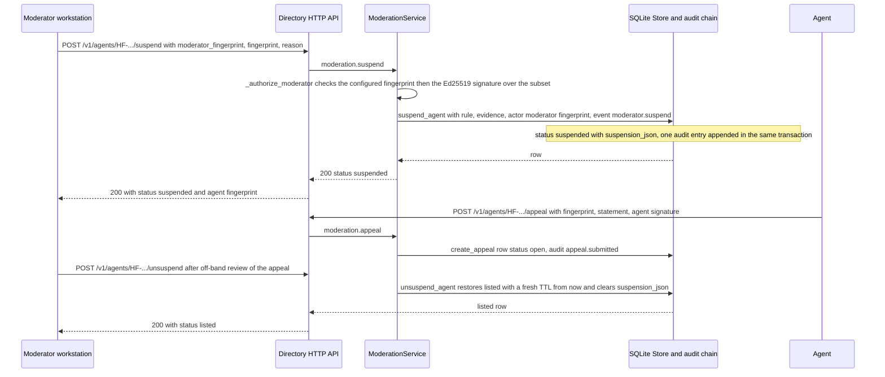
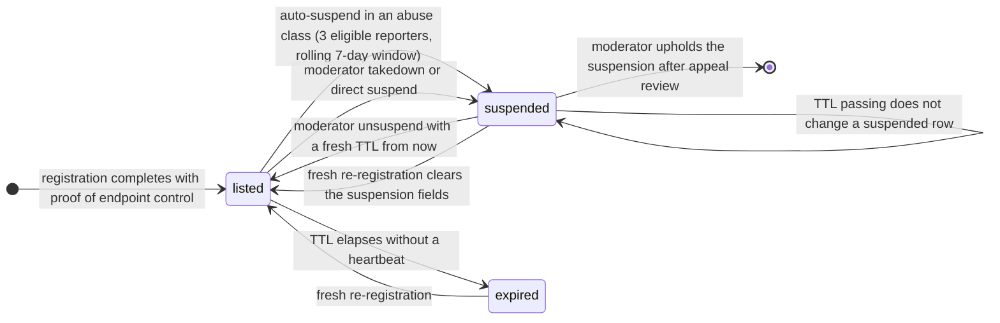

# Moderation & Appeals (L4) — Moderator-Keyed Human Actions

L4 in the trust ladder (see [trust-model](/openwiki/concepts/trust-model.md)) has exactly one human-in-the-loop job: act on *defined abuse classes* — never on opinion, and never issuing a "trustworthiness" verdict, because the directory is a phone book, not a judge. Reporters supply signed allegations; deterministic automata run published thresholds; **moderators** (operator-held Ed25519 keys) decide takedowns, direct suspensions, and appeal outcomes — the only human judgement calls in the hot path, and every one of them is L5-audited with the moderator key fingerprint. This page documents those mechanics: who may act, how an action is authorized and signed, the suspension state an action produces, how an agent appeals, and how unsuspend restores an entry.

The layer spans four modules and a runbook:

- `src/haap_directory/moderation.py` — `ModerationService`, the four moderator/agent keyed actions.
- `src/haap_directory/reputation.py` — `ReputationService`, which owns reports and the **auto-suspend automaton** (fully detailed on the [reputation](/openwiki/workflows/reputation.md) page).
- `src/haap_directory/store.py` — the `agents`, `reports`, `appeals` and `audit_log` tables and the suspension/unsuspend/appeal writes.
- `src/haap_directory/http_api.py` — the `/v1/reports/{id}/takedown`, `/v1/agents/{fp}/suspend|unsuspend|appeal` routes.
- `docs/MODERATION.md` — the **append-only runbook and policy log**: operators record every policy decision there with a date, so the audit trail of *policy* is as durable as the audit trail of *actions*.

Sibling pages own the other slices: [business-logic](/openwiki/architecture/business-logic.md) (service wiring and trust-block assembly), [store-and-audit](/openwiki/architecture/store-and-audit.md) (schema and the in-transaction audit invariant), [http-layer](/openwiki/architecture/http-layer.md) (routes and the error envelope), [signed-wire-format](/openwiki/concepts/signed-wire-format.md) (the canonical-JSON signature inputs), [audit-transparency](/openwiki/workflows/audit-transparency.md) (the public chain), and [runbook](/openwiki/operations/runbook.md) (operations).

## Moderator keys: operator-held Ed25519 identities

Moderators are **operator-held Ed25519 keypairs**, configured out of band by their **public** keys (standard base64) in the config file:

```json
{ "moderator_keys": ["<b64 ed25519 public key>", "..."] }
```

`DirectoryConfig.moderator_keys` (`src/haap_directory/config.py`) is a plain list field in the flat config object, so it takes the same precedence as every other setting (CLI > `~/.haap/dird.json` > env `HAAP_DIRD_*` > defaults) — in practice it is set in `dird.json`. Operator guidance: **keep the moderator private keys off the directory host** and sign requests on a separate workstation.

At `ModerationService` construction (`src/haap_directory/moderation.py`) each configured key is converted to its fingerprint with `fingerprint_of_public_key` (`"HF-"` + first 16 hex chars of `sha256(raw_public_key)`, `src/haap_directory/identity.py`) and stored in an in-memory `fingerprint -> public_key_b64` map; malformed config entries are skipped. That construction-time map **is** the authorization universe: a request whose `moderator_fingerprint` is not in the map can never act, no matter what key signed it.

## Authorization: exact signed subsets and the two 403 gates

Moderation routes have no session auth — the key *is* the credential. Every moderator-signed request carries a `signature` (base64 Ed25519) over the **canonical JSON** of an exact subset of the body: `json.dumps(subset, sort_keys=True, separators=(",", ":"), ensure_ascii=False)` via `verify_over` (`src/haap_directory/signing.py`, serializer in `src/haap_directory/canonical.py`). Body fields outside the subset are ignored, which is why the tests deliberately re-sign a body after adding extra fields.

| Action | Route | Signed subset (exact) | Verified against |
|---|---|---|---|
| Takedown a reported agent | `POST /v1/reports/{report_id}/takedown` | `{moderator_fingerprint, report_id, reason}` | configured moderator key |
| Direct suspend | `POST /v1/agents/{fp}/suspend` | `{moderator_fingerprint, fingerprint, reason}` | configured moderator key |
| Unsuspend / restore | `POST /v1/agents/{fp}/unsuspend` | `{moderator_fingerprint, fingerprint}` | configured moderator key |
| Appeal (by the **agent**) | `POST /v1/agents/{fp}/appeal` | `{fingerprint, statement}` | the **agent's** registered key |

`ModerationService._authorize_moderator` runs the same gate for all three moderator actions, in a fixed order:

1. unknown `moderator_fingerprint` (not in the construction-time map) → `DirectoryError("MODERATOR_UNKNOWN")` → **403**;
2. signature that fails verification over the subset with the mapped key → `DirectoryError("TAKEDOWN_UNAUTHORIZED")` → **403**.

Both codes live in the stable §4.10 error table (`src/haap_directory/errors.py`) and are never renamed or removed — `MODERATOR_UNKNOWN` and `TAKEDOWN_UNAUTHORIZED` both map to 403. The per-action failures below map to `REPORT_NOT_FOUND`/`AGENT_NOT_FOUND` (404) and the appeal signature failure to `SIGNATURE_MISMATCH` (400).



Caption — moderator actions authorize by fingerprint lookup then signature verification over the exact subset, mutate the agent row through `store.suspend_agent` / `unsuspend_agent`, and append one audit entry per action in the same SQLite transaction; an agent appeal is signed by the agent's own registered key, not a moderator.

## Takedown — `POST /v1/reports/{report_id}/takedown`

`moderation.takedown` (`src/haap_directory/moderation.py`) is the *reported-agent* hide: it requires a report id to exist, then suspends that report's target:

1. authorize the moderator (`MODERATOR_UNKNOWN` / `TAKEDOWN_UNAUTHORIZED` — both 403);
2. load the report; missing → `REPORT_NOT_FOUND` (404);
3. suspend the report's `target_fingerprint` through `store.suspend_agent` with rule `"moderator takedown: <reason>"`, `evidence_reports=[report_id]`, actor `moderator:<fp>`, event `moderator.takedown`;
4. a target row that has vanished in between → `AGENT_NOT_FOUND` (404);
5. success → `200 {"status": "suspended", "agent": {"fingerprint": <fp>}}`.

A takedown may act on **any category and any evidence kind** — it is the moderator's unrestricted counterpart to the narrow auto-suspend automaton below.

## Direct suspend — `POST /v1/agents/{fp}/suspend`

`moderation.suspend` is the *no-report-required* hide. After the same authorization gate it calls `store.suspend_agent` with rule `"moderator suspend: <reason>"`, **empty** `evidence_reports`, actor `moderator:<fp>`, event `moderator.suspend`. Unknown fingerprint → `AGENT_NOT_FOUND` (404); success → `200 {"status": "suspended", "agent": {"fingerprint": <fp>}}`. This is the route a moderator uses for behaviour seen out of band (or for upholding a suspension after appeal review without an evidence report id).

## Unsuspend restores with a fresh TTL — `POST /v1/agents/{fp}/unsuspend`

`moderation.unsuspend` authorizes over the smallest subset (`{moderator_fingerprint, fingerprint}`) and calls `store.unsuspend_agent` (`src/haap_directory/store.py`), which:

- accepts **only** a row whose `status` is `'suspended'` — an unknown row *or a row that is already listed or expired* returns `None`, surfaced as `AGENT_NOT_FOUND` (404). There is no idempotent "already listed" success;
- restores the entry: `status='listed'`, `suspension_json=NULL`, `suspended_at=NULL`, `is_history=0`;
- grants a **fresh TTL window of `config.ttl_seconds` measured from now** (`expires_at`/`expires_epoch` = now + ttl) — restoration never inherits stale time left on the listing clock;
- appends one audit entry, event `moderator.unsuspend`, actor `moderator:<fp>`, result `ok`, in the same transaction.

Success → `200 {"status": "listed", "agent": {"fingerprint": <fp>}}`.

## The suspension record

Suspension is persisted on the agent row itself — `status='suspended'` plus two columns (`src/haap_directory/store.py`):

```json
"status": "suspended",
"suspension_json": { "rule": "…", "evidence_reports": ["rp_…"], "at": "2026-09-04T…Z" },
"suspended_at": "2026-09-04T…Z"
```

`store.suspend_agent` is the single suspension writer, shared by all three callers — moderator takedown, moderator direct suspend, and the reputation auto-suspend automaton (actor `directory`) — each supplying its own `rule` string, `evidence_reports` list, `actor` and audit `event`. It appends exactly one audit entry in the same transaction as the `UPDATE` (result `"suspended"`), with the suspension object as the detail.

The trust-block shape carries this record: `build_trust_block` (`src/haap_directory/service.py`) emits `status` and, when the row is suspended, `suspension` parsed from `suspension_json` next to the L2/L3/L4 signals (SPEC §5.2, threat row M8) — a suspended row's record (`rule`, `evidence_reports`, `at`) is therefore part of the defined wire shape even though the current read endpoints only serve listed agents (below).

## Appeals — agent-signed, decisions off-band

`POST /v1/agents/{fp}/appeal` (`src/haap_directory/moderation.py`) is the *agent's* route and is **not** moderator-signed:

1. load the agent row — unknown → `AGENT_NOT_FOUND` (404);
2. verify the signature over the subset `{fingerprint, statement}` **against the agent's registered public key** — failure → `SIGNATURE_MISMATCH` (400);
3. insert an `appeals` row with id `ap_<hex>` and `status='open'` (`store.create_appeal`), appending audit `appeal.submitted`, actor `agent:<fp>`, in the same transaction;
4. success → `202 {"appeal_id": "ap_…", "status": "open"}`.

Mechanics worth noting:

- The code does **not** require the agent to be suspended to file an appeal — any registered agent whose key signs a statement gets an `open` appeal row.
- The appeal `statement` is stored verbatim in the `appeals` table (not hashed); the audit detail for `appeal.submitted` carries only `{appeal_id}`.
- The `appeals` schema carries a status enum `open | granted | denied`, but **no HTTP endpoint or code path in this implementation flips an appeal to `granted`/`denied` or appends the SPEC's `appeal.granted`/`appeal.denied` audit events.** Decisions are made **off-band by moderators**: reviewers read the target's public per-agent audit view (`GET /v1/agents/{fp}/audit`, which serves redacted entries — event/result/`detail_hash` only, never detail bodies) and the evidence reports referenced by `suspension_json`, then either act through the `unsuspend` route (audited `moderator.unsuspend`) or leave the row suspended. The wiki documents the mechanics; the *policy* for deciding lives in `docs/MODERATION.md`, which is append-only — policy decisions are logged there with dates so the audit trail of policy matches the audit trail of actions.

## Suspension lifecycle: state and the one real divergence from the docs



Caption — `store.suspend_agent` moves a `listed` row to `suspended`; only `moderator.unsuspend` or a fresh proof-of-endpoint re-registration moves it back to `listed`; expiry pruning (`prune_expired`) never touches suspended rows, and heartbeats are refused while suspended.

Implemented behaviors that matter for operators:

- **Suspended agents are hidden from the public surface.** Search iterates `store.live_agents()` (status `'listed'` only), and `GET /v1/agents/{fp}` raises `AGENT_NOT_LISTED` (404) for a suspended row — the code comment says this deliberately does *not* distinguish suspended from expired for anonymous callers. `/health` reports the aggregate `suspended` count and `/metrics` exposes `haapd_agents_suspended`; only the audit chain attributes *why* a specific entry is gone.
- **A suspended row does not expire on its own.** `prune_expired` transitions only `status='listed'` rows to `'expired'`; a suspended entry whose TTL elapses simply stays `'suspended'` (and keeps being counted by `count_suspended`) until a moderator unsuspends it or the key re-registers.
- **Fresh re-registration clears suspension.** `_upsert_agent_cur`'s upsert (`src/haap_directory/store.py`) unconditionally writes `status='listed'`, `suspension_json=NULL`, `suspended_at=NULL`, `is_history=0`, and — for a non-live row — resets `registered_at`/`registered_epoch` to now. So an agent suspended under one listing that completes the full challenge again (fresh proof of endpoint control, audited as `register.completed`) is listed again with a fresh tenure clock. Suspension governs the *listing row*, not the key or the fingerprint: the durable deterrent is that the public chain shows the suspension and the re-registration adjacent to each other.

**Flagged divergence — suspended agents may *not* heartbeat.** Both `docs/MODERATION.md` ("heartbeats are still accepted so the agent keeps its key alive during review") and `docs/SPEC.md` §3.5.2 ("heartbeats still accepted (so the agent keeps its key alive and can appeal)") describe an intent the code does not implement: `store.heartbeat` requires `row["status"] == "listed"` and `heartbeat_v1` gates on `is_live_row` (status `'listed'`, not history, unexpired), so a suspended agent's heartbeat fails with `UNKNOWN_OR_EXPIRED` (404, deliberately indistinguishable from an unknown key) and its TTL is not extended during suspension. Operators should treat the runbook sentence as aspirational: in this implementation a suspension that outlives the listing TTL leaves the row suspended-but-not-heartbeating, and restoration via `unsuspend` still grants the full fresh TTL.

Second, smaller divergence: SPEC §4.6 promises moderators/owners a keyed view of a suspended entry's full state, and §3.5.2 says profile-by-fingerprint returns `status:"suspended"`. The implemented `get_agent` has no key check and answers `AGENT_NOT_LISTED` to every caller; today a suspended entry's specifics are observable only through the audit chain and the aggregate health/metrics counters.

## Automated vs human: the auto-suspend automaton in one paragraph

The *only* automated suspension is `ReputationService._maybe_auto_suspend` (`src/haap_directory/reputation.py`): when a **counting** report (reporter registered, live, listed ≥ `report_tenure_hours` = 72 h, no duplicate within `report_dup_window_hours`) lands in an **abuse class** (`spam`, `phishing`, `impersonation_attempt`, `endpoint_hijack`) and at least `auto_suspend_threshold` = 3 **unique eligible** reporters exist for that target/category in the rolling `report_window_days` = 7-day window, a currently-listed target is suspended with actor `"directory"`, event `report.auto_suspend`, the threshold rule as text, and `evidence_reports` = the sorted reporter fingerprints. No other category auto-suspends; reports older than `report_decay_days` = 180 days stop counting. This is a published, audited spam-filter-grade rule — a suspension is a *status*, never a finding of guilt. Full report/eligibility/decay mechanics live on the [reputation](/openwiki/workflows/reputation.md) page; here the point is attribution: **every state change — moderator-signed or automaton — is L5-audited with actor `moderator:<fp>` or `directory`**, and those two actor classes are the entire human-judgement surface of the hot path.

## Audit integration and evidence handling

Every moderator action and every auto-suspend appends **one** hash-chain entry inside the same SQLite write transaction as the state change (the "audit rows == mutating ops" invariant of [store-and-audit](/openwiki/architecture/store-and-audit.md) makes the chain equal to the mutation log). The event taxonomy for this layer:

| Event | Actor | Result | Trigger |
|---|---|---|---|
| `moderator.takedown` | `moderator:<fp>` | `suspended` | takedown route |
| `moderator.suspend` | `moderator:<fp>` | `suspended` | direct suspend route |
| `moderator.unsuspend` | `moderator:<fp>` | `ok` | unsuspend route |
| `report.auto_suspend` | `directory` | `suspended` | reputation automaton |
| `appeal.submitted` | `agent:<fp>` | `ok` | appeal route |
| `report.recorded` | `agent:<fp>` or `human_moderation_channel` | `ok` | report POST |

Two evidence-handling rules keep sensitive bodies out of the public chain (`docs/MODERATION.md` "Evidence handling", enforced by the chain's design): report **evidence bodies never enter the public record** — only a `detail_hash`/`evidence_hash` over the evidence, while raw evidence lives in a separate encrypted store accessible to moderators and the reporter/owner — and the audit chain itself stores only `sha256` **`detail_hash`**es of detail objects, so the rule/reason text inside a suspension detail is provable-but-redacted on-chain: what the chain makes public and attributable is *who* (actor `moderator:<fp>` / `directory`), *what* (event), *whom* (`fingerprint`), *when* (`ts`), and the hash. The suspension object `{rule, evidence_reports, at}` is that detail for suspensions.

## Failure and invariant summary

- **Authorization ordering:** unknown fingerprint is rejected *before* any signature math — `MODERATOR_UNKNOWN` (403); a known key with a bad signature gives `TAKEDOWN_UNAUTHORIZED` (403). Every moderator route goes through this gate; no moderation action is reachable without it.
- **Subject failures:** takedown on a missing report → `REPORT_NOT_FOUND` (404); suspend on a missing agent → `AGENT_NOT_FOUND` (404); takedown whose target row is gone → `AGENT_NOT_FOUND`; unsuspend on a row that is not `'suspended'` (including already-listed or expired) → `AGENT_NOT_FOUND` (404); appeal on an unknown agent → `AGENT_NOT_FOUND`, appeal with a bad agent signature → `SIGNATURE_MISMATCH` (400).
- **Not-a-verdict invariant:** a suspension never implies (and the code never records) "guilty"; it is a reversible, audited listing status with rule text, evidence ids, and timestamps attached.
- **State-change atomicity:** the `status` flip, the `suspension_json` write, and the audit append commit together or not at all; there is no window where a suspension exists without its chain line.
- **Doc/code drift is real and flagged above:** heartbeat-while-suspended and the owner/moderator full-state profile view exist in the runbook/spec but not in this code; implementors should trust `store.py` + `service.py` and update the docs.

## Focused tests

`tests/test_reputation.py` is the behavioral contract for this layer:

- `test_auto_suspend_after_three_eligible_reporters` — three aged, eligible reporters in an abuse class flip the target to suspended; the target then returns 404 on profile and is excluded from search while `/health` counts `suspended: 1`.
- `test_non_abuse_class_does_not_auto_suspend` — three eligible reports of `abusive_content` change nothing.
- `test_moderator_takedown` — full takedown flow returns `status: suspended` and hides the target; note it re-signs the subset to prove extra body fields are ignored.
- `test_moderator_unknown_and_unauthorized` — stranger fingerprint → `MODERATOR_UNKNOWN`, known key with garbage signature → `TAKEDOWN_UNAUTHORIZED` (both 403).
- `test_moderator_suspend_unsuspend_and_appeal` — direct suspend hides the agent, the agent's signed appeal returns `202 status open`, and moderator unsuspend restores profile visibility (200).

## Configuration and operations pointer

Configure `moderator_keys` in `~/.haap/dird.json` (or equivalent CLI/env precedence); the fingerprint map is derived once at service construction, so a key change requires a restart. Keep moderator private keys on a separate operator workstation. Decisions and policy thresholds are logged in `docs/MODERATION.md` (append-only; current entry: v1 thresholds of 72 h tenure / 3 unique eligible reporters / 7-day window / abuse classes / 180-day decay adopted from SPEC §3.5.2). Related: [runbook](/openwiki/operations/runbook.md), [quickstart](/openwiki/quickstart.md), [vouching](/openwiki/workflows/vouching.md), [domain verification](/openwiki/workflows/domain-verification.md).
