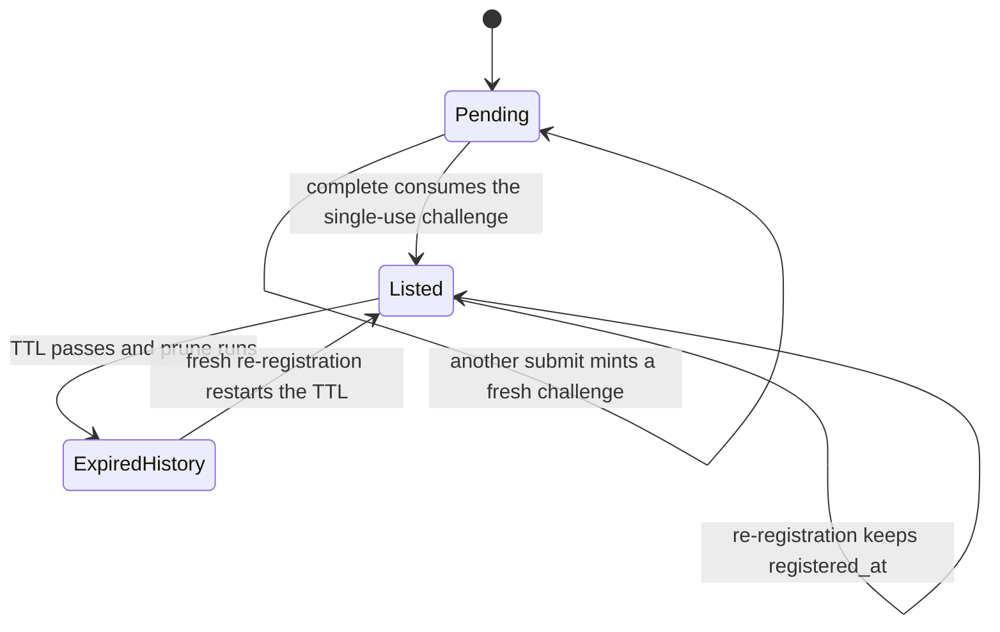

# Registration & Heartbeat Lifecycle (L1 Proof-of-Endpoint)

This page walks the **end-to-end L1 lifecycle of a directory listing**: how an agent gets in (submit a signed manifest → win a single-use endpoint challenge → complete proof-of-endpoint), how it stays in (signed or legacy heartbeats renew the TTL), how it leaves (expiry + pruning), and how it gets back in (re-registration — an *update* if the entry is still live, a *fresh* registration if it expired). The directory is a **phone book, not a notary** (SPEC §2.2): L1 proves, at a moment in time, that the key holder controls the messaging endpoint it declared; it never proves trustworthiness, and the directory never contacts the agent's endpoint during registration — that would be a SSRF vector (`repo://docs/SPEC.md#L231`).

Ownership boundaries: the HTTP surface (`src/haap_directory/http_api.py`) parses bodies and routes `/v1` plus legacy aliases; `DirectoryService` (`src/haap_directory/service.py`) runs the validation, crypto checks and capacity gates; all state changes and their L5 audit entries live in `Store` (`src/haap_directory/store.py`) inside the same SQLite write transaction. Sibling pages own the surrounding slices: [business-logic](/openwiki/architecture/business-logic.md) has the service orchestration, [store-and-audit](/openwiki/architecture/store-and-audit.md) has the schema, write model and audit-equals-mutation invariant, [http-layer](/openwiki/architecture/http-layer.md) owns routing and the stable error envelope, [legacy-client](/openwiki/integrations/legacy-client.md) owns the wire contract for the unmodified `haap` client, [signed-wire-format](/openwiki/concepts/signed-wire-format.md) owns canonical JSON, and [domain-verification](/openwiki/workflows/domain-verification.md) covers the L2 layer that builds on a live listing.

## The lifecycle at a glance

Caption — the L1 lifecycle: submit creates a pending single-use challenge; only a valid proof-of-endpoint completion moves the agent to `Listed`; heartbeats and live re-registration keep the row listed (an update), while a passed TTL flips the row to an expired history entry that a fresh re-registration can re-list.

Failure branches that leave state untouched: a submit that fails validation, capacity, or signature checks issues **no** challenge (`repo://src/haap_directory/service.py#L83-L108`), and a completion that fails any challenge or proof check lists **no** agent (`repo://src/haap_directory/service.py#L146-L168`, asserted by `test_proof_signed_by_wrong_key_not_listed`, `repo://tests/test_registration.py#L164-L180`). A pending challenge that expires (default TTL 120 s) or is evicted to make room for a newer one simply never completes; used and expired challenge rows stay on disk until the pending cap evicts the oldest unused row.

## Step 1 — submit: validate the signed manifest, then issue a bound challenge

`POST /v1/register` (and its legacy twin `POST /register`) takes one body shape on both routes — `{manifest, public_key_b64, manifest_signature}` — and runs the identical `DirectoryService.submit_registration` pipeline (`repo://src/haap_directory/service.py#L80-L132`, `repo://src/haap_directory/http_api.py#L483-L506`). Checks run in a strict order, and each failure answers its dedicated stable code (full code table on [http-layer](/openwiki/architecture/http-layer.md)):

1. **Schema and hard signed-wire rules** — `validate_manifest` requires `format == "haap-public-manifest-v1"`, an `agent.fingerprint` matching `^HF-[0-9a-f]{16}$`, and an `http(s)://` endpoint with no query, fragment or embedded credentials; it recursively rejects the forbidden fields `private_key`/`signature`/`nonce` at any depth (`FORBIDDEN_FIELD`) and any float value anywhere (`FLOAT_FORBIDDEN`) — floats are the single most common v1 bug because canonical JSON forbids them in signed data (`repo://src/haap_directory/manifest.py#L26-L101`). Validation never mutates the manifest, so its canonical byte form stays identical to what the agent signed (`repo://src/haap_directory/manifest.py#L1-L16`).
2. **Canonical size cap** — the manifest is serialized to canonical JSON and compared against `config.max_manifest_bytes` (256 KiB); over the cap → `MANIFEST_TOO_LARGE` (413). The transport-level `PAYLOAD_TOO_LARGE` (512 KiB body) fires earlier, in the HTTP layer, before any parsing (`repo://src/haap_directory/http_api.py#L193-L210`).
3. **Fingerprint recompute** — the directory never trusts the client-supplied fingerprint: it base64-decodes `public_key_b64` (raw 32 bytes) and recomputes `fingerprint_of_public_key(raw_pub)` = `"HF-"` + first 16 hex chars of `sha256(raw_pub)` (SPEC §2.7.2, `repo://src/haap_directory/identity.py#L9-L22`). A malformed key or a fingerprint that does not match → `FINGERPRINT_MISMATCH` (400).
4. **Manifest signature** — the Ed25519 `manifest_signature` must verify against that same raw public key over the canonical JSON bytes of the manifest; failures (including undecodable base64) → `SIGNATURE_MISMATCH` (400). The directory only ever *verifies* agent signatures (`repo://src/haap_directory/crypto.py#L50-L60`).

Only after all four steps does the directory check **capacity** and mint a challenge. Capacity is enforced at submit time, not complete time: if the fingerprint is **not** already live and `store.count_live() >= config.max_agents` (default 10 000) → `DIRECTORY_FULL` (503). An already-live fingerprint may always re-register without consuming the cap, and rows that are expired or suspended do not count toward it (`repo://src/haap_directory/service.py#L104-L108`, `repo://src/haap_directory/config.py#L33`; the cap path is exercised by `running_full` in `repo://tests/conftest.py#L244-L247` and `test_directory_full` in `repo://tests/test_registration.py#L197-L204`).

The issued challenge is a persisted, single-use row bound to the validated key (`repo://src/haap_directory/store.py#L293-L348`):

- `challenge_id` = `"ch_"` + 32 hex chars; `nonce` = `"v1:register:"` + 64 hex chars (prefix constant `NONCE_PREFIX`, `repo://src/haap_directory/service.py#L33`);
- the row binds `fingerprint`, `public_key_b64`, the declared `endpoint`, and a **snapshot of the validated canonical manifest JSON** — the completion step lists from this snapshot, never from a re-sent manifest;
- expiry = now + `config.challenge_ttl_s` (**120 s** default, `repo://src/haap_directory/config.py#L32`), audited `register.challenge_issued` in the same transaction;
- when the number of unused, unexpired pending challenges reaches `config.max_pending_challenges` (5 000), the oldest unused pending row is evicted first (audited `challenge.evicted`) to make room (`repo://src/haap_directory/store.py#L306-L327`).

The v1 response is **202** with `{challenge_id, nonce, registry_fingerprint, directory_fingerprint, expires_at, algorithm: "ed25519", ttl_seconds}`. The legacy alias answers **200** with a body the unmodified `haap` client can consume: it adds `challenge_nonce` — the field the legacy client actually reads — and `registry_signature`, a **directory-key** Ed25519 signature over the raw ASCII nonce bytes (`b64e(server.service.keypair.sign(nonce.encode("ascii")))`), plus both fingerprint spellings (`repo://src/haap_directory/http_api.py#L483-L506`). Submissions are rate-limited per client IP by the `register` token bucket (default `rate_register_per_hour` = 5/hour, answered `RATE_LIMITED` 429 with `Retry-After`); completion and heartbeat routes carry no separate limiter in this implementation (`repo://src/haap_directory/http_api.py#L381-L394`, `repo://src/haap_directory/rate_limit.py#L66-L71`).

## Step 2 — complete: consume the single-use challenge and list the agent

`POST /v1/register/complete` (legacy `POST /register/complete`; `/v1/register/challenge` is tolerated as an alias of the same handler, and `/health` advertises `api.completion_route: "/v1/register/complete"` — `repo://src/haap_directory/http_api.py#L387-L394`, `repo://src/haap_directory/service.py#L319-L333`) drives `DirectoryService.complete_registration` (`repo://src/haap_directory/service.py#L134-L185`). The v1 body is `{challenge_id, fingerprint, endpoint_proof}`; the legacy client presents just `{fingerprint, endpoint_proof}` — no `challenge_id` and no `public_key_b64`.

**Challenge selector.** With an explicit `challenge_id` the row is looked up directly. Without one — the legacy path — `complete_registration` falls back to `store.latest_pending_challenge(fingerprint)`, the most recent **unused** pending endpoint challenge for that fingerprint (`repo://src/haap_directory/store.py#L357-L365`). Unknown id / nothing pending → `CHALLENGE_NOT_FOUND` (404).

**Check order and stable codes** (each failure leaves the agent unlisted):

| Check | Failure code |
|---|---|
| Challenge exists (explicit id) or a pending one exists (legacy) | `CHALLENGE_NOT_FOUND` (404) |
| Challenge row's fingerprint equals the request fingerprint | `FINGERPRINT_MISMATCH` (400) |
| Challenge still unused | `CHALLENGE_USED` (409) |
| Challenge not past its TTL (`expires_epoch >= now` at completion time) | `CHALLENGE_EXPIRED` (410) |
| Optional presented `public_key_b64` equals the key bound at submit | `KEY_MISMATCH` (400) |
| `endpoint_proof` verifies under the **bound** key over the ASCII nonce bytes | `PROOF_INVALID` (400) |

Two points deserve emphasis. First, the proof is always checked against the **key bound at submit** (`challenge["public_key_b64"]`), so a completion body can carry a *different* key only to be told `KEY_MISMATCH`, and a proof signed by any other key is `PROOF_INVALID` — the binding is to the validated key, not to whatever the completing caller presents (`repo://src/haap_directory/service.py#L156-L168`; see `test_proof_signed_by_wrong_key_not_listed` and `test_public_key_mismatch_between_register_and_complete`, `repo://tests/test_registration.py#L164-L194`). Second, **single-use is enforced twice**: the service pre-checks the `used` flag, and `Store.complete_registration` re-reads and re-checks it *inside* the serialized `BEGIN IMMEDIATE` write lock before flipping it, so a replayed or racing completion loses the write-lock race with `CHALLENGE_USED` — consume, agent upsert, and audit entry commit as one transaction (`repo://src/haap_directory/store.py#L448-L488`; replay covered by `test_challenge_reuse_rejected`, `repo://tests/test_registration.py#L151-L161`).

On success the entry is live. `Store.complete_registration` marks the challenge used and upserts the `agents` row with `status='listed'`, `is_history=0`, and `expires_at = now + config.ttl_seconds` — the default **24 h** listing TTL (`ttl_hours = 24.0`, `repo://src/haap_directory/config.py#L31`). The row records `endpoint_proof_at` **and** the initial `last_heartbeat` at completion time, which is why a freshly registered agent's trust block reads `fresh: true` immediately. The audit event is `register.completed` (or `register.updated`, below) with actor `agent:{fingerprint}`. Response: **201** v1 / **200** legacy, body `{status: "registered", agent_url: "/v1/agents/{fingerprint}", expires_at, directory_fingerprint, ttl_seconds}` (`repo://src/haap_directory/service.py#L179-L185`).

## Listed: liveness, profile exposure and the trust block

A row is **live** iff `status='listed' AND is_history=0 AND expires_epoch >= now` (`store.is_live_row`, `repo://src/haap_directory/store.py#L381-L387`). Everything observable follows from that predicate:

- `live_agents()` (search input) and `count_live()` (capacity, `/health`) select only live rows, and both **lazily prune** first (`repo://src/haap_directory/store.py#L547-L567`);
- `GET /v1/agents/{fingerprint}` returns the manifest plus the full L1–L5 trust block for live agents, including `listed_since` (= `registered_at`), `endpoint_proof_at`, `last_heartbeat`, and `fresh` (heartbeat within the TTL) — assembled by `DirectoryService.build_trust_block`, which never emits a verdict, only labelled signals (`repo://src/haap_directory/service.py#L257-L317`);
- a fingerprint that never registered → `AGENT_NOT_FOUND` (404); an existing but expired, suspended or otherwise unlisted entry → `AGENT_NOT_LISTED` (404) — the service deliberately does **not** distinguish suspended from expired for anonymous callers (`repo://src/haap_directory/service.py#L248-L255`).

`status` has three values in the schema — `listed | suspended | expired` — plus the `is_history` soft-delete flag (`repo://src/haap_directory/store.py#L38-L53`). Suspension is a moderation-layer state owned by the [moderation-appeals](/openwiki/workflows/moderation-appeals.md) page; the lifecycle rules here are that a suspended row is not live, and the expiry pruner only ever touches `status='listed'` rows (`repo://src/haap_directory/store.py#L530-L535`).

## Keeping it alive: signed (v1) and legacy heartbeats

**Signed heartbeat (canonical, `POST /v1/heartbeat`).** `heartbeat_v1` (`repo://src/haap_directory/service.py#L188-L217`, SPEC §4.7) verifies `{fingerprint, timestamp, signature}`:

1. `timestamp` must parse as RFC 3339 and lie within **±300 s** of server time (`MAX_CLOCK_SKEW_S = 300`, `repo://src/haap_directory/service.py#L32`) — otherwise `STALE_TIMESTAMP` (400), whether or not the fingerprint exists;
2. the fingerprint's row must exist and be **live** — unknown, expired or suspended rows answer `UNKNOWN_OR_EXPIRED` (404) with no further checks;
3. the Ed25519 `signature` must verify against the **stored** agent public key over the ASCII string `heartbeat:{fingerprint}:{timestamp}`;
4. on success `Store.heartbeat` re-stamps `last_heartbeat` and pushes `expires_at` to **now + `ttl_seconds`** (a full fresh TTL window, not an increment), appending audit event `heartbeat.ok` in the same transaction (`repo://src/haap_directory/store.py#L490-L521`).

The signature check **never confirms a fingerprint's existence to a caller that cannot sign**: a bad signature against a real live fingerprint and a completely unknown fingerprint both answer the identical `UNKNOWN_OR_EXPIRED` (404) — the docstring and tests are explicit (`repo://src/haap_directory/service.py#L197-L208`; `test_heartbeat_unknown_never_confirms` sends an unknown fingerprint and asserts 404, `repo://tests/test_search_heartbeat.py#L121-L128`).

**Legacy unsigned heartbeat (`POST /heartbeat`).** The unmodified `haap` client renews with a bare `{fingerprint}`. `_handle_heartbeat` gates on `if versioned or signed:` — a `/v1/heartbeat` request, *or* any body carrying both `signature` and `timestamp`, is forced into the signed path above. Only an **unsigned body on the legacy alias** reaches `heartbeat_legacy`, which renews through the *same* `Store.heartbeat` write path but with `legacy=True`, selecting audit event **`heartbeat.legacy_unsigned`** so the L5 chain records *how* an entry was kept alive; success answers `200 {"status": "ok"}` and failure (unknown/expired) answers `UNKNOWN_OR_EXPIRED` (`repo://src/haap_directory/http_api.py#L520-L537`, `repo://src/haap_directory/service.py#L219-L222`).

A heartbeat renews a live entry's TTL, but it is not an identity proof of durability: SPEC §3.2 is explicit that PoE — refreshed by heartbeats — is a *now* statement about endpoint control, and that even a live endpoint only proves a process answers (`repo://docs/SPEC.md#L236`).

## Expiry, pruning and re-registration

**Time.** All TTLs, expiry comparisons and freshness windows read **now** through an injected `Clock` callable (epoch seconds) shared by `Store`, `DirectoryService`, its sub-services and the rate limiters; production uses `system_clock`, tests inject `MutableClock` and `advance()` it to exercise TTL expiry without sleeping real hours (`repo://src/haap_directory/timeutil.py#L12-L22`, `repo://src/haap_directory/store.py#L12-L14`, `repo://tests/conftest.py#L70-L80`). Server time is authoritative for all TTLs (SPEC §2.7.4).

**Prune.** A listed row whose `expires_epoch` has passed does not vanish: `prune_expired` flips it to `status='expired', is_history=1` and appends one audited `agent.expired` entry per row, idempotently (`repo://src/haap_directory/store.py#L523-L545`). Pruning runs in three places:

- **on startup**, in `DirectoryService.__init__`, before the first request (`repo://src/haap_directory/service.py#L59-L60`);
- **lazily before live reads** — `live_agents()` and `count_live()` call `prune_expired()` at the top, so search, capacity checks and `/health` see an up-to-date live set (`repo://src/haap_directory/store.py#L547-L567`);
- **offline**, via `haap-dird --prune` for a maintenance pass (`repo://src/haap_directory/cli.py#L57-L62`).

Expired-history rows are kept as the record of "this fingerprint existed and lapsed"; `count_live` and search ignore them. Restart durability of the whole flow is covered by `test_expiry_pruned_on_startup`, which restarts a fresh server on the same DB after advancing the clock (`repo://tests/test_search_heartbeat.py#L149-L157`), and the expiry-on-read path by `test_expiry_pruned_on_read_with_injected_clock` (`repo://tests/test_search_heartbeat.py#L138-L146`).

**Re-registration: update vs fresh.** Because the completion upsert is keyed on the fingerprint, a second full register/complete cycle for a fingerprint whose entry is **still live** is an *update*: the manifest and TTL are refreshed but `registered_at`/`registered_epoch` are preserved, and the audit event is **`register.updated`**. A registration after the entry has lapsed (or with no prior row) is a *fresh insert* with a new `registered_at`, audited **`register.completed`** (`_upsert_agent_cur` decides via `was_live` inside the same transaction, `repo://src/haap_directory/store.py#L389-L446` and `repo://src/haap_directory/store.py#L476-L488`). Both paths end `listed` with a full TTL from now, so duplicate live registrations never create duplicates — `test_reregister_live_is_update_not_duplicate` asserts `count_live() == 1`, and `test_reregister_after_expiry_is_fresh` shows an expired fingerprint re-lists cleanly (`repo://tests/test_registration.py#L207-L224`). This is exactly the SPEC rule: "Re-registration of a live fingerprint = update (… keep `registered_at`); registration of an expired entry = fresh insert" (`repo://docs/SPEC.md#L232`).

## Invariants that hold across the whole lifecycle

- **Challenge invariants** — a challenge is short-TTL (120 s), single-use, bound to the exact public key validated at submit, and snapshots the validated manifest; consumption is guarded again under the write lock, so replay → `CHALLENGE_USED`, expiry → `CHALLENGE_EXPIRED`, and the completing key must equal the bound key → `KEY_MISMATCH`.
- **No listing without proof** — any failure of the challenge checks or the endpoint-proof verification leaves the directory exactly as it was: no agent row, no audit entry beyond what the failed read produced.
- **Capacity measured in live rows** — `DIRECTORY_FULL` (503) gates *submit* against the count of live listed agents; a live fingerprint is exempt, expired/suspended rows are not counted, and pruning frees capacity before the count.
- **Heartbeats never oracle** — signed heartbeats return `STALE_TIMESTAMP` only for timestamp problems and the indistinguishable `UNKNOWN_OR_EXPIRED` for unknown, expired, suspended, or wrongly-signed fingerprints.
- **Update never duplicates** — re-registration of a live entry preserves `registered_at` (audit `register.updated`); only genuinely new or lapsed identities get a fresh `registered_at` (`register.completed`).
- **Time is injected; state and audit commit together** — every TTL decision reads the shared clock, and every lifecycle state change (challenge issue/evict, complete/update, heartbeat, expiry) appends exactly one L5 chain entry in the same SQLite transaction (`repo://src/haap_directory/store.py#L196-L261`).

## Focused tests

The behavior contract lives in the F1/F2 suites: `tests/test_registration.py` covers submit rejections (`SIGNATURE_MISMATCH`, `FINGERPRINT_MISMATCH`, `FORBIDDEN_FIELD`, `FLOAT_FORBIDDEN`, `INVALID_JSON`, `ENDPOINT_INVALID`, `MANIFEST_TOO_LARGE`), the complete-time failures (`CHALLENGE_EXPIRED`, `CHALLENGE_USED`, `PROOF_INVALID`, `KEY_MISMATCH`), the capacity path (`DIRECTORY_FULL`), and update-vs-fresh re-registration; `tests/test_search_heartbeat.py` covers signed-heartbeat TTL renewal, `STALE_TIMESTAMP`, the never-confirm `UNKNOWN_OR_EXPIRED`, the legacy unsigned heartbeat, and both prune triggers (on-read and on-startup) under the injected clock. `tests/conftest.py` supplies `MutableClock`, the `Agent` signing kit, the three-step `register_agent` helper and the server factory. The unmodified `haap` client is additionally driven end-to-end by `tests/test_compat_client.py` when a companion checkout is available (SPEC §4.9 / phase F1+ gate); the whole suite is mapped in [test-suite](/openwiki/testing/test-suite.md).
