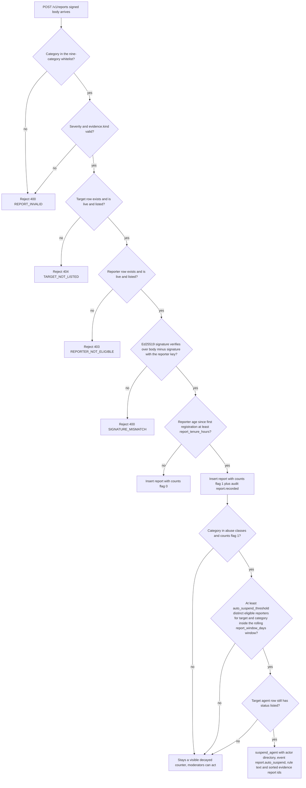
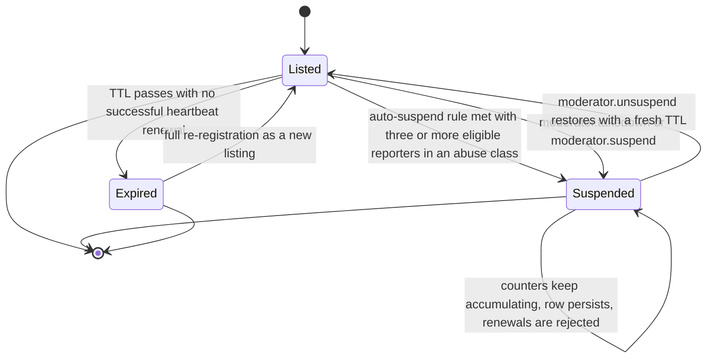

# Reputation (L4) — Signed Reports, Decay & Auto-Suspend

L4 answers the question *"what has this agent actually done, according to signed witnesses, and how does that change over time?"* Every L0–L3 signal is a claim made before or at first contact; only observed behaviour separates a good agent from a patient scammer. The directory therefore keeps a **collective, signed, decaying memory of allegations** and runs it through small **deterministic, transparent automata** — no ML, no human judgement inside the hot path (SPEC §3.5, §4.5).

The layer's home is `src/haap_directory/reputation.py` (`ReputationService`) with persistence in the `reports` table of `src/haap_directory/store.py`, surfaced through the trust block assembled in `src/haap_directory/service.py`, exposed over `POST /v1/reports` and `GET /v1/agents/{fp}/reports` in `src/haap_directory/http_api.py`, and driven by the L4 knobs in `DirectoryConfig` (`src/haap_directory/config.py`). Human moderation (takedown, direct suspend/unsuspend, appeal decisions) is a separate, moderator-keyed layer documented on the [moderation & appeals](/openwiki/workflows/moderation-appeals.md) page; this page covers the **automated** side that `ReputationService` owns.

## Design posture: allegations, never findings

The non-negotiable framing is that **reports are allegations, not findings**, and it shapes every mechanism below:

- Counters are **raw facts**: N signed witnesses alleged category C within the window, at these times. The directory never marks a target "guilty", never issues a trustworthiness verdict, and never suppresses a report because it is disputed.
- The **only** automated action is a published, audited **auto-suspend** for a narrow set of abuse classes (see [the automaton](#the-auto-suspend-automaton)). Everything else a report produces is a visible counter, an annotation, or a recommendation that consumers may ignore.
- Automation is a **published deterministic rule anyone can replay from the L5 audit log**: the threshold, the window, the evidence ids, and the key/actor that caused the transition are all public.
- **Decay bounds damage in both directions**: reputation is about the recent past — an agent can reform, and a good agent gone bad loses its history's shield within the window of the first credible reports.
- The residual, explicitly priced-in risk is **coordinated lying**: three colluding tenured reporters can land a one-week suspension on a victim. The mitigations are reporter tenure + liveness, public attributable reports that make the ring itself suspendable for `report_abuse`, a moderator appeal path, and an audit trail (SPEC §3.5.4, §3.5.6).



Caption — report intake gates then the auto-suspend decision: whitelist and identity checks always run; tenure decides the stored `counts` flag; only a counting report in an abuse class ever re-evaluates the suspension automaton, and the automaton only fires while the target row is still `listed`.

## The report record and its intake gates

### Whitelists (constants in `reputation.py`)

| Constant | Values |
|---|---|
| `CATEGORIES` | `impersonation_attempt`, `endpoint_hijack`, `phishing`, `spam`, `fraud`, `payment_fraud`, `abusive_content`, `protocol_violation`, `report_abuse` |
| `ABUSE_CLASSES` (the only auto-suspend trigger set) | `spam`, `phishing`, `impersonation_attempt`, `endpoint_hijack` |
| `SEVERITIES` | `low`, `medium`, `high` |
| `EVIDENCE_KINDS` | `envelope`, `url`, `transcript`, `none` |

Non-abuse categories (`fraud`, `payment_fraud`, `abusive_content`, `protocol_violation`, `report_abuse`) can never auto-suspend a target; they feed counters, moderator review, and the `block_recommendation` signal. `report_abuse` is the self-referential category: false reporting is itself grounds for the same automaton against the *reporter*.

### `ReputationService.create_report(body)` — validation, in order

Validation failures are stable §4.10 codes (`src/haap_directory/errors.py`): `REPORT_INVALID` → 400, `TARGET_NOT_LISTED` → 404, `REPORTER_NOT_ELIGIBLE` → 403, `SIGNATURE_MISMATCH` → 400, `REPORT_EXISTS` → 409.

1. **Whitelists.** `category` must be in `CATEGORIES`, `severity` in `SEVERITIES`, and `evidence` must be a dict whose `kind` is in `EVIDENCE_KINDS` — otherwise `REPORT_INVALID`. `reporter_fingerprint` must be non-empty.
2. **Target gate.** The target must be a registered agent row that `Store.is_live_row` accepts — `status == 'listed'`, not history, and not past its expiry epoch — else `TARGET_NOT_LISTED` (404, no confirmation of existence).
3. **Reporter gate.** The reporter must likewise be a live, listed agent row, else `REPORTER_NOT_ELIGIBLE`. This makes every report attributable to a real, currently-maintained identity — a registered agent whose listing is alive at submission time.
4. **Signature.** The request must be signed by the reporter's own registered Ed25519 key over the **body minus the `signature` field**, serialized as canonical JSON (`sort_keys`, compact separators, `ensure_ascii=false`) via `verify_over` — the same serializer every signed endpoint uses. Failure is `SIGNATURE_MISMATCH`.
5. **Tenure → counting.** `counts = (now - reporter_row["registered_epoch"]) >= report_tenure_hours * 3600` (default 72 h). This boolean is stored as the row's `counts` flag and returned as `counts_toward_automation`; it is the single gate between "stored and visible" and "counts toward automation". The tenure clock starts at `registered_epoch`, which is the **first** listing timestamp: `_upsert_agent_cur` preserves `registered_at`/`registered_epoch` across re-registration of an entry that was still live, so an attacker cannot reset the clock by re-registering — an identity must genuinely age before its reports count.
6. **Insert.** The report row is written with `report_id` (client-supplied or generated `rp_` + 16 random bytes hex), `occurred_at` as given, and server-authoritative `submitted_at`/`submitted_epoch`. `Store.create_report` rejects a duplicate — same `reporter_fingerprint + target_fingerprint + category` with a submission inside the last `report_dup_window_hours` (default 24 h) — with `REPORT_EXISTS` (409). Note the SPEC's promise that re-POSTing the same `report_id` returns the original is *not* implemented: any duplicate in the window is rejected, so report submission is not idempotent.
7. **Audit.** The insert and its L5 entry `report.recorded` (actor `agent:<reporter_fingerprint>`, detail `{report_id, category, counts}`) commit in the same SQLite transaction.
8. **Response.** `202 {"report_id", "status": "recorded", "counts_toward_automation": <bool>}`. `ReputationService` runs the auto-suspend check only when `counts` is true *and* the category is in `ABUSE_CLASSES` (step 5 of the diagram above).

`Store.create_report` structurally accepts `reporter=None` and would audit such rows with actor `human_moderation_channel` (the SPEC's anonymous "human moderation channel" for moderator review), but the current `ReputationService.create_report` gate requires a live listed reporter, so the public `/v1/reports` route can only ever produce agent-attributable reports today.

## Evidence hashing: hashes in, raw evidence never on-chain

Report **evidence bodies never enter the store or the public chain** — only digests do:

- `evidence_hash = sha256(canonical_json(evidence))` — always computed over the whole `evidence` dict, whatever its `kind`;
- `description_hash = sha256(description.encode("utf-8"))` — only when `evidence.description` is a string.

The `reports` table stores `category`, `severity`, `evidence_kind`, `evidence_hash`, `description_hash`, `occurred_at`, timestamps and the `counts` flag — never the envelope bodies, URLs or free-text description. The L5 audit chain stores only a `detail_hash` per entry, so the public record proves *that* a report existed, what rule acted on it, and binds the evidence digest — without leaking the evidence contents. Operators keep raw evidence (envelopes, transcripts) in a **separate encrypted store accessible to moderators and the reporter/owner**, as `docs/MODERATION.md` prescribes; the directory side has no raw evidence to leak.

## Counters, decay, and the public reports endpoint

`Store.report_counters(target, decay_s)` reads the `reports` table with `submitted_epoch > now - decay_s` and aggregates:

```json
"reports": {
  "by_category":   { "spam": 2, "fraud": 1 },
  "unique_reporters": 2,
  "first_at": "2026-09-02T…",
  "last_at":  "2026-09-03T…"
}
```

- The window is `report_decay_days` (default **180 days**): reports older than that stop contributing to *any* counter shown or decision taken, but remain visible in history and in L5. This is the "not a life sentence" mechanism.
- `by_category` and `unique_reporters` include **every** report in the decay window — counting and non-counting alike — because a young reporter's allegation is still a visible raw fact; `first_at`/`last_at` always accompany the counters so consumers see the time span the numbers cover.
- Decay is *not* the auto-suspend window: automation re-evaluates on the much shorter rolling `report_window_days` (7 days) with the `counts=1` filter only (see below).

`ReputationService.counters(fingerprint)` wraps this with the configured decay, and `DirectoryService.build_trust_block` embeds the result as `trust.reports` in every search result and profile of a listed agent (SPEC §5.2), next to `trust.block_recommendation` and `trust.suspension`. Consumers filter on it directly: search accepts `recent_reports_max=N`, which excludes agents whose `unique_reporters` exceeds N (`_passes_trust_filters`).

**`GET /v1/agents/{fingerprint}/reports`** (regex `_REPORTS_RE`, handled before the profile route) returns exactly `{"fingerprint": ..., "reports": <decayed counters>}` — counters plus time metadata, **never evidence bodies, and no liveness gate**: it is served for any fingerprint, listed, suspended, or unknown (an unknown agent just gets empty counters). Evidence beyond the digests is only ever released by the moderator/owner channel described in `docs/MODERATION.md`.

## The auto-suspend automaton

The core automated decision is a single deterministic rule, fully contained in `ReputationService._maybe_auto_suspend(target, category)` plus its store query:

1. **Only counting, abuse-class reports trigger evaluation.** The check runs right after a report insert when `counts` is true and `category ∈ ABUSE_CLASSES`.
2. **Count distinct eligible reporters, not reports.** `Store.unique_eligible_reporters_in_window` runs `SELECT DISTINCT reporter_fingerprint … WHERE target_fingerprint=? AND category=? AND counts=1 AND reporter_fingerprint IS NOT NULL AND submitted_epoch > now - window_s`. Because `counts=1` was decided at intake, every counted reporter was live, listed, and ≥ 72 h old *at the moment it reported*; one key cannot vote 100 times.
3. **Threshold over a rolling window.** The window is `report_window_days` (default **7 days**) and the threshold `auto_suspend_threshold` (default **3**). The third distinct eligible reporter in the same abuse class inside the window trips the rule.
4. **Guard on current state.** The target's agent row must still have `status == 'listed'`; an already-suspended or expired target is left alone (the counters keep updating, and a moderator decides).
5. **The transition.** `Store.suspend_agent(target, rule=f">= {auto_suspend_threshold} unique eligible reporters in {report_window_days}d ({category})", evidence_reports=sorted(<the distinct reporter fingerprints>), actor="directory", event="report.auto_suspend")`. The **rule string records the exact trigger** (threshold, window days, category) and the **`evidence_reports` list names the reporters whose reports fired it**; both go into the row's `suspension_json` `{rule, evidence_reports, at}`.

The state change itself is a plain store write plus one audit entry in the same transaction: `status` → `'suspended'`, `suspension_json` and `suspended_at` set. The audit entry for the transition carries `event = report.auto_suspend`, `actor = directory`, and the suspension object as its detail (hashed into the chain), making the whole event replayable from L5.



Caption — the agent lifecycle as the L4 automaton and moderators drive it: only the `listed` state is live and searchable; `report.auto_suspend` (actor `directory`) is the only automated entry into `suspended`, moderators provide the human exits, and expiry pruning never touches a `suspended` row (only `listed` rows transition to `expired`).

### Effects of a suspension

- **Visibility.** Suspended rows are absent from `Store.live_agents`, so they vanish from search (whose `not_suspended=true` filter is the default) and profile-by-fingerprint returns 404 `AGENT_NOT_LISTED` — deliberately indistinguishable from "unknown" to anonymous callers. `/health` reports the count via `count_suspended`.
- **Counting continues.** New reports against a suspended target are still accepted (reporter gates permitting) and still decay; the row's `suspension_json`/rule is not cleared by new reports.
- **No self-expiry, no self-revival.** `prune_expired` only transitions `status='listed'` rows past their TTL to `expired`; a suspended row is never pruned, so the suspension persists until a moderator acts. One divergence worth flagging operationally: the SPEC and the moderation runbook describe suspended agents still heartbeating "so the agent keeps its key alive during review", but the current `Store.heartbeat` requires `status == 'listed'` and returns `None` otherwise — a suspended agent *cannot* renew in this implementation, and must appeal and wait for `moderator.unsuspend`, which restores the row to `listed` with a **fresh TTL computed from now** (`unsuspend_agent`).
- **Reversal is human and audited.** The appeal path (agent-signed statement → `appeals` row, decided off-band by a moderator) and `unsuspend` are covered in full on the [moderation & appeals](/openwiki/workflows/moderation-appeals.md) page.

## Signals that are data, never enforcement

### `block_recommendation`

A **pure function of recent counters** — the directory's answer to *consumer safety*, exposed as `trust.block_recommendation` on listed profiles:

```python
fraud   = unique_eligible_reporters_in_window(fp, "fraud", 7d)
payment = unique_eligible_reporters_in_window(fp, "payment_fraud", 7d)
return {"default_max_contact_rate_h": 1} if len(set(fraud) | set(payment)) >= 2 else None
```

It uses the **same eligibility notion as auto-suspend** (distinct reporters whose stored `counts=1` rows fall inside the rolling `report_window_days` window) over the two fraud classes, and recommends a one-message-per-hour default cap on first-contact messaging to the target. It is **data, not enforcement**: nothing in the directory blocks on it, and consumers MAY ingest it or ignore it.

### `report_war` annotation

Mutual-report detection: `Store.mutual_report_count(a, b, window)` computes `min(<reports a→b>, <reports b→a>)` over `report_war_days` (default **30 days**) — i.e., only pairs where *both* directions have reported count toward the annotation. `ReputationService.report_war(a, b)` returns true when that minimum is ≥ 2, flagging an A↔B dispute. The annotation is deliberately non-suppressing: both sides' reports stay visible because the directory does not hide evidence of a dispute. Note that the method exists on `ReputationService` but is not yet surfaced anywhere in the assembled trust block (which currently returns `reputation_history: []`), so today it is an available building block rather than an emitted signal.

## Configuration knobs

All L4 timers and thresholds are plain fields on the flat `DirectoryConfig` (CLI > `~/.haap/dird.json` > env `HAAP_DIRD_*` > defaults), so they follow the same precedence as every other setting:

| Field | Default | Meaning |
|---|---|---|
| `report_tenure_hours` | 72 | minimum listed age of a reporter for its report to set `counts=1` |
| `report_dup_window_hours` | 24 | same reporter+target+category within this window → `REPORT_EXISTS` (409) |
| `report_window_days` | 7 | rolling window for auto-suspend counting and `block_recommendation` |
| `auto_suspend_threshold` | 3 | distinct eligible reporters required to auto-suspend |
| `report_decay_days` | 180 | reports older than this stop contributing to counters/automation |
| `report_war_days` | 30 | mutual-report annotation window |

All windows are measured in epoch seconds against the injected `Clock` (`ReputationService.now()`), the same injectable clock the store uses — tests advance it deterministically instead of sleeping through TTLs. `ReputationService` and `ModerationService` are wired together by `DirectoryService._attach_subservices` at construction, sharing one store, config, and clock; `ModerationService` holds a reference to the reputation service for takedown flows.

## Failure semantics worth knowing

- **Rejections never confirm existence**: a missing or suspended target surfaces as `TARGET_NOT_LISTED`/`AGENT_NOT_LISTED` (404), and a missing reporter as `REPORTER_NOT_ELIGIBLE` (403) — the caller cannot distinguish "unknown" from "hidden".
- **The count flag is frozen at intake.** Eligibility is evaluated once, when the report lands. A reporter that later suspends, expires, or loses tenure does not retroactively un-count its earlier reports; conversely a report filed before tenure does not start counting later. This keeps the automaton deterministic and replayable from the audit log.
- **Non-idempotent submission.** The duplicate window turns retries into 409s; clients should treat `REPORT_EXISTS` as success if they merely wanted the report recorded once.
- **Auto-suspend fires after the insert, in a second transaction**: the report row and audit entry commit first, then `_maybe_auto_suspend` opens its own write for the suspension if the rule trips. If the suspension write fails, the report remains recorded and the rule re-evaluates on the next counting report in the window.

## Focused tests

`tests/test_reputation.py` pins the mechanics that matter:

- `test_young_reporter_recorded_but_not_counted` — a just-registered reporter gets `202` with `counts_toward_automation: false`.
- `test_duplicate_report_rejected` — the second same-reporter/same-target/same-category report within the dup window is `409 REPORT_EXISTS`.
- `test_target_must_be_listed` — reporting an unregistered target is `404 TARGET_NOT_LISTED`.
- `test_auto_suspend_after_three_eligible_reporters` — after the clock advances past the 72 h tenure, the third distinct eligible `spam` report auto-suspends: the target's profile 404s, `/health` reports `suspended: 1`, and search (default `not_suspended`) contains the three reporters but not the target.
- `test_non_abuse_class_does_not_auto_suspend` — three eligible `abusive_content` reports leave `suspended: 0`: only abuse classes trigger the automaton.

## Related pages

- [Trust model](/openwiki/concepts/trust-model.md) — where L4 sits in the L0–L5 trust ladder and what consumers may infer.
- [Moderation & appeals (L4)](/openwiki/workflows/moderation-appeals.md) — the moderator-keyed human layer that shares the `suspended` state this page's automaton writes.
- [Business logic](/openwiki/architecture/business-logic.md) — service wiring and trust-block assembly around the report counters.
- [Store & audit](/openwiki/architecture/store-and-audit.md) — the `reports`/`agents` schema, in-transaction audit invariant, and the L5 chain the automaton writes to.
- [Audit transparency](/openwiki/workflows/audit-transparency.md) — replaying `report.recorded` / `report.auto_suspend` entries to verify the automaton.
- [Signed wire format](/openwiki/concepts/signed-wire-format.md) — the canonical-JSON signature input reports use.
- [Test suite](/openwiki/testing/test-suite.md) — fixtures (`MutableClock`, agent kit) the reputation tests build on.
