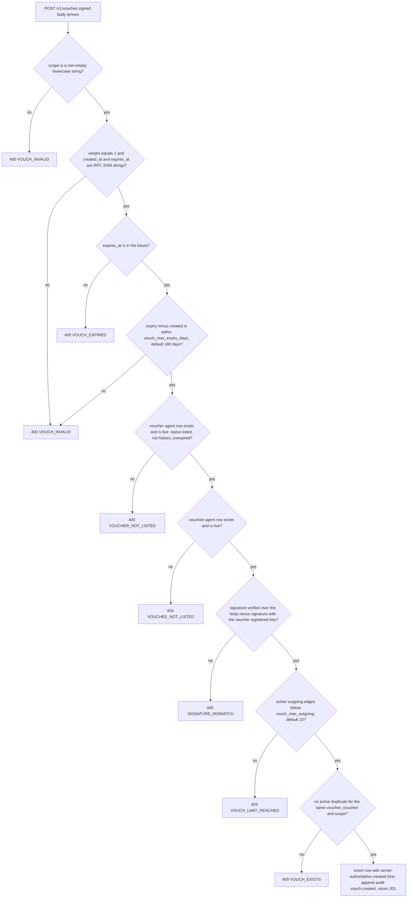
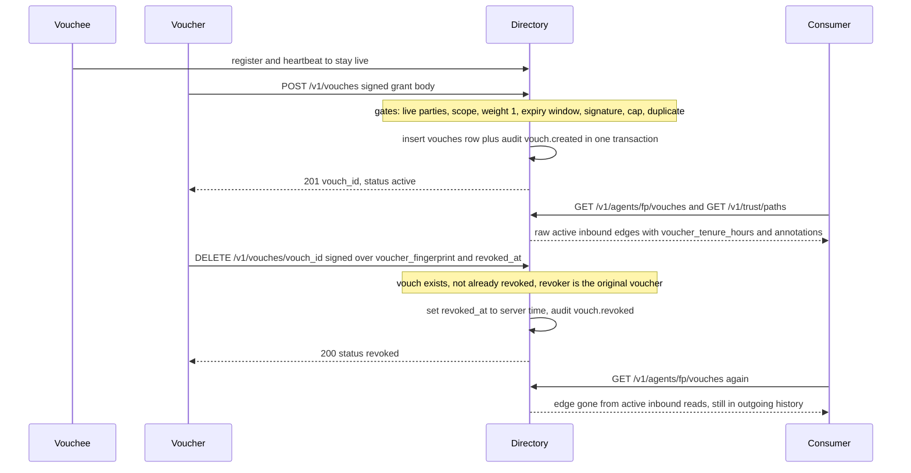

# Vouching (L3) — Signed Peer Statements & the Trust Graph

L3 in the trust ladder (see [trust-model](/openwiki/concepts/trust-model.md)) answers the *first-contact* question: *"who, among entities I might already trust, is willing to put a signed, expiring statement behind this agent?"* A vouch is a statement by a listed agent (the **voucher**) about another listed agent (the **vouchee**), scoped and time-boxed: *"I, agent V, assert by my key that agent B is what B claims to be, within scope S, for the next T days."* The vouchee borrows reputation from someone the consumer already trusts, instead of starting from zero (SPEC §3.4).

The layer's home is `src/haap_directory/vouching.py` (`VouchService`), with persistence in the `vouches` table of `src/haap_directory/store.py`, routes wired in `src/haap_directory/http_api.py`, trust-block embedding in `DirectoryService.build_trust_block` (`src/haap_directory/service.py`), and L3 knobs in `DirectoryConfig` (`src/haap_directory/config.py`). The behavioral/automated side of reputation (reports, auto-suspend) is a separate layer documented on the [reputation](/openwiki/workflows/reputation.md) page; this page covers everything the `VouchService` owns: grant, revoke, the raw graph reads, and the trust-path query.

## Design posture: vouches are opinions with signatures, not facts

The module's own docstring states the non-negotiable framing (`repo://src/haap_directory/vouching.py#L1-L8`):

> A vouch is an opinion with a signature, not a fact. The directory enforces *mechanics* only (live keys, caps, expiry, revocation validity) and serves the graph as raw edges — never an aggregate score. Consumers apply their own trust set. Collusion rings are made *visible*, not "stopped".

Every mechanism below follows from that stance:

- The directory never certifies that "B is trustworthy because A and C vouch for B". It shows **who** vouched, with scope and timestamps, so a consumer can spot a ring of strangers vouching only for each other — the directory's answer to Sybil attacks is visibility and consumer policy, not a directory-side score (SPEC §3.4.6).
- A vouch is a **reputation stake, not a comment box**: it is key-signed by a live L0+L1-verified agent, audited in the L5 chain (`vouch.created`, `vouch.revoked`), and the voucher cannot later deny it.
- What a vouch **does not** guarantee is explicit: it does not verify offline identity, does not predict future behaviour, and does not cover out-of-scope behaviour — a `task_delivery` vouch says nothing about payment honesty.
- **No transitive trust** is served: the directory offers ≤ 2-hop *paths* as raw edges only (`repo://src/haap_directory/vouching.py#L165-L187`); transitivity, if any, is a consumer policy.

## The vouch record and its persistence

The `vouches` table (`repo://src/haap_directory/store.py#L89-L104`) stores one row per granted vouch:

```sql
CREATE TABLE IF NOT EXISTS vouches (
    vouch_id            TEXT PRIMARY KEY,        -- vc_ + 32 hex chars
    voucher_fingerprint TEXT NOT NULL,
    vouchee_fingerprint TEXT NOT NULL,
    scope               TEXT NOT NULL,
    note                TEXT,
    weight              INTEGER NOT NULL DEFAULT 1,
    created_at          TEXT NOT NULL,
    created_epoch       INTEGER NOT NULL,
    expires_at          TEXT NOT NULL,
    expires_epoch       INTEGER NOT NULL,
    revoked_at          TEXT,
    signature_b64       TEXT NOT NULL
);
CREATE INDEX IF NOT EXISTS idx_vouches_vouchee ON vouches(vouchee_fingerprint);
CREATE INDEX IF NOT EXISTS idx_vouches_voucher ON vouches(voucher_fingerprint);
```

Design facts encoded in the schema:

- **No status column.** A vouch is *active* only by inference: `revoked_at IS NULL AND expires_epoch >= now`. Vouches are never deleted, never transitioned by a background job — expiry is a time filter, revocation is a write of `revoked_at`, and both index queries and the BFS read use the same predicate (`repo://src/haap_directory/store.py#L745-L777`). Expired or revoked rows stay on the public record, exactly as SPEC §3.4.6 point 5 requires ("the vouch is not deleted — it stays visible next to the red record").
- **The voucher's signature is persisted** (`signature_b64`), so the accountability ("V cannot later deny it") is verifiable from the row itself.
- **`revoked_at` is nullable**; reads must tolerate both `null` (active) and a timestamp (revoked) in the same list — the outgoing read does.
- Relationships to `agents` are **by-value references, not enforced foreign keys** (see [store-and-audit](/openwiki/architecture/store-and-audit.md)); the store performs its own referential checks inside its transaction (voucher ownership on revocation, live-party checks on grant).

## Granting a vouch — `POST /v1/vouches`

The route (`repo://src/haap_directory/http_api.py#L411-L414`) hands the JSON body to `VouchService.create` (`repo://src/haap_directory/vouching.py#L40-L90`), which validates in a strict order — the same order tests and consumers can rely on:



Caption — grant-time gates in evaluation order: field-shape checks first, then party liveness, then signature, then the two store-enforced scarcity rules (cap and duplicate) which run inside the write transaction.

### Body fields and field rules

Request body fields: `voucher_fingerprint`, `vouchee_fingerprint`, `scope`, `weight`, `note`, `created_at`, `expires_at`, `signature` (SPEC §3.4.1). The rules:

- **`scope`** must be a non-empty lowercase string, else `VOUCH_INVALID` (`repo://src/haap_directory/vouching.py#L49-L50`). The module declares the canonical prefixes — `identity`, `task_delivery`, `service:`, `payment` (`_CANONICAL_SCOPE_PREFIXES`, `repo://src/haap_directory/vouching.py#L22`) — but **does not enforce membership**: any lowercase scope is accepted, because the vouch only means what its scope says and scope taxonomy belongs to the ecosystem, not the directory.
- **`weight` is forced to 1 in v1** (`repo://src/haap_directory/vouching.py#L51-L52`): any other value is `VOUCH_INVALID`. The column stores 1 unconditionally — the field is reserved for future weighting, and today the response, graph edges, and filters all treat every vouch as equal weight.
- **`created_at` and `expires_at` are required RFC 3339 strings**, else `VOUCH_INVALID` (`repo://src/haap_directory/vouching.py#L53-L59`). `expires_at` must be strictly in the future (`VOUCH_EXPIRED`, `repo://src/haap_directory/vouching.py#L60-L61`) and the span `expires_at − created_at` must not exceed `config.vouch_max_expiry_days` (default **180 days**), else `VOUCH_INVALID` (`repo://src/haap_directory/vouching.py#L62-L63`). Vouches never auto-renew; the voucher must re-sign.
- **`note`** is an optional human string, stored when present and ignored otherwise; **it is never returned on any read edge** — inbound and outgoing serializers omit it (`repo://src/haap_directory/vouching.py#L113-L123`, `#L154-L162`), so it is write-only human context, not part of the trust signal.

### Live parties and the signature

- **Both parties must be currently live listed agents**: `Store.is_live_row` requires `status == 'listed'`, not history, and `expires_epoch >= now` (`repo://src/haap_directory/store.py#L381-L387`). A missing/not-live voucher yields `VOUCHER_NOT_LISTED` (400), a missing/not-live vouchee `VOUCHEE_NOT_LISTED` (404) (`repo://src/haap_directory/vouching.py#L34-L38`, `#L65-L66`). The voucher's *registered public key is read from that live row* and is what the signature is checked against — so vouching costs ongoing liveness, and a stolen or abandoned key cannot keep vouching (SPEC §3.4.1).
- **The signature is verified over the whole body minus the `signature` field** via `verify_over(voucher_key, body_without_signature, signature)` (`repo://src/haap_directory/vouching.py#L68-L70`), which canonicalizes with `sort_keys, separators=(",", ":"), ensure_ascii=False` and verifies Ed25519 (`repo://src/haap_directory/signing.py#L18-L25`, `repo://src/haap_directory/canonical.py#L22-L26`). Failure is `SIGNATURE_MISMATCH` (400). This is the same signed-wire contract every mutating endpoint uses (see [signed-wire-format](/openwiki/concepts/signed-wire-format.md)).

### Persistence, scarcity rules, and the response

`Store.create_vouch` (`repo://src/haap_directory/store.py#L674-L723`) runs inside the store's serialized write transaction (`BEGIN IMMEDIATE` … `COMMIT`):

1. **Outgoing cap.** `VOUCH_LIMIT_REACHED` (429) when the voucher already holds `>= max_outgoing` **active** outgoing vouches — active meaning unrevoked *and* unexpired at insert time (`repo://src/haap_directory/store.py#L687-L693`). The default cap is `vouch_max_outgoing = 10` (`repo://src/haap_directory/config.py#L52`), keeping voucher-dilution bounded so "who vouches" is a scarce, meaningful resource. Incoming vouches are uncapped.
2. **Duplicate-scope rule.** `VOUCH_EXISTS` (409) when an identical active vouch — same `(voucher_fingerprint, vouchee_fingerprint, scope)`, unrevoked and unexpired — already exists (`repo://src/haap_directory/store.py#L694-L700`). A revoked or expired prior vouch does **not** block a new one: the voucher can re-sign after a revocation, and does not need to wait out an old expiry for a *different* scope. These two rules are checked and the row inserted in the same transaction as the audit entry, so the cap and duplicate checks are race-free.
3. **Server-authoritative timestamps.** The row's `created_at`/`created_epoch` are set from the injected clock's `now` at insert time, **not** copied from the client's `created_at` (`repo://src/haap_directory/store.py#L701-L717`). The client-signed `created_at` participates only in the expiry-window validation; the stored record is server time, which is what tenure, ordering, and expiry filters all read.
4. **Audit.** The insert and the L5 entry `vouch.created` (actor `agent:<voucher_fingerprint>`, detail `{vouch_id, scope}`) commit atomically (`repo://src/haap_directory/store.py#L718-L721`).

The vouch id is generated server-side as `"vc_" + secrets.token_hex(16)` (`repo://src/haap_directory/vouching.py#L72`). Success returns **201** `{vouch_id, status: "active", voucher, vouchee, scope, expires_at}` (`repo://src/haap_directory/vouching.py#L83-L90`).

## Vouch lifecycle



Caption — the vouch lifecycle: grant (201, audited `vouch.created`), raw graph reads while active, and signed revocation (200, audited `vouch.revoked`) after which the edge is filtered out of every active read but remains in outgoing history.

A vouch has exactly three observable phases, all derived rather than stored: **active** (`revoked_at IS NULL` and unexpired), **revoked** (`revoked_at` set — immediate and permanent for that vouch id, no un-revoke path), and **expired** (implicit once `expires_epoch < now`; still revocable — the store's revoke path never checks expiry, `repo://src/haap_directory/store.py#L725-L743`). Expiry of the *voucher's listing* does not delete its vouches either: agent rows past their TTL transition to `status='expired', is_history=1` (`prune_expired`, `repo://src/haap_directory/store.py#L523-L545`), but vouch rows are untouched, so historical edges keep their attribution.

## Revoking a vouch — `DELETE /v1/vouches/{vouch_id}`

Revocation is a signed, audited mutation (`repo://src/haap_directory/http_api.py#L465-L476` → `VouchService.revoke`, `repo://src/haap_directory/vouching.py#L92-L102`):

1. The request body is `{voucher_fingerprint, revoked_at, signature}`. Only the **original voucher** can revoke: the signature is verified with the stored key over the canonical JSON of exactly `{voucher_fingerprint, revoked_at}` (`repo://src/haap_directory/vouching.py#L98-L100`). The client `revoked_at` is signed content only; the stored timestamp is the server's now (`repo://src/haap_directory/vouching.py#L101`).
2. The voucher's agent row must exist (else `SIGNATURE_MISMATCH` with message "unknown voucher", deliberately not a distinct existence leak — `repo://src/haap_directory/vouching.py#L95-L97`), but **need not be live**: a voucher whose listing lapsed or was suspended can still revoke a standing vouch. Revocation is the cheapest honest signal a victim can emit and must stay available.
3. `Store.revoke_vouch` sets `revoked_at` only when the vouch id exists, is not already revoked (else `VOUCH_NOT_FOUND`, 404), and is owned by the revoking voucher (else `SIGNATURE_MISMATCH`) (`repo://src/haap_directory/store.py#L725-L737`); the update and the audit entry `vouch.revoked` (actor `agent:<voucher_fingerprint>`, detail `{vouch_id}`) commit in one transaction (`repo://src/haap_directory/store.py#L738-L741`).

Success returns **200** `{"status": "revoked", "vouch_id": vouch_id}` (`repo://src/haap_directory/vouching.py#L102`). Note that revocation does **not** require knowing the vouchee or proving misbehaviour — the directory records the fact, and L5 makes it undeniable.

## Reading the graph — the raw edge surface

### Inbound — `GET /v1/agents/{fingerprint}/vouches`

Returns the active inbound graph for the queried agent (`repo://src/haap_directory/http_api.py#L280-L284` → `inbound_graph`, `repo://src/haap_directory/vouching.py#L145-L150`):

```json
{
  "fingerprint": "HF-…",
  "vouches_in": [
    { "voucher_fingerprint": "HF-…",
      "scope": "service:hairdresser:booking",
      "created_at": "…", "expires_at": "…", "revoked_at": null,
      "voucher_tenure_hours": 900 }
  ],
  "annotations": { "mutual_vouch_density": 0.12,
                   "vouchers_share_registration_cluster": false }
}
```

- `vouches_in` lists **active edges only** — `revoked_at IS NULL AND expires_epoch >= now`, newest first (`Store.inbound_vouches(active_only=True)`, `repo://src/haap_directory/store.py#L745-L759`). Each edge carries `voucher_fingerprint`, `scope`, server-authoritative `created_at`, `expires_at`, `revoked_at` (always `null` here by construction) and `voucher_tenure_hours`.
- **`voucher_tenure_hours`** is the per-edge youth label (`repo://src/haap_directory/vouching.py#L105-L109`): `max(0, (created_epoch − voucher_registered_epoch) / 3600)` — how long the voucher's listing had existed when it signed this vouch, computed at read time against the voucher's agent row (or `null` if that row is gone). It is returned **raw, per edge**; the directory never thresholds it. The config knob `vouch_young_hours = 72` (`repo://src/haap_directory/config.py#L54`) documents the SPEC's youth window, but **no code in the directory compares tenure against it** — "ignore vouches from agents younger than 72 h" is a consumer policy that reads this label, not a directory rule. This is deliberate: the SPEC leaves voucher-age judgement to consumers so the directory does not block legitimate new-agent sponsorship (SPEC §3.4.1, §3.4.6 point 3).
- **Annotations** (`repo://src/haap_directory/vouching.py#L126-L143`) are computed structural facts, served raw:
  - `mutual_vouch_density` — the share of this agent's **active inbound** vouchers whom the agent also vouches back to (rounded to 4 decimals; `0.0` when there are no inbound vouchers). It is a cheap "ring" signal: high density with a handful of mutually-interlocking vouchers is exactly the pattern a collusion ring produces. One honest implementation nuance: the reciprocal set is "outgoing edges with `revoked_at IS NULL`" regardless of their own expiry (`repo://src/haap_directory/vouching.py#L131-L135`), so an unrevoked-but-expired outgoing edge still counts toward reciprocity — the signal is deliberately simple, not a precise simultaneity measure.
  - `vouchers_share_registration_cluster` — **hard-coded `False`** because registration-IP clustering is not tracked in this build. The code documents this as an honest "no signal" rather than fabricating a measured fact (`repo://src/haap_directory/vouching.py#L139-L142`). Consumers must read it as "unknown", not as "measured false".

### Outgoing — `GET /v1/agents/{fingerprint}/vouches/outgoing`

Returns the vouches this agent has issued, **active and revoked together**, newest first (`repo://src/haap_directory/http_api.py#L275-L279` → `outgoing_graph`, `repo://src/haap_directory/vouching.py#L152-L163`; `Store.outgoing_vouches`, `repo://src/haap_directory/store.py#L761-L767`):

```json
{
  "fingerprint": "HF-…",
  "vouches_out": [
    { "voucher_fingerprint": "HF-…", "vouchee_fingerprint": "HF-…",
      "scope": "…", "created_at": "…", "expires_at": "…", "revoked_at": "…" }
  ]
}
```

Each edge carries both endpoints (for inbound reads the endpoint is implied by the URL; outgoing must say whom the agent vouched for), scope, timestamps, and `revoked_at` — which is **non-null exactly for revoked edges**, so consumers can see the voucher's full history including its revocations. Expired edges appear here too (the query has no expiry filter). There is no tenure label and no annotations block on this endpoint: it is the voucher's own issuance history, and the SPEC's post-hoc pattern "vouched for N agent(s) since suspended" is assembled by consumers from exactly this list plus L4 state.

### No liveness gate and no rate limit on graph reads

Both graph GETs are matched before the profile route and call straight into the service with no liveness check on the queried fingerprint and no per-IP limiter (`repo://src/haap_directory/http_api.py#L273-L284`) — unlike profiles, which refuse non-live agents with `AGENT_NOT_LISTED` (`DirectoryService.get_agent`, `repo://src/haap_directory/service.py#L248-L255`). That asymmetry is load-bearing: when a vouchee is suspended or expires, its **inbound vouches stay readable** on the graph endpoint — frozen next to the red record, exactly as SPEC §3.4.6 point 5 requires — while its profile disappears. An unknown fingerprint simply yields empty lists plus zero-valued annotations (the query finds no rows).

## Trust paths — `GET /v1/trust/paths?from=…&to=…&max_depth=2`

`_handle_trust_paths` parses `from`, `to`, and `max_depth` (`repo://src/haap_directory/http_api.py#L363-L372`) and delegates to `VouchService.trust_paths` (`repo://src/haap_directory/vouching.py#L165-L187`), whose contract is:

- **BFS over active edges only**: the adjacency map is built from `Store.active_vouch_edges()` — `revoked_at IS NULL AND expires_epoch >= now` (`repo://src/haap_directory/store.py#L769-L777`) — so revoked and expired vouches can never carry a path.
- **`max_depth` is clamped to 2** (`max_depth = max(1, min(int(max_depth), 2))`), making the query cheap by construction — depth-2 BFS on a ≤ 10-outgoing-per-agent graph. Default is 2.
- The search enumerates **simple paths only** (a per-path `seen` set prevents revisiting a node within a path) and returns **every** path from `source` to `target` of length ≤ `max_depth`, in breadth-first discovery order; a direct edge is recorded, and paths are never extended through the target.
- Every path is a **list of full edge objects** — `{voucher_fingerprint, vouchee_fingerprint, scope, created_at, expires_at, revoked_at}` — and the response is exactly `{"paths": [ [edge, …], … ]}`, or `{"paths": []}` when no path exists (`repo://src/haap_directory/vouching.py#L173-L187`). No distance, no aggregate, no "score": the directory computes **no** summary over paths (no PageRank, no recommendation). The canonical consumer pattern is `from=<the consumer's own fingerprint>`, applying its own trust set to the vouchers named on each edge.

Because edges never require the *intermediate* agent to still be live at query time, a path can traverse a vouchee whose own listing has since lapsed — the path answers "who signed what, in this chain", and the consumer decides what that is worth.

## Vouches in the trust block and in search

Every **v1** profile (`GET /v1/agents/{fp}`) and every v1 search result embeds the trust block assembled by `DirectoryService.build_trust_block` (`repo://src/haap_directory/service.py#L257-L317`). The L3 slice of it is:

- `trust.vouches_in` — the **same active inbound edges** `VouchService.inbound_signal` produces, each with scope, timestamps, and `voucher_tenure_hours` (`repo://src/haap_directory/service.py#L281`, `#L309`). Edges are listed **per-edge with their scope and timestamps**; they are never collapsed into a count or a score inside the block.
- `trust.vouch_annotations` — the same `mutual_vouch_density` / `vouchers_share_registration_cluster` pair (`repo://src/haap_directory/service.py#L282-L285`, `#L310`).
- Honest no-signal defaults when the sub-service is unwired: `vouches_in: []`, `vouch_annotations: {mutual_vouch_density: 0.0, vouchers_share_registration_cluster: False}` (`repo://src/haap_directory/service.py#L281-L285`). Note `reputation_history` is currently hard-coded `[]` (`repo://src/haap_directory/service.py#L315`) — the SPEC's plan to fold past vouch revocations into history is not implemented; revocation history is visible today through the outgoing graph and L5, not through `reputation_history`.

Search's optional `min_vouches_in=N` query parameter gates **inclusion only** (`_passes_trust_filters`, `repo://src/haap_directory/service.py#L422-L434`; parsed at `repo://src/haap_directory/http_api.py#L324`): an agent is excluded when `len(trust["vouches_in"]) < min_vouches_in`. It counts **visible active inbound edges — explicitly not quality**, never ranks results, and never consults annotations. The legacy `/search` and `/agents/{fp}` aliases return bare manifests and drop the trust block entirely, so the L3 signals are a v1-surface feature (see [legacy-client](/openwiki/integrations/legacy-client.md)).

## Stable error codes

Rejections use the shared `{"error": {code, message, request_id}}` envelope. The L3 codes (`repo://src/haap_directory/errors.py#L40-L48`) are part of the add-only API table:

| Code | HTTP | Meaning |
|---|---|---|
| `VOUCHER_NOT_LISTED` | 400 | voucher not a currently live listed agent |
| `VOUCHEE_NOT_LISTED` | 404 | vouchee not a currently live listed agent |
| `VOUCH_INVALID` | 400 | bad scope, weight ≠ 1, missing/unparseable timestamps, or expiry window > `vouch_max_expiry_days` |
| `VOUCH_EXPIRED` | 400 | `expires_at` in the past |
| `VOUCH_EXISTS` | 409 | identical active (voucher, vouchee, scope) edge |
| `VOUCH_NOT_FOUND` | 404 | unknown or already-revoked `vouch_id` on revoke |
| `VOUCH_LIMIT_REACHED` | 429 | ≥ `vouch_max_outgoing` active outgoing vouches |
| `SIGNATURE_MISMATCH` | 400 | signature does not verify with the registered key (also covers revoke-by-non-voucher) |

## Configuration & operations

| Knob | Default | Meaning |
|---|---|---|
| `vouch_max_outgoing` | 10 | cap on active (unrevoked, unexpired) outgoing vouches per agent → `VOUCH_LIMIT_REACHED` |
| `vouch_max_expiry_days` | 180 | maximum span `expires_at − created_at` on a grant → `VOUCH_INVALID` |
| `vouch_young_hours` | 72 | documented youth window for `voucher_tenure_hours`; **informational in this build** — no directory rule consumes it, consumers apply the threshold |

Set via the usual precedence: CLI flags > `~/.haap/dird.json` > `HAAP_DIRD_*` env > defaults (`repo://src/haap_directory/config.py#L1-L9`, `#L51-L54`). Because the outgoing cap and duplicate checks run inside the same SQLite write transaction as the insert, operators do not need locking knobs to keep them race-free (see [runbook](/openwiki/operations/runbook.md) and [store-and-audit](/openwiki/architecture/store-and-audit.md)). The graph GET endpoints are unthrottled (only search carries a per-IP limiter); the `register` limiter does not apply to `POST /v1/vouches`, so abuse control for vouching is the live-identity cost per voucher plus the cap, not request throttling.

## Focused tests

`tests/test_vouching.py` (F4 phase) drives the full surface over real HTTP with the injected `MutableClock` from `tests/conftest.py`:

- create + read: a 201 grant appears in both `GET /v1/agents/{b}/vouches` and the profile trust block (`repo://tests/test_vouching.py#L30-L42`);
- signed `DELETE` revocation removes the edge from inbound reads (`repo://tests/test_vouching.py#L45-L66`);
- unregistered vouchee → `VOUCHEE_NOT_LISTED` (404) (`repo://tests/test_vouching.py#L69-L74`);
- past expiry → `VOUCH_EXPIRED` (400); expiry beyond 180 days → `VOUCH_INVALID` (400) (`repo://tests/test_vouching.py#L77-L90`);
- duplicate active scope → `VOUCH_EXISTS` (409) (`repo://tests/test_vouching.py#L93-L99`);
- the outgoing cap (`vouch_max_outgoing` default 10) → `VOUCH_LIMIT_REACHED` (429) on the eleventh (`repo://tests/test_vouching.py#L102-L113`);
- `/v1/trust/paths?from=A&to=C&max_depth=2` finds `A→B→C` and returns `{"paths": []}` for the unreachable reverse direction (`repo://tests/test_vouching.py#L116-L133`).

The test helper `_vouch_body` signs the full grant body (minus the later-added signature field) with the voucher's key exactly as the wire contract demands (`repo://tests/test_vouching.py#L15-L27`), and the suite overview is on [test-suite](/openwiki/testing/test-suite.md).

## Related pages

- [Trust model (L0–L5)](/openwiki/concepts/trust-model.md) — where L3 sits in the ladder and what each signal may and may not mean
- [Signed wire format](/openwiki/concepts/signed-wire-format.md) — canonical-JSON signature subsets for `POST /v1/vouches` and `DELETE /v1/vouches/{id}`
- [Reputation (L4)](/openwiki/workflows/reputation.md) — the behavioural layer vouches hand off to; auto-suspend freezes vouches visible
- [Moderation & appeals](/openwiki/workflows/moderation-appeals.md) — human-keyed layer that acts on top of the same agent records
- [Service layer](/openwiki/architecture/business-logic.md) — `VouchService` wiring and trust-block assembly
- [Store and audit](/openwiki/architecture/store-and-audit.md) — `vouches` schema, in-transaction audit invariant, expiry-as-filter
- [HTTP layer](/openwiki/architecture/http-layer.md) — routing, error envelope, body caps
- [Test suite](/openwiki/testing/test-suite.md), [runbook](/openwiki/operations/runbook.md), [quickstart](/openwiki/quickstart.md)
